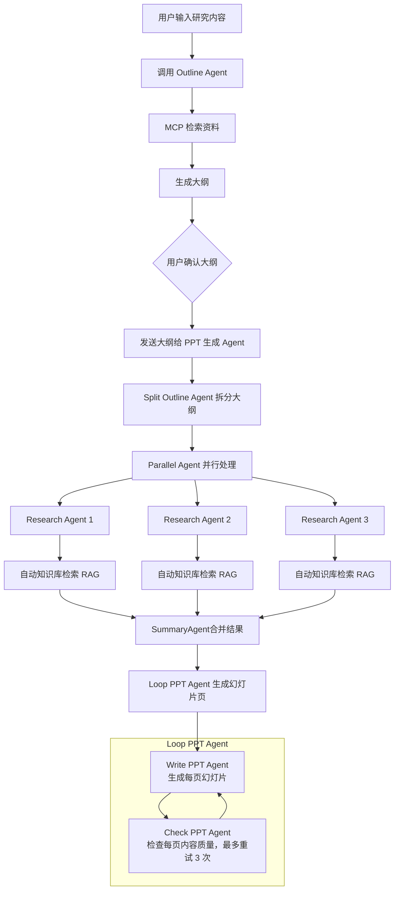

# 🚀 MultiAgentPPT

一个基于 A2A + MCP + ADK 的多智能体系统，支持流式并发生生高质量（可在线编辑）PPT 内容。

## ⚙️ 快速开始

### 1. 后端环境配置

**创建虚拟环境**（推荐 Python 3.11+/3.12 版本）：

```bash
python -m venv multiagent
```

**激活虚拟环境**：

Windows 系统：

```bash
multiagent\Scripts\activate
```

macOS / Linux 系统：

```bash
source multiagent/bin/activate
```

**安装依赖**：

```bash
cd backend
pip install -r requirements.txt
```

**设置环境变量**：

```bash
cd backend
copy env_template .env     # Windows
# cp env_template .env    # macOS/Linux
```

编辑 `backend/.env` 文件，配置必要的环境变量。

### 2. 启动数据库

使用 Docker 启动 PostgreSQL 数据库：

**使用 VPN 时：**

```bash
docker run --name postgresdb -p 5432:5432 -e POSTGRES_USER=postgres -e POSTGRES_PASSWORD=welcome -d postgres
```

```bash
docker run -d -p 6379:6379 --name redis redis:alpine
```

**国内使用（镜像加速）：**

```bash
docker run --name postgresdb -p 5432:5432 -e POSTGRES_USER=postgres -e POSTGRES_PASSWORD=welcome -d swr.cn-north-4.myhuaweicloud.com/ddn-k8s/ghcr.io/cloudnative-pg/postgresql:15
```

### 3. 启动后端服务

**启动 FastAPI 统一网关**（端口 8000）：

```bash
cd backend/api
python main.py
```

启动成功后可访问：

- API 文档：http://localhost:8000/docs
- 健康检查：http://localhost:8000/api/health

### 4. 启动前端服务

**配置环境变量**：

```bash
cd frontend
copy env_template .env     # Windows
# cp env_template .env    # macOS/Linux
```

**安装依赖并启动**：

```bash
# 安装依赖
pnpm install

# 初始化数据库
pnpm db:push

# 启动前端服务
npm run dev
```

**访问应用**：http://localhost:3000/presentation

### 完整启动流程（推荐）

打开三个终端窗口：

**终端 1 - 启动数据库：**

```bash
docker run --name postgresdb -p 5432:5432 -e POSTGRES_USER=postgres -e POSTGRES_PASSWORD=welcome -d postgres
```

**终端 2 - 启动后端：**

```bash
cd backend/api
python main.py
```

**终端 3 - 启动前端：**

```bash
cd frontend
npm run dev
```

访问：http://localhost:3000/presentation

---

## 🧠 项目简介

MultiAgentPPT 利用多智能体架构实现从主题输入到完整演示文稿生成的自动化流程，主要步骤包括：

1. **大纲生成 Agent**：根据用户需求生成初步内容大纲。
2. **Topic 拆分 Agent**：将大纲内容细分为多个主题。
3. **Research Agent 并行工作**：多个智能体分别对每个主题进行深入调研。
4. **Summary Agent 汇总输出**：将调研结果汇总生成 PPT 内容，实时流式返回前端。

### 优点

- **多Agent协作**：通过多智能体并行工作，提高内容生成的效率和准确性
- **实时流式返回**：支持流式返回生成的 PPT 内容，提升用户体验
- **高质量内容**：结合外部检索和智能体协作，生成高质量的内容大纲和演示文稿
- **可扩展性**：系统设计灵活，易于扩展新的智能体和功能模块

---

## 📦 近期升级

### ✅ 已完成

- ✅ **持久化记忆系统**（2026-01-30）：
  - PostgreSQL + Redis + pgvector 三层记忆架构
  - 会话持久化（乐观锁并发控制）
  - 用户偏好智能学习
  - 向量语义检索
  - 研究结果缓存（降低30%成本）

- ✅ 流式输出 Bug 修复（ADK 和 A2A 包问题）
- ✅ 图片渲染优化（动态切换样式，支持内容更新与校对）
- ✅ 循环 Agent 生成每页 PPT（避免 token 限制）
- ✅ PPTChecker Agent 质量检查
- ✅ 前端显示每个 Agent 的生成过程状态
- ✅ PPTX 下载功能（使用 python-pptx）
- ✅ metadata 数据传输（支持配置传递）

### 📝 待完成

- 🔄 整合编辑可见可下载的 pptx 前端

---

## 🗂️ 项目结构

```bash
MultiAgentPPT/
├── backend/              # 后端多Agent服务目录
│   ├── simpleOutline/    # 简化版大纲生成服务（无外部依赖）
│   ├── simplePPT/        # 简化版PPT生成服务（不使用检索或并发）
│   ├── slide_outline/    # 带外部检索的大纲生成服务（大纲根据MCP工具检索后更精准）
│   ├── slide_agent/      # 并发式多Agent PPT生成主要xml格式的PPT内容
├── frontend/             # Next.js 前端界面
```

---

## 📊 并发的多Agent协作流程



---

## 🧪 API 测试

在启动后端服务后，可以使用以下方式测试 API：

### 使用浏览器访问 API 文档

打开浏览器访问：http://localhost:8000/docs

### 使用 curl 测试

```bash
# 健康检查
curl http://localhost:8000/api/health

# 测试大纲生成（需要配置 API Key）
curl -X POST http://localhost:8000/api/ppt/outline/generate \
  -H "Content-Type: application/json" \
  -d '{"prompt": "人工智能发展概述", "language": "zh-CN", "numberOfCards": 10}'
```

### 使用 Apifox/Postman

导入以下端点进行测试：

- `POST http://localhost:8000/api/ppt/outline/generate` - 生成大纲
- `POST http://localhost:8000/api/ppt/generate` - 生成幻灯片
- `GET http://localhost:8000/api/presentations` - 查询演示文稿列表

---

## 🐳 Docker 部署（生产环境）

**注意事项：** 使用前请自行检查 `docker-compose.yml` 和每个目录下的 `Dockerfile` 文件。

**启动前端：**

```bash
cd frontend
docker compose up
```

**启动后端：**

```bash
cd backend
docker compose up
```

---

## 📝 示例数据说明

> 当前系统内置调研示例为：**"电动汽车发展概述"**。如需其他主题调研，请配置对应 Agent 并对接真实数据源。
> 配置真实数据，只需更改 prompt 和对应的 MCP 工具即可。

---

## 📚 文档

### 核心文档
- **[记忆系统文档](docs/memory-system/README.md)** - 记忆系统架构和使用指南
- **[快速开始指南](QUICK_START.md)** - 5分钟快速上手

### 技术报告
- **[项目报告存档](docs/reports/README.md)** - 架构优化、重构记录、分析报告等

### 架构优化
- **[架构优化报告](docs/memory-system/adapter-layer/ARCHITECTURE_OPTIMIZATION_REPORT.md)** - 记忆系统从三层简化为两层

---

## 📎 参考来源

前端项目部分基于开源仓库：[allweonedev/presentation-ai](https://github.com/allweonedev/presentation-ai)

---

# Star History

[](https://www.star-history.com/#johnson7788/MultiAgentPPT&Date)
