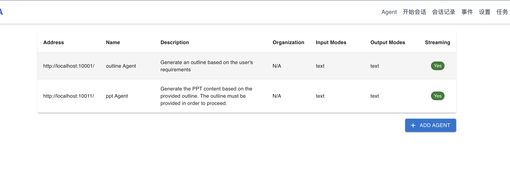
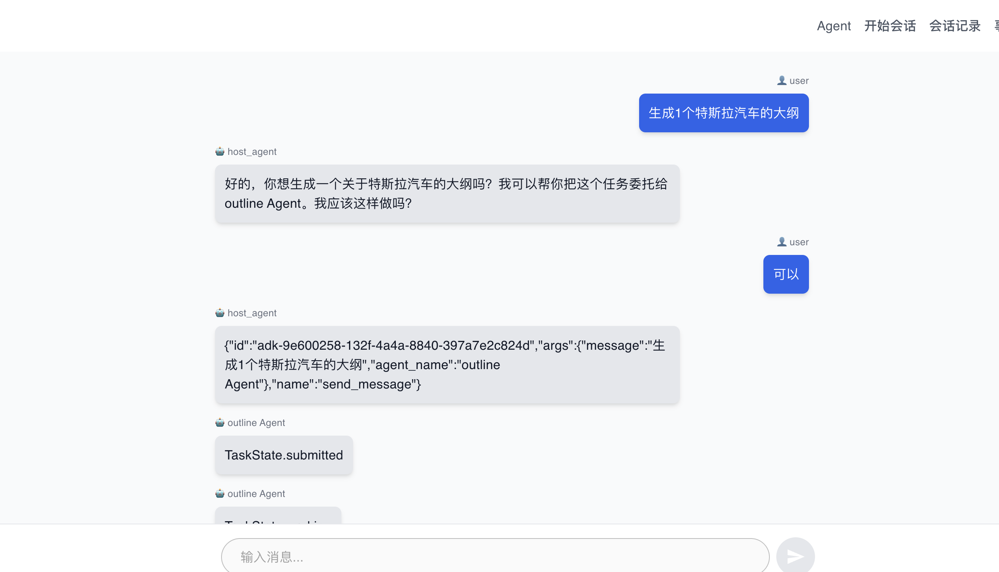
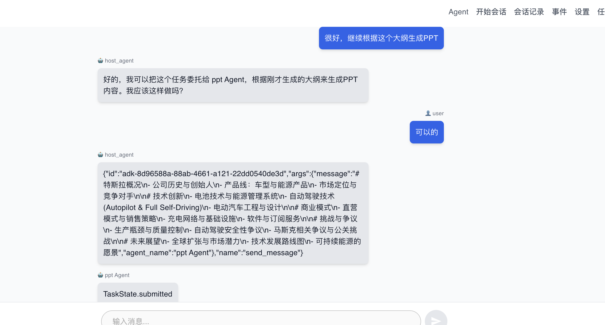
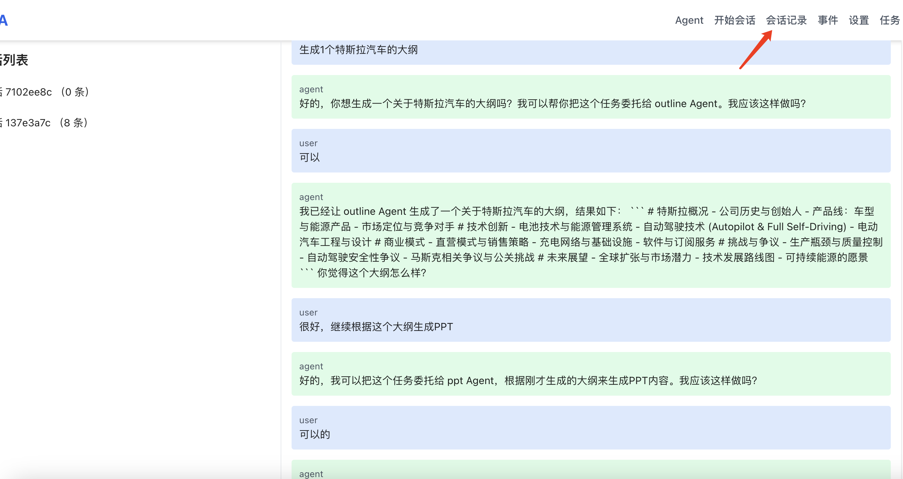
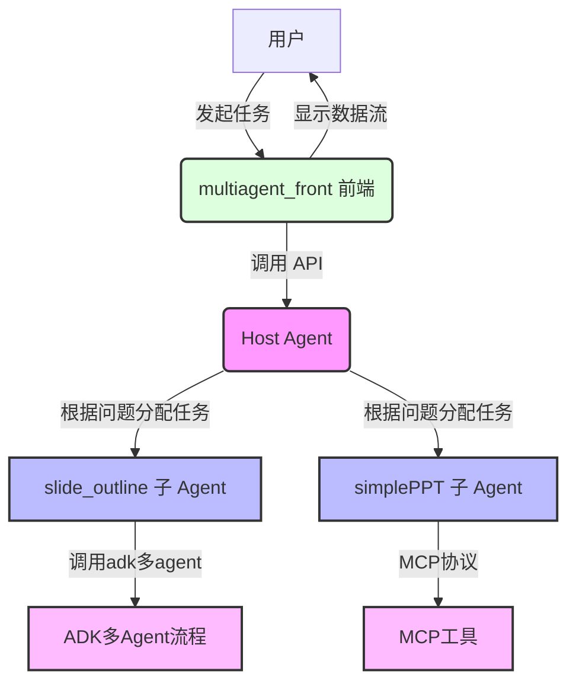
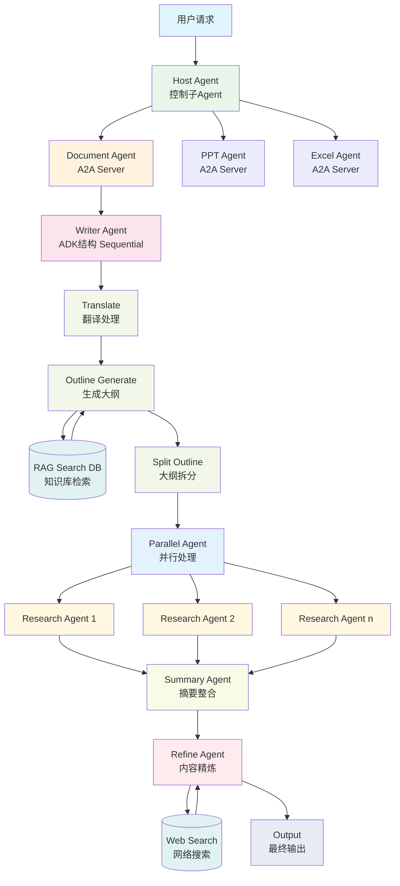

# Backend 目录说明

## 📋 目录结构

| 目录名 | 功能说明 |
|--------|---------|
| `simpleOutline` | 用于前端测试的大纲生成（简化版） |
| `simplePPT` | 用于前端测试的简单 PPT 生成 |
| `slide_outline` | 用于前端的大纲生成，经过检索生成大纲，更专业 |
| `slide_agent` | 标准多智能体系统，根据大纲生成 PPT，更专业 |
| `save_ppt` | 保存成 PPT 文件，使用 python-pptx 通过 PPT 母版保存成 pptx 文件 |
| `hostAgentAPI` | 纯 A2A 的 API 版本的总 Agent，用于串联多个 Agent |
| `multiagent_front` | Super Agent 的前端代码 |

---

## 📦 后端依赖安装

```bash
pip install -r requirements.txt
```

---

## 🔧 LLM 模型配置

**注意：** Gemini 目前最适配（第一次一定要用 Gemini 试验，其它还有 bug）。

如需使用其它的 LLM，可以修改以下文件中的 `create_model.py`，然后在 `.env` 文件中对 `MODEL_PROVIDER` 和 `LLM_MODEL` 这 2 个环境变量进行配置：

- `slide_agent/slide_agent/create_model.py`
- `simpleOutline/create_model.py`
- `simplePPT/create_model.py`
- `hostAgentAPI/hosts/multiagent/create_model.py`

---

## 🚧 开发中（待完善）

- `super_agent` - 文字版本的多智能体系统，用于串联多个 Agent，纯文本的输入、输出，控制大纲和 PPT 生成

---

## 💡 多 Agent 开发注意事项

每个子 Agent 的描述必须清晰，因为 Super Agent 根据每个子 Agent 任务确定它的输入信息。

---

## 📚 A2A、ADK 与 MCP：构建多 Agent 层级调用系统

本文基于 **MultiAgentPPT** 项目，深入探讨如何利用最新版 **A2A (Agent-to-Agent)** 框架，融合 **Google ADK** 和 **FastMCP**，构建一个高效的多 Agent 层级调用系统。通过 **multiagent_front** 前端界面，用户能够便捷地注册子 Agent、发起任务并跟踪会话，而 **Host Agent** 则负责协调子 Agent 完成任务分发与执行。我们将以 **PPT 大纲和内容生成**为例，展示 A2A 的层级调用机制、ADK 的任务增强能力和 FastMCP 的流式输出支持，重点突出系统的架构设计与实现细节。

---

## 一、A2A 多 Agent 层级调用架构

A2A 框架的核心在于通过 Host Agent 实现多 Agent 的层级调用与管理。Host Agent 作为中央协调者，负责子 Agent 的注册、任务分配、上下文管理和结果整合。结合 Google ADK 和 MCP，系统实现了以下关键功能：

- **子 Agent 注册与管理**：Host Agent 通过 `/agent/register` 和 `/agent/list` 接口维护子 Agent 列表，每个子 Agent 的功能描述（例如：生成 PPT 大纲或内容）被明确定义，确保任务精准分配。
- **层级任务分配**：Host Agent 解析用户请求，动态分配任务给合适的子 Agent（例如：`slide_outline` 或 `slide_agent`），支持串行或并行执行。
- **上下文管理**：通过 `/conversation/create` 和 `/message/send` 接口，Host Agent 维护会话状态，确保任务连续性。
- **流式响应与事件跟踪**：结合 FastMCP 的 SSE (Server-Sent Events) 支持，系统能够实时返回任务状态和结果，并通过 `/events/get` 和 `/events/query` 跟踪事件。
- **ADK 集成**：Google ADK 增强了子 Agent 处理复杂任务的能力，例如通过 GenAI API 生成结构化内容。

### 项目中的层级调用流程

以 PPT 生成为例，其流程如下：

1. 用户通过 **multiagent_front** 前端输入任务（例如："调研电动汽车发展"）。
2. Host Agent 创建会话，并分配任务给 `slide_outline` 子 Agent 生成大纲。
3. 用户确认大纲后，Host Agent 调用 `slide_agent` 子 Agent 生成 PPT 内容。
4. 子 Agent 通过 ADK 调用 GenAI API 处理任务，FastMCP 提供 SSE 流式返回结果。

---

## 二、环境搭建

### 1. 后端环境配置

按照 **HostAgentAPI** 的 README 进行配置：

**安装依赖**

确保 Python 3 已安装：

```bash
pip install -r requirements.txt
```

**配置模型**

复制 `env_template.txt` 为 `.env`，并配置模型 `provider`（例如 Google、OpenAI）：

```bash
# 在 .env 文件中配置
MODEL_PROVIDER=google
GOOGLE_API_KEY=your_api_key_here
```

参考 `hostAgentAPI/hosts/multiagent/create_model.py` 设置支持的模型。

**启动 Host Agent API**

```bash
python host_agent_api.py
```

API 默认运行在 `http://localhost:13000`。

### 2. 前端环境配置

按照 **A2A 多 Agent 对话前端** 的 README 配置 **multiagent_front**：

**安装依赖**

确保安装 Node.js 和 npm：

```bash
npm install
```

**配置环境变量**

检查 `.env` 文件，确认 `REACT_APP_HOSTAGENT_API` 指向 API 地址：

```env
REACT_APP_HOSTAGENT_API=http://127.0.0.1:13000
```

**启动前端**

```bash
npm run dev
```

前端默认在 `http://localhost:5173` 运行。

### 3. 运行子 Agent 生成大纲

进入 `slide_outline` 目录：

```bash
cd slide_outline
```

**MCP 配置**

检查 `mcp_config.json`：

```bash
cat mcp_config.json
```

在 `.env` 中添加 Google GenAI API 密钥：

```env
GOOGLE_GENAI_API_KEY=your_genai_api_key
```

**启动 SSE 模式的 MCP 服务**

```bash
fastmcp run --transport sse mcpserver/rag_tool.py
```

**启动主服务**

```bash
python main_api.py
```

子 Agent 的监听地址为 `http://localhost:10001`。

### 4. 运行第二个子 Agent 根据大纲生成内容

进入 `simplePPT` 目录：

```bash
cd simplePPT
cp env_template .env
```

**启动主服务**

```bash
python main_api.py
```

子 Agent 的监听地址为 `http://localhost:10011`。

---

## 三、通过前端实现 A2A 层级调用

**multiagent_front** 前端提供了直观的界面，简化了 Agent 注册、任务发起和结果跟踪。以下是操作流程：

### 1. 注册子 Agent

1. 打开前端界面 (`http://localhost:5173`)。
2. 进入 **Agent 注册** 页面（通常在顶部或侧边栏）。
3. 添加子 Agent 地址：
   - `http://localhost:10001`
   - `http://localhost:10011`
4. 提交后，Host Agent 会通过 `/agent/register` 记录子 Agent，界面将显示注册成功。
5. 在 **Agent 列表** 页面（调用 `/agent/list`）确认子 Agent 列表。



### 2. 发起任务

1. 在 **对话** 或 **新建会话** 页面，点击"创建会话"。
2. 输入任务，例如："调研电动汽车发展"。
3. 前端会调用 `/conversation/create` 获取 `conversation_id`，然后通过 `/message/send` 发送请求。



### 3. Host Agent 层级调用原理

- **任务解析**：Host Agent 使用 `list_remote_agents` 工具查询可用子 Agent。
- **任务分配**：根据请求内容，Host Agent 分配任务给 `slide_outline` 子 Agent 生成大纲。
- **ADK 增强**：`slide_outline` 通过 `adk_agent_executor.py` 调用 Google GenAI API，生成结构化大纲。
- **FastMCP 流式输出**：FastMCP 通过 SSE 实时返回大纲，状态更新（例如："submitted" → "working" → "completed"）会显示在前端。



### 4. 查看中间结果

前端会实时显示大纲。在 **会话列表** 页面查看所有会话（`/conversation/list`）。点击会话，可以查看消息历史（`/message/list`）和事件记录（`/events/query`），如任务状态更新或产物生成。



---

## 四、A2A 结合 ADK 和 FastMCP 的技术亮点

### 1. A2A 层级调用

- **动态任务分配**：Host Agent 根据子 Agent 描述动态选择执行者，支持复杂任务分解。
- **工具支持**：Host Agent 内置 `list_remote_agents` 和 `send_message` 工具，简化任务分发。
- **事件驱动**：通过 `add_event` 记录用户消息、Agent 状态更新和产物生成，确保全流程可追溯。

### 2. Google ADK 集成

- **增强子 Agent 能力**：`adk_agent_executor.py` 集成 Google GenAI API，处理复杂任务如结构化内容生成。
- **模块化设计**：ADK 逻辑与 A2A 分离，子 Agent 可独立扩展。

### 3. A2A 的 SSE

- **流式输出**：A2A 通过 SSE 实时推送任务状态和结果，提供更流畅的用户体验。

### 4. 原理图



### 生产环境更复杂示例



---

## 五、测试与调试

### 1. 单元测试 HostAgentAPI

运行 `test_api.py` 验证 API 接口：

```bash
python test_api.py
```

检查状态码、响应内容和耗时。

### 2. 整体测试

使用 `host_agent_api_client.py` 模拟前端操作：

```bash
python host_agent_api_client.py
```

### 3. 常见问题

- **PyCharm 异常**：如遇 `AttributeError: 'NoneType' object has no attribute 'call_exception_handler'`，请尝试使用命令行运行 `python host_agent_api.py`。

---

## 六、注意事项

- **子 Agent 描述清晰**：注册时需明确功能（例如："Generates structured PPT outlines"），以确保 Host Agent 正确分配任务。
- **会话管理**：建议为每个任务创建独立的会话，并使用前端的会话列表跟踪任务进度。
- **代理设置**：如果使用国内模型，建议取消 `.env` 中的所有 HTTP 代理，注释掉即可。

---

## 七、总结

通过 A2A 框架结合 Google ADK 和 FastMCP，**MultiAgentPPT** 项目展示了一个高效的多 Agent 层级调用系统。Host Agent 协调子 Agent（例如 `slide_outline` 和 `simplePPT`），实现了任务从输入到输出的自动化处理。**multiagent_front** 前端提供了直观的交互界面，支持 Agent 注册、任务发起和结果跟踪，显著提升了系统的灵活性和用户体验。这个架构不仅适用于 PPT 生成，还可扩展到其他多 Agent 协作场景，展现了 A2A 框架的强大潜力。
