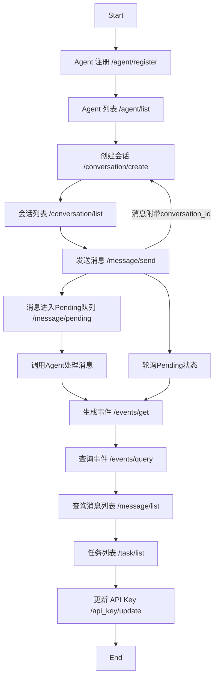

# 🎯 Host Agent API 接口

## 📖 项目简介

本项目的目标是为 A2A 的协调者和组织者的 Agent 提供启动和管理功能的 API 接口。通过这些接口，可以方便地和其它 Agent 进行交互，从而实现对其它 Agent 控制。

**即 Super Agent**

---

## 🚀 快速开始

### 1. 环境准备

确保你的系统已经安装了 Python 3。

安装所需依赖包：

```bash
pip install -r requirements.txt
```

### 2. 配置模型

复制环境变量模板：

```bash
cp env_template.txt .env
```

**支持的模型 provider** 参考 `hostAgentAPI/hosts/multiagent/create_model.py`，包括：

- claude
- google
- openai
- deepseek
- ali

### 3. 启动 API 服务

在项目根目录下，运行以下命令启动 API 服务：

```bash
python host_agent_api.py
```

默认情况下，API 服务会在本地的 `http://localhost:13000` 启动。

---

## 🧪 测试

**单元测试：**

```bash
python test_api.py
```

**整体测试和使用方法：**

```bash
python host_agent_api_client.py
```

---

## 📊 请求流程图



---

## 📝 API 端点说明

| 流程步骤 | 说明 |
|---------|------|
| `/agent/register` | 注册一个 Agent（例如某个模型服务） |
| `/agent/list` | 查看当前注册的 Agent |
| `/conversation/create` | 创建一个上下文会话（返回 `conversation_id`） |
| `/conversation/list` | 列出所有创建过的会话 |
| `/message/send` | 向某个会话发送消息，绑定 `conversation_id` |
| `/message/pending` | 查询哪些消息还在处理中（Pending状态） |
| `/events/get` | 获取所有事件（消息发送、回复等） |
| `/events/query` | 查询某个 conversation_id 对应的事件 |
| `/message/list` | 获取指定会话的所有消息 |
| `/task/list` | 查看当前所有调度任务 |
| `/api_key/update` | 更新当前系统使用的 API Key |

---

## 💻 代码说明

### server.py

里面定义了每个 API 的行为，修改 API 代码或者添加新的 API 的话，可以在其中操作。

例如 `/events/query` 就是新增的，在 `types.py` 里面定义返回消息的格式，在 `server.py` 中定义接口行为。

---

## ⚠️ PyCharm 异常处理

如果遇到以下异常，请使用命令行直接运行 `python api.py` 即可：

```
Exception ignored in: <function Task.__del__ at 0x104149080>
Traceback (most recent call last):
  File "/Users/admin/miniforge3/envs/multiagent/lib/python3.12/asyncio/tasks.py", line 150, in __del__
    self.loop.call_exception_handler(context)
    ^^^^^^^^^^^^^^^^^^^^^^^^^^^^^^^^^
AttributeError: 'NoneType' object has no attribute 'call_exception_handler'
2025-06-26 10:49:42,338 - [INFO] - _base_client - _sleep_for_retry - Retrying request to /chat/completions in 0.428395 seconds
/Applications/PyCharm.app/Contents/plugins/python/helpers/pydev/_pydevd_bundle/pydevd_pep_669_tracing.py:510: RuntimeWarning: coroutine 'TCPConnector._resolve_host_with_throttle' was never awaited
  frame = _getframe()
RuntimeWarning: Enable tracemalloc to get the object allocation traceback
```

---

## 🔧 注册的 Agent 工具说明

注册的 Agent 都是作为被工具调用的参数，Host Agent 有 2 个工具：

1. **查询子 Agent**：`self.list_remote_agents`
2. **发送消息给子 Agent**：`self.send_message`

---

## 📚 事件记录说明

使用 `self.add_event` 记录事件，有三处使用：

1. **process_message 方法内**
   - 当用户通过 `process_message` 方法发送一条消息时，系统会立即将这条用户消息记录为一个事件
   - 这个事件的 actor 被设置为 'user'，表示该事件是由用户触发的

2. **process_message**
   - 记录代理产生的事件（状态更新、产物更新等）

3. **task_callback**
   - 作为 HostAgent 的回调函数
   - 当底层代理发生任务状态更新事件 (TaskStatusUpdateEvent) 或任务产物更新事件 (TaskArtifactUpdateEvent) 时触发
