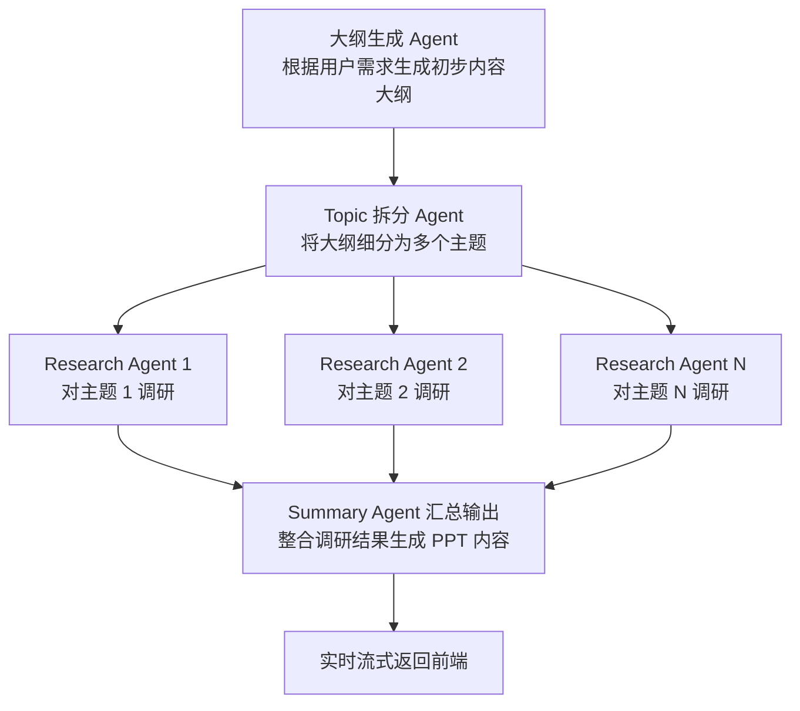

# 🧠 Multi-Agent 自动生成 PPT 内容

本项目基于多智能体（Multi-Agent）协作架构，实现从内容大纲出发，自动完成主题拆解、信息调研与汇总生成 PPT 内容的流程。

---

## 🔧 核心功能模块

| Agent 名称 | 功能描述 |
|-----------|---------|
| `split_topic_agent` | 将输入的大纲内容拆解为多个独立研究主题 |
| `parallel_search_agent` | 并行调研每个主题，调用检索与信息提取工具 |
| `summary_writer_agent` | 汇总所有研究结果，生成结构化 PPT 文本内容 |

---

## 🚀 快速开始

### 1. 修改 Agent 使用的模型

编辑模型配置文件以自定义每个 Agent 所调用的模型（如 GPT-4、Claude、Gemini 等）：

**配置文件路径：**
```python
backend/slide_agent/slide_agent/config.py
```

### 2. 修改搜索引擎配置

**注意：** 需要修改 `tools.py` 中的搜索引擎配置：

**配置文件路径：**
```python
slide_agent/sub_agents/research_topic/tools.py
```

### 3. 启动本地测试

直接运行多智能体流程测试：

```bash
python main.py
```

### 4. 启动后端 API 服务（供前端调用）

提供标准 API 接口（支持 SSE 流式返回），供前端请求：

```bash
python main_api.py
```

---

## 📁 项目结构简要说明

```text
.
├── README.md                    # 使用说明文档
├── __init__.py                 # 包初始化文件
├── a2a_client.py               # 示例客户端，用于测试向 Agent 发送请求
├── adk_agent_executor.py       # 基于 ADK 的 Agent 调度执行器
├── api.log                     # 接口运行日志文件
├── env_example                 # 环境变量模板文件（用于创建 .env）
├── main.py                     # 本地测试入口，运行完整 Agent 流程
├── main_api.py                 # 提供 HTTP/SSE API 的主程序（供前端调用）
├── pyproject.toml              # Python 项目配置文件（依赖与构建）
└── slide_agent/                # 多 Agent 核心逻辑目录
    ├── __init__.py
    ├── agent.py                # 核心 Agent 管理逻辑（注册与调度）
    ├── agent_utils.py          # Agent 辅助工具函数（如日志、格式转换等）
    ├── config.py               # Agent 配置文件（模型参数、Agent 路由等）
    ├── create_model.py         # 创建和初始化模型实例
    └── sub_agents/             # 各子任务的智能体模块
        ├── __init__.py
        ├── research_topic/     # 研究任务 Agent：对主题进行调研并提取信息
        │   ├── agent.py        # Research Agent 主体
        │   ├── prompt.py       # Research Agent 使用的提示词模板
        │   ├── tools.py        # 调研用工具函数（如搜索、摘要等）
        │   └── mcpserver/
        │       └── research_tool.py  # MCP 工具包装，用于调研时调用，暂时未使用
        ├── split_topic/        # 拆分任务 Agent：将大纲拆分为多个主题
        │   ├── agent.py
        │   └── prompt.py
        └── summary_writer/     # 汇总任务 Agent：汇总多个研究结果生成PPT内容
            ├── agent.py
            └── prompt.py
```

---

## 📊 并发的多 Agent 协作流程



---

## 🧪 a2a_client.py 客户端测试

### 运行测试

```bash
python a2a_client.py
```

### 输出结果示例

**发送消息信息：**
```json
{
  "message": {
    "role": "user",
    "parts": [
      {
        "type": "text",
        "text": "# 电动汽车发展概述..."
      }
    ],
    "messageId": "712d7956dddf488891df56c4804a3c3f"
  }
}
```

**任务状态更新流程：**

1. **submitted** - 任务已提交
2. **working** - 正在处理
3. **completed** - 完成

**典型输出chunk示例：**

```json
{'id': '0caef9d1-d72d-48bf-853e-9e197595ecf3', 'jsonrpc': '2.0', 'result': {'contextId': '4c4f93c2-5ebb-48e9-ab03-33ae1d16b38a', 'final': False, 'kind': 'status-update', 'status': {'state': 'submitted'}, 'taskId': '24138672-2677-402a-8854-5d97655588ad'}}
```

```json
{'id': '0caef9d1-d72d-48bf-853e-9e197595ecf3', 'jsonrpc': '2.0', 'result': {'contextId': '4c4f93c2-5ebb-48e9-ab03-33ae1d16b38a', 'final': False, 'kind': 'status-update', 'status': {'state': 'working'}, 'taskId': '24138672-2677-402a-8854-5d97655588ad'}}
```

**最终artifact输出示例（部分）：**

```json
{
  "artifact": {
    "artifactId": "093a81e4-04a4-43ce-8d27-9a56c751d52a",
    "parts": [
      {
        "kind": "text",
        "text": "```json\n{\n    \"topics\": [\n        {\n            \"id\": 1,\n            \"title\": \"电动汽车的定义、类型和发展历程\",\n            \"description\": \"介绍电动汽车的基本概念，包括不同类型（BEV、PHEV、HEV）的区分，以及电动汽车从早期尝试到现代复兴的发展历史。\"\n        }\n    ]\n}\n```"
      }
    ]
  }
}
```

<details>
<summary>📦 查看完整的流式输出过程（点击展开）</summary>

完整的流式输出包含多个chunk，每个chunk对应Agent处理的不同阶段：

1. **Split Topic Agent 输出**：将大纲拆分为多个研究主题的JSON格式
2. **Parallel Research Agent 输出**：每个Research Agent并行处理一个主题，输出调研结果
3. **Summary Agent 输出**：汇总所有调研结果，生成最终的PPT内容

每个中间状态都会通过SSE实时推送到前端，包括：
- 任务状态更新（submitted → working → completed）
- 流式文本内容
- 最终artifact（完整结果）

</details>

---

## 📝 技术特点

- **多Agent协作**：通过多个专门Agent分工合作，提高内容生成的效率和准确性
- **并行处理**：Research Agent可以并行工作，加速内容生成
- **流式输出**：支持SSE实时推送，用户体验更流畅
- **可扩展性**：模块化设计，易于添加新的Agent或修改现有Agent行为
- **ADK集成**：结合Google ADK框架，增强Agent处理能力

---

## ⚙️ 环境配置

### 安装依赖

```bash
pip install -r requirements.txt
```

### 配置环境变量

复制环境变量模板并修改：

```bash
cp env_example .env
```

在 `.env` 文件中配置：
- 模型提供商（MODEL_PROVIDER）
- API密钥（API_KEY）
- 其他必要配置

---

## 🔍 常见问题

**Q: 如何切换不同的LLM模型？**

A: 修改 `slide_agent/config.py` 文件中的模型配置。

**Q: 如何自定义搜索引擎？**

A: 编辑 `sub_agents/research_topic/tools.py` 文件中的搜索工具配置。

**Q: 支持哪些输出格式？**

A: 目前主要支持XML格式的PPT内容输出，可被前端解析和渲染。
