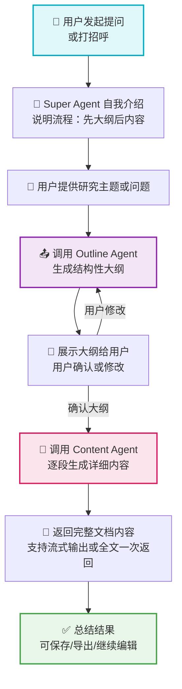

# super Agent，负责总的任务执行
1. 用户提出1个主题，然后大纲Agent负责生成大纲
2. 用户确认没有问题，那么ppt Agent开始生成ppt

# 🧭 Super Agent 工作流程图（Mermaid）



# 缺点和现状
任务委派给某个子Agent，但是不能动态串联2个子Agent一起做某个任务。可能planner能实现，但是每个子Agent的状态怎么返回出来？
如果使用谷歌的ADK的Agent的Tool支持流式的返回吗？即把Agent作为tool呢？
A2A官方对多Agent的使用，把每个Agent作为工具使用。

# 启动SuperAgent
python main_api.py

# 测试客户端
python client.py


## 完整的文字版交流测试记录
```

```

