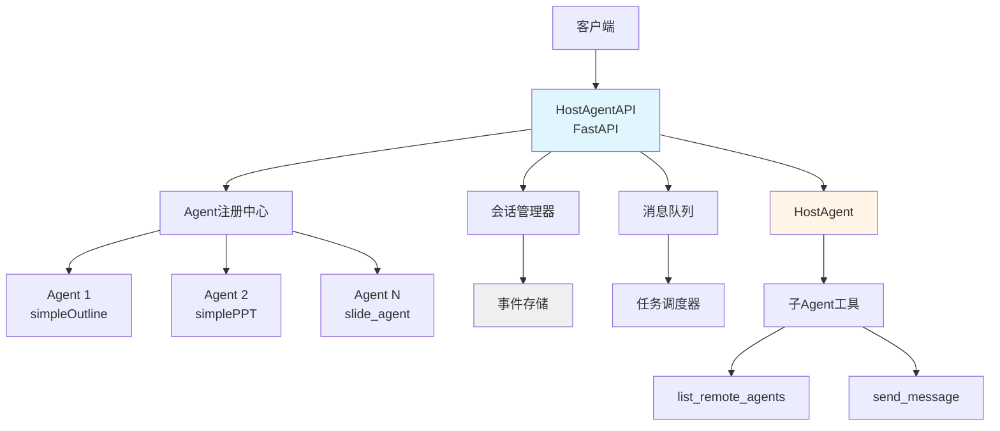
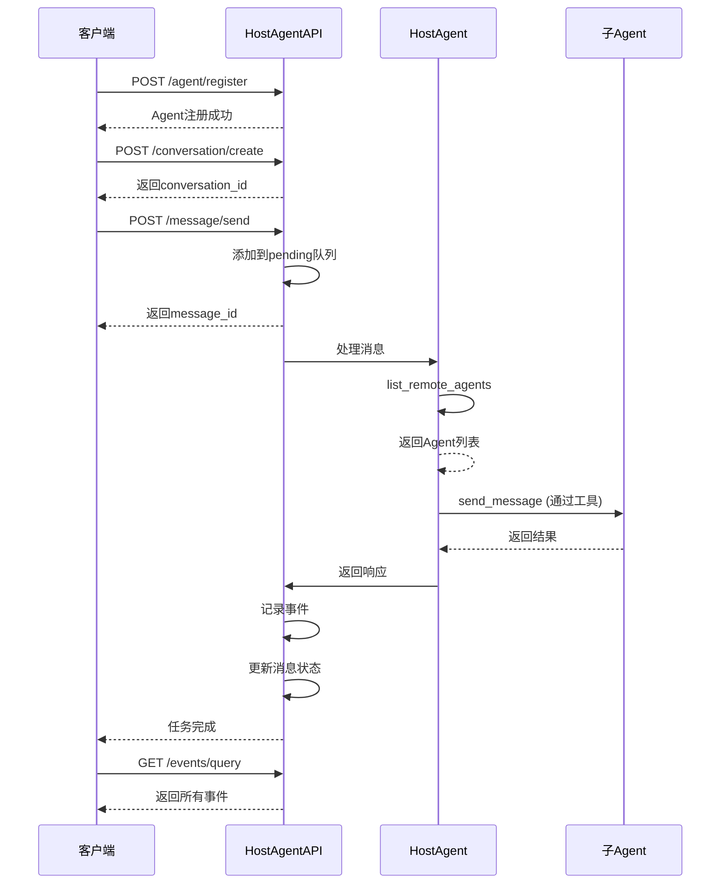

# hostAgentAPI 模块详解

## 📋 目录
- [模块概述](#模块概述)
- [核心功能](#核心功能)
- [技术架构](#技术架构)
- [目录结构](#目录结构)
- [核心组件解析](#核心组件解析)
- [API接口说明](#api接口说明)
- [工作流程](#工作流程)
- [配置说明](#配置说明)
- [使用方法](#使用方法)
- [事件系统](#事件系统)
- [常见问题](#常见问题)

---

## 模块概述

**hostAgentAPI** 是 MultiAgentPPT 项目中的 **Super Agent** API 接口服务，负责协调和管理多个子 Agent，实现 Agent-to-Agent 的通信和控制。

### 特点
- ✅ **Agent注册中心**：集中管理多个Agent服务
- ✅ **会话管理**：维护多轮对话上下文
- ✅ **事件系统**：记录和查询所有交互事件
- ✅ **消息队列**：Pending队列管理消息处理
- ✅ **任务调度**：管理和调度后台任务
- ✅ **动态配置**：支持运行时更新API Key

### 适用场景
- 协调多个Agent服务
- 管理复杂的多轮对话
- 监控Agent执行状态
- 动态配置和热更新

---

## 核心功能

| 功能 | 说明 |
|-----|------|
| **Agent注册** | 注册和管理子Agent服务 |
| **会话创建** | 创建和维护对话会话 |
| **消息发送** | 向Agent发送消息并获取响应 |
| **事件记录** | 记录所有交互事件 |
| **状态查询** | 查询Agent和消息状态 |
| **任务管理** | 管理后台任务调度 |
| **配置更新** | 动态更新API Key |

---

## 技术架构

### 技术栈
```yaml
框架: FastAPI
数据库: 内存存储 (可扩展为持久化)
通信协议: HTTP/REST
Agent协调: Host Agent模式
事件系统: 自定义事件存储
```

### 架构图



---

## 目录结构

```
hostAgentAPI/
├── README.md                  # 使用说明文档
├── host_agent_api.py          # FastAPI主入口 (端口13000)
├── host_agent_api_client.py   # 客户端示例
├── test_api.py                # 单元测试
├── types.py                   # 数据类型定义
├── server.py                  # API服务器实现
├── env_template.txt           # 环境变量模板
├── requirements.txt           # Python依赖
└── hosts/                     # Agent定义目录
    ├── __init__.py
    ├── agent.py               # Agent入口
    ├── host_agent.py          # HostAgent实现
    └── multiagent/            # MultiAgent配置
        ├── __init__.py
        ├── agent.py           # MultiAgent Agent
        └── create_model.py    # 模型创建
```

---

## 核心组件解析

### 1. HostAgent实现 (hosts/host_agent.py)

**核心概念**：Host Agent作为协调者，通过工具调用其他子Agent。

**两个关键工具**：

1. **list_remote_agents**：查询可用的子Agent
```python
def list_remote_agents(self) -> str:
    """查询所有注册的子Agent"""
    return json.dumps(self.remote_agents)
```

2. **send_message**：向子Agent发送消息
```python
async def send_message(self, agent_name: str, message: str) -> str:
    """向指定Agent发送消息"""
    agent_url = self.remote_agents.get(agent_name)
    if not agent_url:
        return f"Agent {agent_name} not found"

    # 发送HTTP请求到子Agent
    response = await httpx.post(agent_url, json={"message": message})
    return response.text
```

### 2. Agent创建 (hosts/multiagent/agent.py)

```python
from .host_agent import HostAgent

# 创建HostAgent，注册子AgentURLs
root_agent = HostAgent(['http://localhost:10000']).create_agent()
```

### 3. API服务器 (server.py)

**关键API端点**：

```python
# Agent注册
@app.post("/agent/register")
async def register_agent(agent_info: AgentInfo):
    """注册一个新的Agent"""
    registered_agents[agent_info.name] = agent_info
    return {"status": "registered"}

# 查询Agent列表
@app.get("/agent/list")
async def list_agents():
    """获取所有已注册的Agent"""
    return registered_agents

# 创建会话
@app.post("/conversation/create")
async def create_conversation():
    """创建新的对话会话"""
    conversation_id = str(uuid.uuid4())
    conversations[conversation_id] = {
        "created_at": datetime.now(),
        "messages": []
    }
    return {"conversation_id": conversation_id}

# 发送消息
@app.post("/message/send")
async def send_message(request: MessageRequest):
    """向会话发送消息"""
    conversation_id = request.conversation_id
    message = request.message

    # 添加到会话
    conversations[conversation_id]["messages"].append(message)

    # 调用HostAgent处理
    response = await host_agent.process(message)
    return {"response": response}
```

---

## API接口说明

### 完整API列表

| 端点 | 方法 | 说明 |
|-----|------|------|
| `/agent/register` | POST | 注册Agent |
| `/agent/list` | GET | 查询Agent列表 |
| `/conversation/create` | POST | 创建会话 |
| `/conversation/list` | GET | 查询会话列表 |
| `/message/send` | POST | 发送消息 |
| `/message/pending` | GET | 查询待处理消息 |
| `/events/get` | GET | 获取所有事件 |
| `/events/query` | POST | 查询特定会话事件 |
| `/message/list` | GET | 获取会话消息列表 |
| `/task/list` | GET | 查询任务列表 |
| `/api_key/update` | POST | 更新API Key |

### 详细接口说明

#### 1. Agent注册

**POST** `/agent/register`

注册一个新的Agent服务。

**请求体**：
```json
{
  "name": "outline_agent",
  "url": "http://localhost:10001",
  "description": "生成大纲的Agent",
  "capabilities": ["text_generation", "outline"]
}
```

**响应**：
```json
{
  "status": "registered",
  "agent_id": "uuid",
  "timestamp": "2025-01-30T10:00:00Z"
}
```

#### 2. 查询Agent列表

**GET** `/agent/list`

获取所有已注册的Agent。

**响应**：
```json
{
  "agents": [
    {
      "name": "outline_agent",
      "url": "http://localhost:10001",
      "status": "active"
    },
    {
      "name": "ppt_agent",
      "url": "http://localhost:10011",
      "status": "active"
    }
  ]
}
```

#### 3. 创建会话

**POST** `/conversation/create`

创建新的对话会话。

**请求体**：
```json
{
  "user_id": "user123",
  "metadata": {
    "language": "chinese"
  }
}
```

**响应**：
```json
{
  "conversation_id": "conv-uuid",
  "created_at": "2025-01-30T10:00:00Z",
  "status": "active"
}
```

#### 4. 发送消息

**POST** `/message/send`

向指定会话发送消息。

**请求体**：
```json
{
  "conversation_id": "conv-uuid",
  "message": {
    "role": "user",
    "content": "生成一个关于电动汽车的PPT大纲"
  },
  "agent_name": "outline_agent"
}
```

**响应**：
```json
{
  "message_id": "msg-uuid",
  "status": "pending",
  "queued_at": "2025-01-30T10:00:00Z"
}
```

#### 5. 查询待处理消息

**GET** `/message/pending`

查询正在处理中的消息。

**响应**：
```json
{
  "pending_messages": [
    {
      "message_id": "msg-uuid",
      "conversation_id": "conv-uuid",
      "agent": "outline_agent",
      "status": "processing"
    }
  ]
}
```

#### 6. 获取事件

**GET** `/events/get`

获取所有系统事件。

**响应**：
```json
{
  "events": [
    {
      "event_id": "evt-uuid",
      "type": "message_sent",
      "timestamp": "2025-01-30T10:00:00Z",
      "actor": "user",
      "data": {...}
    }
  ]
}
```

#### 7. 查询特定会话事件

**POST** `/events/query`

查询特定会话的事件。

**请求体**：
```json
{
  "conversation_id": "conv-uuid",
  "event_types": ["message_sent", "agent_response"],
  "limit": 50
}
```

**响应**：
```json
{
  "events": [
    {
      "event_id": "evt-uuid",
      "conversation_id": "conv-uuid",
      "type": "message_sent",
      "timestamp": "2025-01-30T10:00:00Z"
    }
  ]
}
```

#### 8. 更新API Key

**POST** `/api_key/update`

动态更新系统使用的API Key。

**请求体**：
```json
{
  "provider": "openai",
  "api_key": "sk-new-key-here"
}
```

**响应**：
```json
{
  "status": "updated",
  "provider": "openai",
  "timestamp": "2025-01-30T10:00:00Z"
}
```

---

## 工作流程



---

## 配置说明

### 环境变量配置

```bash
cp env_template.txt .env
```

**必要环境变量**：
```env
# 模型配置
MODEL_PROVIDER=deepseek
LLM_MODEL=deepseek-chat

# API密钥
GOOGLE_API_KEY=your_google_api_key
CLAUDE_API_KEY=your_claude_api_key
OPENAI_API_KEY=your_openai_api_key
DEEPSEEK_API_KEY=your_deepseek_api_key
ALI_API_KEY=your_ali_api_key
```

### HostAgent配置

**hosts/multiagent/agent.py**：
```python
from .host_agent import HostAgent

# 配置子Agent URLs
remote_agents = [
    'http://localhost:10000',  # simpleOutline
    'http://localhost:10011',  # simplePPT
    # 添加更多Agent...
]

root_agent = HostAgent(remote_agents).create_agent()
```

---

## 使用方法

### 1. 安装依赖

```bash
cd backend/hostAgentAPI
pip install -r requirements.txt
```

### 2. 配置环境

```bash
cp env_template.txt .env
# 编辑.env文件，配置API密钥
```

### 3. 启动服务

```bash
python host_agent_api.py
```

服务启动在 `http://localhost:13000`

### 4. 测试API

**单元测试**：
```bash
python test_api.py
```

**完整测试**：
```bash
python host_agent_api_client.py
```

### 5. 使用示例

```python
import httpx
import asyncio

async def main():
    base_url = "http://localhost:13000"

    async with httpx.AsyncClient() as client:
        # 1. 创建会话
        resp = await client.post(f"{base_url}/conversation/create")
        conv_id = resp.json()["conversation_id"]

        # 2. 发送消息
        resp = await client.post(f"{base_url}/message/send", json={
            "conversation_id": conv_id,
            "message": {
                "role": "user",
                "content": "生成电动汽车PPT大纲"
            }
        })

        # 3. 查询结果
        resp = await client.get(f"{base_url}/events/query", json={
            "conversation_id": conv_id
        })

        print(resp.json())

asyncio.run(main())
```

---

## 事件系统

### 事件类型

| 事件类型 | 说明 | 触发时机 |
|---------|------|---------|
| `agent_registered` | Agent注册 | 注册新Agent时 |
| `conversation_created` | 会话创建 | 创建新会话时 |
| `message_sent` | 消息发送 | 用户发送消息时 |
| `agent_called` | Agent调用 | HostAgent调用子Agent时 |
| `agent_response` | Agent响应 | 子Agent返回结果时 |
| `task_completed` | 任务完成 | 任务执行完成时 |
| `error_occurred` | 错误发生 | 发生错误时 |

### 事件数据结构

```json
{
  "event_id": "evt-uuid",
  "type": "message_sent",
  "timestamp": "2025-01-30T10:00:00Z",
  "conversation_id": "conv-uuid",
  "actor": "user",
  "data": {
    "message": "消息内容",
    "agent": "outline_agent"
  }
}
```

### 事件记录位置

1. **process_message方法内**：
   - 记录用户消息事件
   - actor设置为'user'

2. **process_message (Agent响应)**：
   - 记录Agent产生的事件
   - 包括状态更新、产物更新等

3. **task_callback**：
   - 作为HostAgent的回调函数
   - 监听TaskStatusUpdateEvent和TaskArtifactUpdateEvent

---

## 常见问题

### Q1: Agent注册失败？

**A**: 检查以下几点：
1. Agent服务是否正常运行
2. URL是否可访问
3. Agent是否实现了正确的接口
4. 网络连接是否正常

### Q2: 会话状态丢失？

**A**:
- 当前使用内存存储，重启会丢失
- 解决方案：使用Redis或数据库持久化

**示例 - Redis持久化**：
```python
import redis

r = redis.Redis(host='localhost', port=6379, db=0)

# 保存会话
def save_conversation(conversation_id, data):
    r.set(f"conv:{conversation_id}", json.dumps(data))

# 获取会话
def get_conversation(conversation_id):
    data = r.get(f"conv:{conversation_id}")
    return json.loads(data) if data else None
```

### Q3: 如何监控Agent状态？

**A**: 使用轮询机制：

```python
async def monitor_agent(agent_name, interval=5):
    while True:
        resp = await client.get("/agent/list")
        agents = resp.json()["agents"]

        for agent in agents:
            if agent["name"] == agent_name:
                print(f"Agent {agent_name} status: {agent['status']}")

        await asyncio.sleep(interval)
```

### Q4: 消息处理慢？

**A**: 优化建议：
1. 使用异步IO
2. 增加并发worker
3. 实现消息优先级队列
4. 添加超时机制

**示例 - 超时处理**：
```python
@app.post("/message/send")
async def send_message(request: MessageRequest):
    try:
        response = await asyncio.wait_for(
            host_agent.process(request.message),
            timeout=30.0  # 30秒超时
        )
        return {"response": response}
    except asyncio.TimeoutError:
        return {"error": "Processing timeout"}
```

### Q5: 如何扩展事件系统？

**A**: 添加自定义事件：

```python
class CustomEvent:
    def __init__(self, event_type, data):
        self.type = event_type
        self.data = data
        self.timestamp = datetime.now()

    def to_dict(self):
        return {
            "type": self.type,
            "data": self.data,
            "timestamp": self.timestamp.isoformat()
        }

# 使用
event = CustomEvent("custom_event", {"key": "value"})
events.append(event.to_dict())
```

### Q6: 与前端集成？

**A**: 提供WebSocket支持：

```python
from fastapi import WebSocket

@app.websocket("/ws")
async def websocket_endpoint(websocket: WebSocket):
    await websocket.accept()
    try:
        while True:
            data = await websocket.receive_text()
            # 处理消息
            response = await process_message(data)
            await websocket.send_json(response)
    except WebSocketDisconnect:
        print("Client disconnected")
```

---

## 高级用法

### 1. 动态Agent发现

```python
import asyncio
import httpx

async def discover_agents(base_url):
    """动态发现可用Agent"""
    async with httpx.AsyncClient() as client:
        # 扫描端口范围
        for port in range(10000, 10020):
            try:
                resp = await client.get(f"http://localhost:{port}/health")
                if resp.status_code == 200:
                    # 注册发现的Agent
                    await register_agent(f"http://localhost:{port}")
            except:
                continue
```

### 2. 负载均衡

```python
class LoadBalancer:
    def __init__(self):
        self.agents = []
        self.current = 0

    def add_agent(self, agent_url):
        self.agents.append(agent_url)

    def get_next_agent(self):
        agent = self.agents[self.current]
        self.current = (self.current + 1) % len(self.agents)
        return agent

# 使用
lb = LoadBalancer()
lb.add_agent("http://localhost:10001")
lb.add_agent("http://localhost:10002")

agent_url = lb.get_next_agent()
```

### 3. 消息优先级队列

```python
import heapq

class PriorityMessageQueue:
    def __init__(self):
        self.queue = []

    def put(self, priority, message):
        heapq.heappush(self.queue, (priority, message))

    def get(self):
        return heapq.heappop(self.queue)[1]

# 使用
queue = PriorityMessageQueue()
queue.put(priority=1, message="高优先级消息")
queue.put(priority=2, message="普通消息")
```

---

## 相关模块

- **simpleOutline**: 大纲生成Agent
- **simplePPT**: PPT生成Agent
- **slide_agent**: 完整的多Agent PPT生成系统
- **multiagent_front**: 前端对话界面

---

## 总结

hostAgentAPI是MultiAgentPPT项目的协调中心，通过Super Agent模式管理多个子Agent，实现统一的API接口和事件系统。它是构建复杂多Agent系统的关键基础设施。

**主要优势**：
- 统一的Agent管理
- 完善的事件系统
- 灵活的API接口
- 易于扩展和集成

**使用建议**：
- 作为多Agent系统的统一入口
- 需要监控和调试时使用
- 构建复杂的Agent工作流
- 实现企业级Agent管理平台
