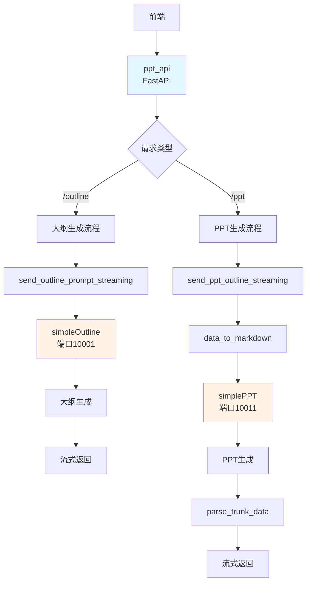
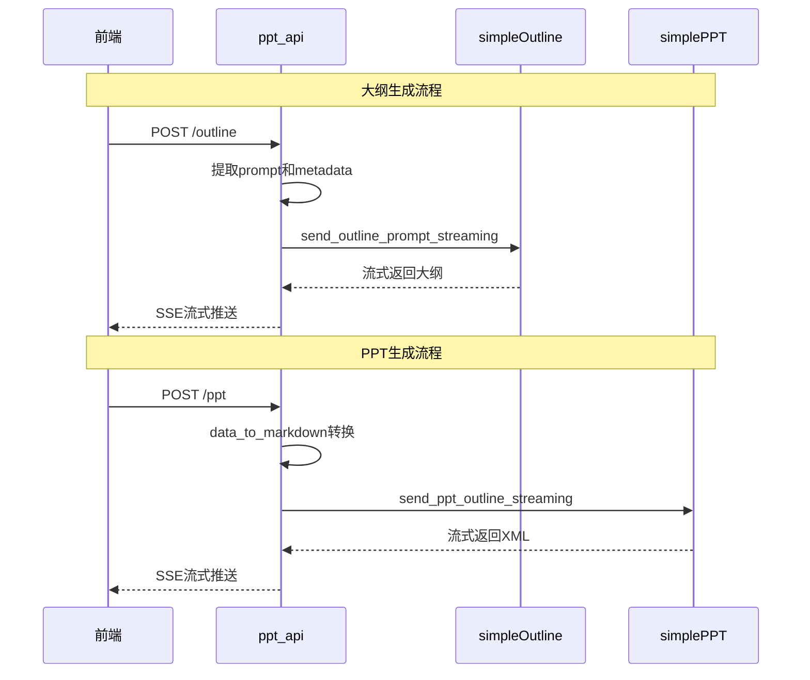

# ppt_api 模块详解

## 📋 目录
- [模块概述](#模块概述)
- [核心功能](#核心功能)
- [技术架构](#技术架构)
- [目录结构](#目录结构)
- [核心组件解析](#核心组件解析)
- [工作流程](#工作流程)
- [API接口](#api接口)
- [配置说明](#配置说明)
- [使用方法](#使用方法)
- [数据处理](#数据处理)
- [常见问题](#常见问题)

---

## 模块概述

**ppt_api** 是 MultiAgentPPT 项目中的 **PPT内容生成API服务**，负责协调大纲生成和PPT内容生成两个服务，提供统一的API接口供前端调用。

### 特点
- ✅ **统一接口**：整合大纲和PPT生成服务
- ✅ **流式响应**：支持SSE流式返回生成内容
- ✅ **格式转换**：Markdown/XML互转
- ✅ **灵活配置**：支持语言、页数等参数
- ✅ **双端点设计**：分别处理大纲和PPT生成

### 适用场景
- 前端直接调用生成PPT
- 需要流式响应的场景
- 测试和演示
- 作为其他系统的API服务

---

## 核心功能

| 功能 | 说明 |
|-----|------|
| **大纲生成** | 调用simpleOutline/slide_outline生成大纲 |
| **PPT生成** | 调用simplePPT/slide_agent生成PPT内容 |
| **流式传输** | 通过SSE实时推送生成内容 |
| **格式转换** | Markdown与XML格式互转 |
| **数据组装** | 将前端数据转换为Agent输入格式 |

---

## 技术架构

### 技术栈
```yaml
框架: FastAPI
流式传输: SSE (Server-Sent Events)
格式转换: 自定义转换器
通信: HTTP + A2A Client
后端服务: simpleOutline, simplePPT
```

### 架构图



---

## 目录结构

```
ppt_api/
├── main_api.py               # FastAPI主入口 (端口6999)
├── a2a_client.py             # A2A客户端封装
├── markdown_convert_json.py  # Markdown-JSON转换器
├── xml_convert_json.py       # XML-JSON转换器
└── fastapi.log               # 运行日志
```

---

## 核心组件解析

### 1. 主服务 (main_api.py)

**服务配置**：
```python
app = FastAPI(title="InfoXMed API", version="1.0")

# 线程池执行器
executor = ThreadPoolExecutor(max_workers=20)

# 启动配置
if __name__ == '__main__':
    uvicorn.run(app, host="0.0.0.0", port=6999)
```

**环境变量**：
```python
# 从环境变量获取后端服务URL
OUTLINE_URL = os.environ["OUTLINE_URL"]  # 大纲服务
SLIDES_URL = os.environ["SLIDES_URL"]    # PPT服务
```

### 2. 流式响应处理

**大纲流处理**：
```python
async def stream_outline(stream_response):
    """处理大纲流式响应"""
    try:
        async for chunk in stream_response:
            yield json.dumps(chunk, ensure_ascii=False)
    except Exception as e:
        logger.error(f"[错误] 大纲流消费失败: {e}")
        yield json.dumps({"error": str(e)})
```

**PPT流处理**：
```python
async def stream_ppt(stream_response):
    """处理PPT流式响应"""
    try:
        async for chunk in stream_response:
            yield json.dumps(chunk, ensure_ascii=False)
    except Exception as e:
        logger.error(f"[错误] PPT流消费失败: {e}")
        yield json.dumps({"error": str(e)})
```

### 3. 格式转换器

**markdown_convert_json.py**：
```python
def data_to_markdown(data: list) -> str:
    """将JSON数据转换为Markdown格式"""
    markdown = ""
    for item in data:
        if item["type"] == "header":
            level = item["level"]
            text = item["content"]
            markdown += f"{'#' * level} {text}\n"
        elif item["type"] == "paragraph":
            markdown += f"{item['content']}\n"
    return markdown

def markdown_to_json(markdown: str) -> dict:
    """将Markdown转换为JSON格式"""
    lines = markdown.split('\n')
    data = []
    for line in lines:
        if line.startswith('#'):
            level = len(line) - len(line.lstrip('#'))
            content = line.lstrip('#').strip()
            data.append({
                "type": "header",
                "level": level,
                "content": content
            })
    return {"data": data}
```

**xml_convert_json.py**：
```python
def parse_trunk_data(xml_string: str) -> dict:
    """解析XML格式的PPT数据"""
    # 解析XML并转换为JSON
    # 返回结构化数据
    pass
```

### 4. A2A客户端 (a2a_client.py)

**大纲生成流式调用**：
```python
async def send_outline_prompt_streaming(
    prompt: str,
    metadata: dict,
    agent_card_url: str
):
    """流式发送大纲生成请求"""
    client = await A2AClient.get_client_from_agent_card_url(
        httpx_client, agent_card_url
    )

    request_id = uuid.uuid4().hex
    payload = {
        'message': {
            'role': 'user',
            'parts': [{'type': 'text', 'text': prompt}],
            'messageId': request_id,
            'metadata': metadata
        }
    }

    streaming_request = SendStreamingMessageRequest(
        id=request_id,
        params=MessageSendParams(**payload)
    )

    async for chunk in client.send_message_streaming(streaming_request):
        yield chunk.model_dump(mode='json', exclude_none=True)
```

**PPT生成流式调用**：
```python
async def send_ppt_outline_streaming(
    outline: str,
    metadata: dict,
    agent_card_url: str
):
    """流式发送PPT生成请求"""
    client = await A2AClient.get_client_from_agent_card_url(
        httpx_client, agent_card_url
    )

    request_id = uuid.uuid4().hex
    payload = {
        'message': {
            'role': 'user',
            'parts': [{'type': 'text', 'text': outline}],
            'messageId': request_id,
            'metadata': metadata
        }
    }

    streaming_request = SendStreamingMessageRequest(
        id=request_id,
        params=MessageSendParams(**payload)
    )

    async for chunk in client.send_message_streaming(streaming_request):
        yield chunk.model_dump(mode='json', exclude_none=True)
```

---

## 工作流程



---

## API接口

### 1. POST /outline

生成PPT大纲。

**请求体**：
```json
{
  "message": {
    "sessionId": "session-123",
    "userId": "user-456",
    "prompt": "电动汽车发展概述",
    "language": "chinese"
  }
}
```

**响应**：SSE流式响应

**流式事件示例**：
```json
// 1. 任务提交
{
  "id": "uuid",
  "jsonrpc": "2.0",
  "result": {
    "contextId": "uuid",
    "final": false,
    "kind": "status-update",
    "status": {
      "state": "submitted"
    },
    "taskId": "uuid"
  }
}

// 2. 正在处理
{
  "id": "uuid",
  "jsonrpc": "2.0",
  "result": {
    "contextId": "uuid",
    "final": false,
    "kind": "status-update",
    "status": {
      "state": "working"
    },
    "taskId": "uuid"
  }
}

// 3. 内容更新
{
  "id": "uuid",
  "jsonrpc": "2.0",
  "result": {
    "contextId": "uuid",
    "final": false,
    "kind": "artifact-update",
    "artifact": {
      "parts": [
        {
          "kind": "text",
          "text": "# 电动汽车发展概述\n..."
        }
      ]
    },
    "taskId": "uuid"
  }
}

// 4. 完成
{
  "id": "uuid",
  "jsonrpc": "2.0",
  "result": {
    "contextId": "uuid",
    "final": true,
    "kind": "status-update",
    "status": {
      "state": "completed"
    },
    "taskId": "uuid"
  }
}
```

### 2. POST /ppt

根据大纲生成PPT内容。

**请求体**：
```json
{
  "message": {
    "sessionId": "session-123",
    "userId": "user-456",
    "prompt": {
      "data": [
        {
          "type": "header",
          "level": 1,
          "content": "电动汽车发展概述"
        },
        {
          "type": "paragraph",
          "content": "全球电动汽车市场持续增长"
        }
      ]
    },
    "language": "chinese",
    "numSlides": 12
  }
}
```

**响应**：SSE流式响应

**流式事件示例**：
```json
// 1. 状态更新
{
  "id": "uuid",
  "jsonrpc": "2.0",
  "result": {
    "contextId": "uuid",
    "final": false,
    "kind": "status-update",
    "status": {
      "state": "working"
    }
  }
}

// 2. XML内容更新
{
  "id": "uuid",
  "jsonrpc": "2.0",
  "result": {
    "contextId": "uuid",
    "final": false,
    "kind": "artifact-update",
    "artifact": {
      "parts": [
        {
          "kind": "text",
          "text": "<PRESENTATION>\n<SECTION layout=\"vertical\">..."
        }
      ]
    }
  }
}

// 3. 完成
{
  "id": "uuid",
  "jsonrpc": "2.0",
  "result": {
    "contextId": "uuid",
    "final": true,
    "kind": "status-update",
    "status": {
      "state": "completed"
    }
  }
}
```

---

## 配置说明

### 环境变量

```env
# 后端服务URL
OUTLINE_URL=http://localhost:10001
SLIDES_URL=http://localhost:10011
DOWNLOAD_SLIDES_URL=http://localhost:10021
```

### 启动服务

```bash
# 确保后端服务已启动
# Terminal 1: 大纲服务
cd backend/simpleOutline
python main_api.py

# Terminal 2: PPT服务
cd backend/simplePPT
python main_api.py

# Terminal 3: ppt_api服务
cd backend/ppt_api
python main_api.py
```

服务启动在 `http://localhost:6999`

---

## 使用方法

### 1. 前端集成

**JavaScript调用示例**：

```javascript
// 生成大纲
async function generateOutline(topic) {
  const response = await fetch('http://localhost:6999/outline', {
    method: 'POST',
    headers: {
      'Content-Type': 'application/json',
    },
    body: JSON.stringify({
      message: {
        sessionId: 'session-123',
        userId: 'user-456',
        prompt: topic,
        language: 'chinese'
      }
    })
  });

  // 处理流式响应
  const reader = response.body.getReader();
  const decoder = new TextDecoder();

  while (true) {
    const { done, value } = await reader.read();
    if (done) break;

    const chunk = decoder.decode(value);
    const lines = chunk.split('\n');

    for (const line of lines) {
      if (line.startsWith('data: ')) {
        const data = JSON.parse(line.slice(6));
        console.log('Received:', data);

        if (data.result?.kind === 'artifact-update') {
          // 处理生成的内容
          const content = data.result.artifact.parts[0].text;
          updateOutlineUI(content);
        }
      }
    }
  }
}

// 生成PPT
async function generatePPT(outlineData) {
  const response = await fetch('http://localhost:6999/ppt', {
    method: 'POST',
    headers: {
      'Content-Type': 'application/json',
    },
    body: JSON.stringify({
      message: {
        sessionId: 'session-123',
        userId: 'user-456',
        prompt: outlineData,
        language: 'chinese',
        numSlides: 12
      }
    })
  });

  // 处理流式响应（同上）
  const reader = response.body.getReader();
  // ...
}
```

### 2. Python客户端

```python
import httpx
import json
import asyncio

async def generate_outline(topic: str):
    """生成大纲"""
    url = "http://localhost:6999/outline"
    payload = {
        "message": {
            "sessionId": "session-123",
            "userId": "user-456",
            "prompt": topic,
            "language": "chinese"
        }
    }

    async with httpx.AsyncClient() as client:
        async with client.stream('POST', url, json=payload) as response:
            async for line in response.aiter_lines():
                if line.startswith('data: '):
                    data = json.loads(line[6:])
                    print(data)

async def generate_ppt(outline_data: dict):
    """生成PPT"""
    url = "http://localhost:6999/ppt"
    payload = {
        "message": {
            "sessionId": "session-123",
            "userId": "user-456",
            "prompt": outline_data,
            "language": "chinese",
            "numSlides": 12
        }
    }

    async with httpx.AsyncClient() as client:
        async with client.stream('POST', url, json=payload) as response:
            async for line in response.aiter_lines():
                if line.startswith('data: '):
                    data = json.loads(line[6:])
                    print(data)

# 使用
asyncio.run(generate_outline("电动汽车发展概述"))
```

---

## 数据处理

### 1. Markdown转JSON

**输入Markdown**：
```markdown
# 电动汽车发展概述
- 全球电动汽车销量持续增长
- 中国市场表现突出
```

**输出JSON**：
```json
{
  "data": [
    {
      "type": "header",
      "level": 1,
      "content": "电动汽车发展概述"
    },
    {
      "type": "list",
      "items": [
        "全球电动汽车销量持续增长",
        "中国市场表现突出"
      ]
    }
  ]
}
```

### 2. JSON转Markdown

**输入JSON**：
```json
{
  "data": [
    {
      "type": "header",
      "level": 1,
      "content": "电动汽车发展概述"
    },
    {
      "type": "paragraph",
      "content": "全球电动汽车市场持续增长"
    }
  ]
}
```

**输出Markdown**：
```markdown
# 电动汽车发展概述

全球电动汽车市场持续增长
```

### 3. XML解析

**输入XML**：
```xml
<PRESENTATION>
<SECTION layout="vertical">
  <H1>标题</H1>
  <P>内容</P>
</SECTION>
</PRESENTATION>
```

**输出JSON**：
```json
{
  "presentation": {
    "sections": [
      {
        "layout": "vertical",
        "content": [
          {"type": "h1", "text": "标题"},
          {"type": "p", "text": "内容"}
        ]
      }
    ]
  }
}
```

---

## 常见问题

### Q1: 连接后端服务失败？

**A**: 检查以下几点：
1. 后端服务是否启动
2. 端口是否正确
3. 环境变量是否配置
4. 网络连接是否正常

```bash
# 检查服务状态
curl http://localhost:10001  # 大纲服务
curl http://localhost:10011  # PPT服务
```

### Q2: 流式响应中断？

**A**: 可能原因：
1. 网络连接超时
2. 后端服务异常
3. 前端SSE处理错误

**解决方法**：
- 添加重连机制
- 增加超时时间
- 完善错误处理

### Q3: 格式转换失败？

**A**: 检查数据格式：
1. 输入数据是否符合预期格式
2. 是否有特殊字符
3. 编码是否正确

**调试方法**：
```python
# 打印中间结果
print(f"Input data: {data}")
print(f"Converted markdown: {markdown}")
```

### Q4: 如何自定义转换逻辑？

**A**: 修改转换器文件：

**markdown_convert_json.py**：
```python
def custom_to_markdown(data: list) -> str:
    """自定义转换逻辑"""
    # 实现你的转换规则
    pass
```

### Q5: 如何添加缓存？

**A**:

```python
from functools import lru_cache
import hashlib

def cache_key(func):
    """缓存装饰器"""
    cache = {}

    def wrapper(*args, **kwargs):
        # 生成缓存key
        key = hashlib.md5(str(args).encode()).hexdigest()

        if key not in cache:
            cache[key] = func(*args, **kwargs)

        return cache[key]

    return wrapper

@cache_key
def expensive_conversion(data):
    # 耗时转换操作
    pass
```

### Q6: 如何监控性能？

**A**:

```python
import time
from functools import wraps

def timing_decorator(func):
    @wraps(func)
    async def wrapper(*args, **kwargs):
        start = time.time()
        result = await func(*args, **kwargs)
        end = time.time()
        logger.info(f"{func.__name__} took {end - start:.2f}s")
        return result
    return wrapper

# 使用
@timing_decorator
async def generate_outline(prompt):
    # ...
    pass
```

---

## 相关模块

- **simpleOutline**: 大纲生成服务
- **simplePPT**: PPT内容生成服务
- **slide_outline**: 高质量大纲生成服务
- **slide_agent**: 完整的多Agent PPT生成系统

---

## 总结

ppt_api是MultiAgentPPT项目的API网关服务，统一整合大纲和PPT生成功能，提供标准化的HTTP接口和SSE流式响应。它是前端与后端服务之间的桥梁。

**主要优势**：
- 统一的API接口
- 流式响应支持
- 格式自动转换
- 易于集成

**使用建议**：
- 作为前端统一调用入口
- 需要流式响应时使用
- 快速集成到现有系统
- 测试和演示场景
