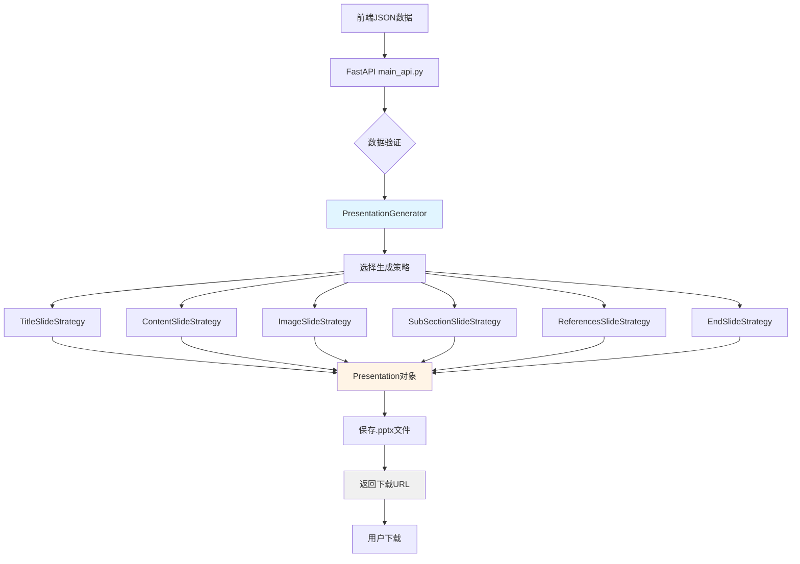
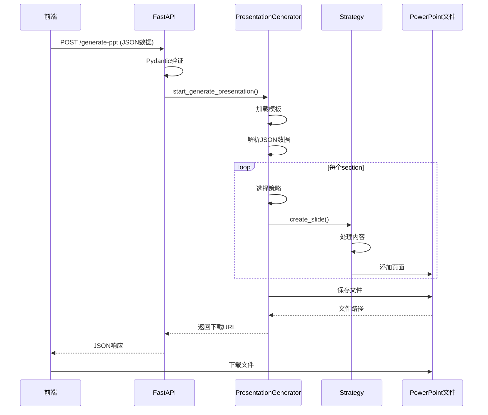

# save_ppt 模块详解

## 📋 目录
- [模块概述](#模块概述)
- [核心功能](#核心功能)
- [技术架构](#技术架构)
- [目录结构](#目录结构)
- [核心组件解析](#核心组件解析)
- [生成策略](#生成策略)
- [工作流程](#工作流程)
- [配置说明](#配置说明)
- [使用方法](#使用方法)
- [数据格式](#数据格式)
- [常见问题](#常见问题)

---

## 模块概述

**save_ppt** 是 MultiAgentPPT 项目中的 **PPT文件生成和下载服务**，负责将前端生成的JSON格式PPT内容渲染到PowerPoint母版中，生成可下载的.pptx文件。

### 特点
- ✅ **母版渲染**：使用预定义的PPT母版模板
- ✅ **智能布局**：根据内容自动选择合适的布局
- ✅ **图片处理**：自动下载和插入网络图片
- ✅ **文本自适应**：自动调整字体大小以适应文本框
- ✅ **占位符管理**：基于母版占位符的精确控制
- ✅ **多页面支持**：支持标题页、内容页、图片页等多种页面类型

### 适用场景
- 生成最终可编辑的PPT文件
- 需要统一企业PPT模板
- 需要高质量输出格式
- 用户下载和分享

---

## 核心功能

| 功能 | 说明 |
|-----|------|
| **PPT文件生成** | 将JSON数据转换为.pptx文件 |
| **母版模板应用** | 使用预定义的PPT母版 |
| **智能布局选择** | 根据内容类型选择合适的页面布局 |
| **图片处理** | 下载网络图片并插入到PPT |
| **文本优化** | 自动调整字体大小和文本框 |
| **文件管理** | 生成并提供下载链接 |

---

## 技术架构

### 技术栈
```yaml
框架: FastAPI
PPT库: python-pptx
图片处理: PIL (Pillow)
HTTP客户端: requests
输出格式: .pptx (PowerPoint)
模板: ppt_template_0717.pptx
```

### 架构图



---

## 目录结构

```
save_ppt/
├── README.md                  # 使用说明文档
├── main_api.py               # FastAPI主入口 (端口10021)
├── ppt_generator.py          # PPT生成器核心逻辑
├── look_master.py            # 查看母版占位符工具
├── test_api.py               # API测试文件
├── ppt_template_0717.pptx    # PPT母版模板
├── requirements.txt          # Python依赖
└── output_ppts/              # 生成的PPT文件目录
```

---

## 核心组件解析

### 1. 配置类 (SlideConfig)

**布局配置**：
```python
SLIDE_LAYOUTS = {
    "TITLE_PAGE": 0,                      # 标题页
    "CONTENT_TITLE_AND_TEXT": 1,          # 内容页
    "TABLE_OF_CONTENTS_3_ITEMS": 30,      # 目录页3项
    "TABLE_OF_CONTENTS_4_ITEMS_A": 23,    # 目录页4项A
    "TABLE_OF_CONTENTS_5_ITEMS_A": 25,    # 目录页5项A
    "IMAGE_TITLE_AND_DESCRIPTION_WIDE": 9, # 横向图片页
    "IMAGE_TITLE_AND_DESCRIPTION_TALL": 7, # 纵向图片页
    "IMAGE_ONLY": 14,                     # 纯图片页
    "REFERENCES_PAGE": 10,                # 参考文献页
    "END_PAGE": 11,                       # 结束页
    "SUBCHAPTER_2_ITEMS": 15,             # 子章节2项
    "SUBCHAPTER_3_ITEMS": 16,             # 子章节3项
    "SUBCHAPTER_4_ITEMS": 17,             # 子章节4项
    "SUBCHAPTER_5_ITEMS": 10,             # 子章节5项
}
```

**形状ID配置**：
```python
SHAPE_IDS = {
    # 标题页
    "TITLE_PAGE_TITLE": 2,
    "TITLE_PAGE_DATE": 9,

    # 目录页
    "TOC_TITLE": 1,
    "TOC_ITEMS": {1: 2, 2: 3, 3: 4, 4: 5, 5: 6, 6: 7},

    # 内容页
    "CONTENT_TITLE": 2,
    "CONTENT_TEXT": 3,
    "CONTENT_TEXT_LAYOUT1_4": 4,

    # 图片页
    "IMAGE_PLACEHOLDER": 3,
    "IMAGE_TITLE": 2,
    "IMAGE_DESCRIPTION": 4,

    # 参考文献页
    "REFERENCES_TITLE": 2,
    "REFERENCES": [
        {"num": 3, "text": 8},
        {"num": 4, "text": 9},
        # ...
    ],
}
```

### 2. 文本处理器 (TextProcessor)

**功能方法**：

```python
class TextProcessor:
    @staticmethod
    def remove_html_tags(text: str) -> str:
        """去除HTML标签"""
        clean = re.sub(r'<.*?>', '', text)
        return clean.strip()

    @staticmethod
    def calculate_optimal_font_size(text: str, shape, font_type: str) -> int:
        """根据文本长度和文本框大小计算最佳字体大小"""
        # 智能计算字体大小

    @staticmethod
    def truncate_text(text: str, max_chars: int) -> str:
        """截断过长的文本"""

    @staticmethod
    def split_text_into_chunks(content: str, max_chars: int) -> List[str]:
        """将长文本分割成块"""
```

### 3. 幻灯片策略基类 (SlideStrategy)

**抽象基类**：
```python
class SlideStrategy(ABC):
    def __init__(self, presentation: Presentation, config: SlideConfig):
        self.presentation = presentation
        self.config = config
        self.text_processor = TextProcessor()
        self.slide_counter = 0

    @abstractmethod
    def create_slide(self, *args, **kwargs):
        """创建幻灯片的抽象方法"""
        pass
```

**公共方法**：
```python
def _log_slide_shapes(self, slide, slide_type: str):
    """记录幻灯片上所有形状的详细信息"""

def _get_slide_layout(self, layout_key: str):
    """获取幻灯片布局"""

def _add_text_with_auto_fit(
    self, slide, shape_id: int, text: str,
    font_type: str = "content", max_chars: Optional[int] = None
):
    """添加文本并自动调整字体大小"""

def _fill_empty_placeholders(self, slide):
    """移除空占位符"""
```

---

## 生成策略

### 1. TitleSlideStrategy（标题页策略）

**布局**：`TITLE_PAGE` (ID: 0)

**内容元素**：
- 标题 (SHAPE_ID: 2)
- 日期 (SHAPE_ID: 9)

**示例**：
```python
strategy = TitleSlideStrategy(presentation, config)
strategy.create_slide("特斯拉汽车调研")
```

**输出效果**：
- 居中大标题
- 当前日期
- 简洁的封面页

### 2. ContentSlideStrategy（内容页策略）

**布局选择**：
- 内容 < 150字符：`TEXT_ONLY_SMALL_TITLE`
- 内容 ≥ 150字符：`CONTENT_TITLE_AND_TEXT`

**内容元素**：
- 标题 (SHAPE_ID: 2)
- 正文 (SHAPE_ID: 3 或 4)

**文本分页**：
- 每页最多 800 字符
- 自动按句子分割
- 支持"(续 N)"标记

**示例**：
```python
strategy = ContentSlideStrategy(presentation, config)
strategy.create_slide("市场分析", "全球电动汽车销量持续增长...")
```

### 3. ImageSlideStrategy（图片页策略）

**布局选择**：
- 有描述 + 横向图片：`IMAGE_TITLE_AND_DESCRIPTION_WIDE`
- 有描述 + 纵向图片：`IMAGE_TITLE_AND_DESCRIPTION_TALL`
- 无描述：`IMAGE_ONLY`

**内容元素**：
- 图片占位符 (SHAPE_ID: 3)
- 标题 (SHAPE_ID: 2)
- 描述 (SHAPE_ID: 4)

**图片处理**：
```python
# 1. URL验证
def _is_valid_image_url(self, url: str) -> bool:
    return any(url.startswith(prefix) for prefix in ["http", "https"])

# 2. 图片下载
def _download_image(self, image_url: str) -> Optional[BytesIO]:
    response = requests.get(image_url, timeout=10)
    return BytesIO(response.content)

# 3. 图片插入
def _insert_image_into_placeholder(self, slide, img_stream: BytesIO, placeholder_shape_id: int):
    # 自动缩放和居中
```

**示例**：
```python
strategy = ImageSlideStrategy(presentation, config)
strategy.create_slide({
    "url": "https://example.com/image.jpg",
    "alt": "电动汽车销量图"
}, "市场概况")
```

### 4. SubSectionSlideStrategy（子章节策略）

**布局选择**：
- 1项：`TEXT_ONLY_SMALL_TITLE`
- 2项：`SUBCHAPTER_2_ITEMS`
- 3项：`SUBCHAPTER_3_ITEMS`
- 4项：`SUBCHAPTER_4_ITEMS`
- 5项：`SUBCHAPTER_5_ITEMS`

**内容元素**：
- 章节标题 (SHAPE_ID: 5)
- 子项（1-5个）

**数据格式**：
```python
sub_section_content = [
    {"summary": "研究主题", "detail": "详细内容..."},
    {"summary": "技术突破", "detail": "详细内容..."},
    {"summary": "市场影响", "detail": "详细内容..."}
]

strategy = SubSectionSlideStrategy(presentation, config)
strategy.create_slide("技术发展", sub_section_content)
```

### 5. TableOfContentsSlideStrategy（目录页策略）

**布局选择**：
- 3项：`TABLE_OF_CONTENTS_3_ITEMS`
- 4项：`TABLE_OF_CONTENTS_4_ITEMS_A` 或 `B` (随机)
- 5项：`TABLE_OF_CONTENTS_5_ITEMS_A` 或 `B` (随机)
- 其他：`TABLE_OF_CONTENTS_GENERIC`

**内容元素**：
- 目录标题 (SHAPE_ID: 1)
- 目录项 (SHAPE_ID: 2-7)

**示例**：
```python
toc_items = ["电动汽车概述", "技术发展", "市场分析", "未来展望"]
strategy = TableOfContentsSlideStrategy(presentation, config)
strategy.create_slide(toc_items)
```

### 6. ReferencesSlideStrategy（参考文献策略）

**布局**：`REFERENCES_PAGE` (ID: 10)

**内容元素**：
- 标题 (SHAPE_ID: 2)
- 参考文献（每页最多5条）

**分页处理**：
- 总参考文献最多10条
- 每页最多5条
- 自动分页

**示例**：
```python
references = [
    "IEA Global EV Outlook 2025",
    "Bloomberg NEF Electric Vehicle Outlook",
    # ...
]
strategy = ReferencesSlideStrategy(presentation, config)
strategy.create_slide(references)
```

### 7. EndSlideStrategy（结束页策略）

**布局**：`END_PAGE` (ID: 11)

**内容**：
- 固定设计的结束页
- 无需额外内容

---

## 工作流程



**详细步骤**：

1. **接收请求**：FastAPI接收前端JSON数据
2. **数据验证**：使用Pydantic验证数据格式
3. **创建生成器**：初始化PresentationGenerator
4. **加载模板**：加载ppt_template_0717.pptx
5. **解析内容**：解析sections数据
6. **选择策略**：根据内容类型选择对应策略
7. **生成页面**：调用策略的create_slide方法
8. **保存文件**：保存到output_ppts目录
9. **返回URL**：返回下载链接给前端

---

## 配置说明

### 环境变量

```python
# main_api.py中配置
OUTER_IP = "http://127.0.0.1:10021"
```

### 模板配置

**查看母版占位符**：
```bash
python look_master.py
```

输出示例：
```
幻灯片上共有 10 个形状:
  形状 #1: 形状ID: 2, 名称: Title 1, 类型: PLACEHOLDER
  形状 #2: �状状ID: 3, 名称: Content Placeholder 2, ...
```

### 自定义配置

**修改字体大小**：
```python
FONT_SIZES = {
    "title": {"min": 18, "max": 44, "default": 26},
    "content": {"min": 12, "max": 24, "default": 18},
    "small": {"min": 10, "max": 16, "default": 14},
}
```

**修改文本块大小**：
```python
MAX_CHARS_PER_TEXT_CHUNK = 800  # 默认800字符/页
```

---

## 使用方法

### 1. 安装依赖

```bash
cd backend/save_ppt
pip install -r requirements.txt
```

**requirements.txt**：
```text
fastapi
uvicorn
python-pptx
requests
Pillow
pydantic
```

### 2. 启动服务

```bash
python main_api.py
```

服务启动在 `http://localhost:10021`

### 3. API调用

**POST** `/generate-ppt`

**请求体**：
```json
{
  "sections": [
    {
      "id": "slide-1",
      "content": [
        {
          "type": "h1",
          "children": [
            {"text": "特斯拉汽车调研"}
          ]
        },
        {
          "type": "bullets",
          "children": [
            {
              "type": "bullet",
              "children": [
                {
                  "type": "h3",
                  "children": [{"text": "市场分析"}]
                },
                {
                  "type": "p",
                  "children": [{"text": "全球电动汽车销量持续增长"}]
                }
              ]
            }
          ]
        }
      ],
      "rootImage": {
        "url": "https://example.com/image.jpg",
        "alt": "特斯拉图片",
        "background": false
      },
      "layoutType": "vertical"
    }
  ],
  "references": [
    "IEA Global EV Outlook 2025"
  ]
}
```

**响应**：
```json
{
  "message": "PPT generated successfully",
  "ppt_url": "http://localhost:10021/static_ppts/特斯拉汽车调研.pptx"
}
```

### 4. Python客户端

```python
import httpx
import json

async def generate_ppt():
    url = "http://localhost:10021/generate-ppt"

    # 读取测试数据
    with open("test_api.py", "r", encoding="utf-8") as f:
        test_data = json.load(f)

    async with httpx.AsyncClient() as client:
        response = await client.post(url, json=test_data)
        result = response.json()

        print(f"PPT生成成功: {result['ppt_url']}")

        # 下载PPT
        ppt_response = await client.get(result['ppt_url'])
        with open("output.pptx", "wb") as f:
            f.write(ppt_response.content)

# 运行
import asyncio
asyncio.run(generate_ppt())
```

---

## 数据格式

### 1. Section数据结构

```json
{
  "id": "unique-slide-id",
  "content": [
    {
      "type": "h1",
      "children": [{"text": "标题文本"}]
    },
    {
      "type": "p",
      "children": [{"text": "段落内容"}]
    },
    {
      "type": "bullets",
      "children": [
        {
          "type": "bullet",
          "children": [
            {"type": "h3", "children": [{"text": "小标题"}]},
            {"type": "p", "children": [{"text": "详细内容"}]}
          ]
        }
      ]
    }
  ],
  "rootImage": {
    "url": "https://example.com/image.jpg",
    "alt": "图片描述",
    "query": "搜索关键词",
    "background": false
  },
  "layoutType": "vertical"
}
```

### 2. ContentBlock类型

| Type | 说明 | Children |
|------|------|----------|
| `h1` | 一级标题 | text对象 |
| `h3` | 三级标题 | text对象 |
| `p` | 段落 | text对象 |
| `bullets` | 项目列表 | bullet对象 |
| `bullet` | 项目项 | h3 + p |

### 3. RootImage属性

| 属性 | 类型 | 说明 |
|-----|------|------|
| `url` | string | 图片URL（必须以http/https开头） |
| `alt` | string | 图片描述文字 |
| `query` | string | DIO搜索关键词（可选） |
| `background` | boolean | 是否为背景图（true时不单独创建图片页） |

---

## 常见问题

### Q1: 如何自定义PPT模板？

**A**:
1. 使用PowerPoint打开`ppt_template_0717.pptx`
2. 修改母版布局
3. 运行`python look_master.py`查看新的占位符ID
4. 更新`SlideConfig`中的配置

### Q2: 图片下载失败？

**A**: 检查：
1. 图片URL是否可访问
2. 网络连接是否正常
3. URL格式是否正确
4. 超时设置（默认10秒）

**解决方法**：
```python
# 增加超时时间
response = requests.get(image_url, timeout=30)
```

### Q3: 文本显示不全？

**A**:
1. 检查文本长度是否超过800字符
2. 文本会自动分页，标记"(续 N)"
3. 可以调整`MAX_CHARS_PER_TEXT_CHUNK`

### Q4: 如何修改字体？

**A**: 修改代码中的字体设置：

```python
# 设置中文字体
from pptx.oxml.ns import nsmap
element.set('{%s}latin' % nsmap('a'), 'Calibri')
element.set('{%s}ea' % nsmap('a'), '微软雅黑')
element.set('{%s}cs' % nsmap('a'), '微软雅黑')
```

### Q5: 如何添加自定义布局？

**A**:
1. 在PPT模板中创建新布局
2. 记录布局ID
3. 添加到`SLIDE_LAYOUTS`
4. 创建新的Strategy类

**示例**：
```python
# 1. 添加布局
SLIDE_LAYOUTS = {
    "CUSTOM_LAYOUT": 12,  # 新布局ID
}

# 2. 创建策略
class CustomSlideStrategy(SlideStrategy):
    def create_slide(self, title: str, custom_content: str):
        slide_layout = self._get_slide_layout("CUSTOM_LAYOUT")
        slide = self.presentation.slides.add_slide(slide_layout)
        # ... 添加内容

# 3. 注册到生成器
self.strategies["custom"] = CustomSlideStrategy(self.presentation, self.config)
```

### Q6: 如何调试生成过程？

**A**: 启用DEBUG日志：

```python
logging.basicConfig(
    level=logging.DEBUG,  # 改为DEBUG
    format='%(asctime)s - %(name)s - %(levelname)s - %(message)s'
)
```

查看详细日志：
- 形状信息
- 文本处理
- 图片下载
- 页面生成

### Q7: 生成的PPT过大？

**A**: 优化图片：
1. 压缩图片大小
2. 使用WebP格式
3. 限制图片分辨率

**示例**：
```python
def _optimize_image(self, img_stream: BytesIO, max_size: tuple = (1920, 1080)):
    img = Image.open(img_stream)
    img.thumbnail(max_size, Image.Resampling.LANCZOS)
    optimized = BytesIO()
    img.save(optimized, format="JPEG", quality=85)
    optimized.seek(0)
    return optimized
```

---

## 相关模块

- **simplePPT**: 生成JSON格式PPT内容
- **slide_agent**: 多Agent并发生成PPT内容
- **ppt_api**: PPT内容生成API

---

## 总结

save_ppt是MultiAgentPPT项目的最终输出模块，负责将JSON格式的PPT内容转换为可编辑的PowerPoint文件。它使用python-pptx库和预定义的母版模板，通过策略模式实现不同类型页面的生成。

**主要优势**：
- 使用母版模板，统一视觉风格
- 智能布局选择
- 自动文本优化
- 图片自动处理
- 详细的日志输出

**使用建议**：
- 自定义企业PPT模板
- 生成高质量输出文件
- 用于最终交付和分享
- 结合前端预览使用
