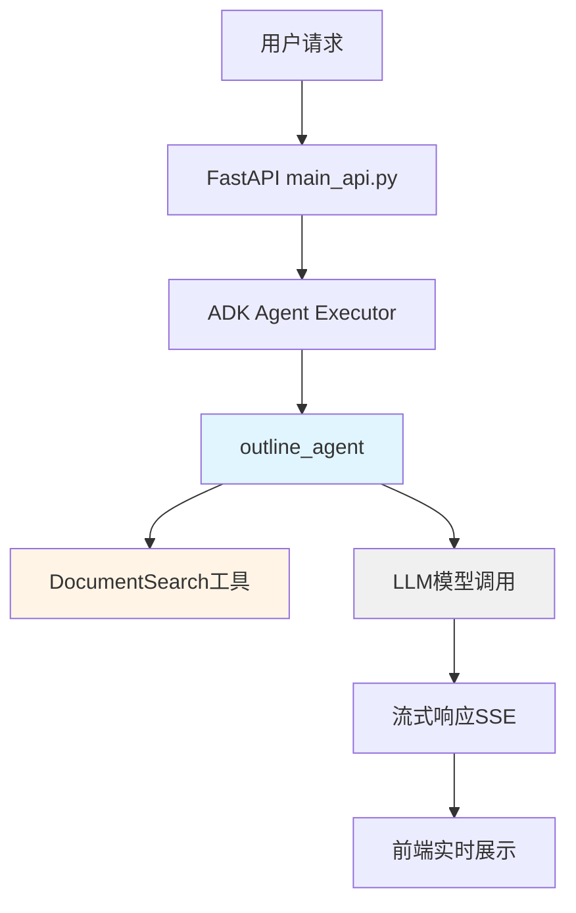
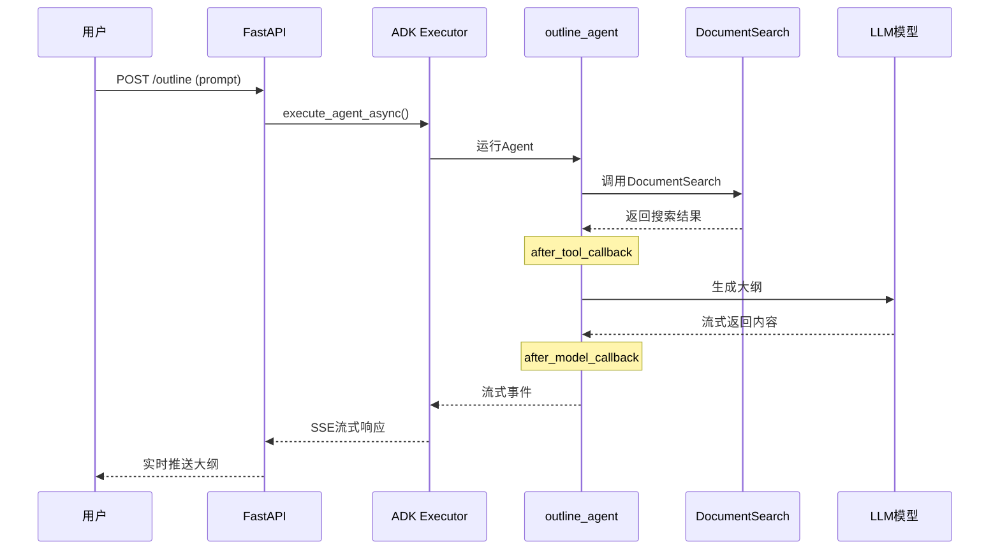

# simpleOutline 模块详解

## 📋 目录
- [模块概述](#模块概述)
- [核心功能](#核心功能)
- [技术架构](#技术架构)
- [目录结构](#目录结构)
- [核心组件解析](#核心组件解析)
- [工作流程](#工作流程)
- [配置说明](#配置说明)
- [使用方法](#使用方法)
- [API接口](#api接口)
- [数据流动](#数据流动)
- [常见问题](#常见问题)

---

## 模块概述

**simpleOutline** 是 MultiAgentPPT 项目中的简化版大纲生成服务，负责根据用户输入的主题生成结构化的演示文稿大纲。

### 特点
- ✅ **简单高效**：无外部检索依赖，快速生成大纲
- ✅ **流式输出**：支持SSE实时流式返回
- ✅ **A2A + ADK集成**：结合Google ADK框架
- ✅ **Metadata支持**：支持元数据传递
- ✅ **工具调用**：集成DocumentSearch工具

### 适用场景
- 快速生成演示文稿大纲
- 不需要外部检索的场景
- 测试和开发环境

---

## 核心功能

| 功能 | 说明 |
|-----|------|
| **大纲生成** | 根据用户主题自动生成结构化大纲 |
| **工具集成** | 内置DocumentSearch工具用于关键词搜索 |
| **流式响应** | 通过SSE实时推送生成内容 |
| **Metadata传递** | 支持从请求到响应的元数据传递 |
| **回调机制** | 提供before/after模型和工具回调 |

---

## 技术架构

### 技术栈
```yaml
框架: FastAPI + A2A + Google ADK
LLM接口: LiteLLM (支持多模型)
流式传输: Server-Sent Events (SSE)
模型支持: Google, Claude, OpenAI, DeepSeek, Ali
```

### 架构图



---

## 目录结构

```
simpleOutline/
├── README.md                  # 使用说明文档
├── main_api.py               # FastAPI服务入口 (端口10001)
├── a2a_client.py             # A2A客户端封装
├── adk_agent_executor.py     # ADK Agent执行器
├── agent.py                  # Agent定义和配置
├── create_model.py           # 模型创建工厂
├── tools.py                  # 工具函数定义
├── env_template              # 环境变量模板
└── .env                      # 环境变量配置文件
```

---

## 核心组件解析

### 1. Agent定义 (agent.py)

**核心Agent配置**：
```python
root_agent = Agent(
    name="outline_agent",
    model=model,
    description="generate outline",
    instruction=instruction,  # 大纲生成指令
    tools=[DocumentSearch],   # 集成搜索工具
    before_model_callback=before_model_callback,
    after_model_callback=after_model_callback,
    after_tool_callback=after_tool_callback,
)
```

**Prompt指令**：
```python
instruction = """
根据用户的描述生成大纲。首先使用DocumentSearch进行一些关键词搜索，
然后按下面的格式生成大纲，仅生成大纲即可，无需多余说明。

# 第一部分主题
- 关于该主题的关键要点
- 另一个重要方面

# 第二部分主题
- 本部分的主要见解
- 支持性细节或示例
"""
```

### 2. 模型创建 (create_model.py)

支持多种LLM提供商：

| Provider | 模型格式 | API Key环境变量 |
|----------|---------|----------------|
| google | 直接使用模型名 | `GOOGLE_API_KEY` |
| claude | `anthropic/`前缀 | `CLAUDE_API_KEY` |
| openai | `openai/`前缀 | `OPENAI_API_KEY` |
| deepseek | `openai/`前缀 | `DEEPSEEK_API_KEY` |
| ali | `openai/`前缀 | `ALI_API_KEY` |

**示例代码**：
```python
def create_model(model: str, provider: str):
    if provider == "google":
        return model  # 直接使用模型名
    elif provider == "deepseek":
        return LiteLlm(
            model="openai/" + model,
            api_key=os.environ.get("DEEPSEEK_API_KEY"),
            api_base="https://api.deepseek.com/v1"
        )
    # ... 其他provider处理
```

### 3. 工具定义 (tools.py)

**DocumentSearch工具**：
- 功能：根据关键词搜索文档
- 参数：
  - `keyword`: 搜索关键词
  - `number`: 返回文档数量
- 返回：匹配的文档内容

### 4. 回调机制

**before_model_callback**：
```python
def before_model_callback(callback_context: CallbackContext, llm_request: LlmRequest):
    agent_name = callback_context.agent_name
    history_length = len(llm_request.contents)
    metadata = callback_context.state.get("metadata")
    print(f"调用{agent_name}模型前，历史记录{history_length}条，metadata: {metadata}")
    return None  # 继续调用LLM
```

**after_model_callback**：
```python
def after_model_callback(callback_context: CallbackContext, llm_response: LlmResponse):
    agent_name = callback_context.agent_name
    response_parts = llm_response.content.parts
    metadata = callback_context.state.get("metadata")
    print(f"调用{agent_name}模型后，metadata: {metadata}")
    return None
```

**after_tool_callback**：
```python
def after_tool_callback(tool, args, tool_context, tool_response):
    tool_name = tool.name
    print(f"调用{tool_name}工具后，返回: {tool_response}")
    return None
```

---

## 工作流程



---

## 配置说明

### 环境变量配置

从模板复制配置文件：
```bash
cp env_template .env
```

**必要环境变量**：
```env
# 模型配置
MODEL_PROVIDER=deepseek
LLM_MODEL=deepseek-chat

# API密钥 (根据选择的provider配置)
GOOGLE_API_KEY=your_google_api_key
CLAUDE_API_KEY=your_claude_api_key
OPENAI_API_KEY=your_openai_api_key
DEEPSEEK_API_KEY=your_deepseek_api_key
ALI_API_KEY=your_ali_api_key
```

### 模型选择建议

| 场景 | 推荐模型 | 说明 |
|-----|---------|------|
| 测试开发 | `deepseek-chat` | 成本低，速度快 |
| 生产环境 | `gpt-4o` | 质量高，稳定 |
| 中文优化 | `claude-3-5-sonnet-20241022` | 中文理解好 |
| 快速响应 | `gemini-1.5-flash` | 速度最快 |

---

## 使用方法

### 1. 启动服务

```bash
cd backend/simpleOutline
python main_api.py
```

服务启动在 `http://localhost:10001`

### 2. 测试客户端

```bash
python a2a_client.py
```

### 3. API调用示例

**请求格式**：
```json
{
  "user_id": "test_user",
  "session_id": "test_session",
  "message": {
    "role": "user",
    "parts": [
      {
        "type": "text",
        "text": "电动汽车发展概述"
      }
    ]
  }
}
```

**响应格式**：
```json
{
  "id": "uuid",
  "jsonrpc": "2.0",
  "result": {
    "contextId": "uuid",
    "final": false,
    "kind": "status-update",
    "status": {
      "state": "working"
    },
    "taskId": "uuid"
  }
}
```

---

## API接口

### POST /outline

生成大纲的主接口。

**请求头**：
```
Content-Type: application/json
```

**请求体**：
```json
{
  "user_id": "string",
  "session_id": "string",
  "message": {
    "role": "user",
    "parts": [
      {
        "type": "text",
        "text": "主题内容"
      }
    ]
  },
  "metadata": {
    "key": "value"
  }
}
```

**响应**：SSE流式响应

**事件类型**：
- `status-update`: 状态更新 (submitted/working/completed)
- `artifact-update`: 内容更新

---

## 数据流动

### Metadata传递流程

```
1. a2a_client.py (payload携带metadata)
   ↓
2. adk_agent_executor.py (context.message.metadata获取)
   ↓
3. _upsert_session (存入state["metadata"])
   ↓
4. agent.py before_model_callback (callback_context.state.get("metadata"))
   ↓
5. 工具调用 (tool_context.state.get("metadata"))
   ↓
6. 工具更新metadata (metadata["tool_document_ids"] = ids)
   ↓
7. agent.py after_model_callback (获取更新后的metadata)
   ↓
8. adk_agent_executor.py (final_session.state获取最终结果)
   ↓
9. 客户端接收 (artifact.metadata)
```

### 数据示例

**输入Metadata**：
```json
{
  "language": "chinese",
  "user_id": "test_user"
}
```

**工具增强后的Metadata**：
```json
{
  "language": "chinese",
  "user_id": "test_user",
  "tool_document_ids": [0, 1, 2, 3]
}
```

---

## 常见问题

### Q1: 如何切换模型？

**A**: 修改 `.env` 文件：
```env
MODEL_PROVIDER=claude
LLM_MODEL=claude-3-5-sonnet-20241022
CLAUDE_API_KEY=your_key
```

### Q2: Metadata不生效？

**A**: 检查以下几点：
1. payload中是否包含metadata字段
2. adk_agent_executor.py中是否正确传递到session state
3. agent callback中是否正确获取

### Q3: 工具调用失败？

**A**: 检查：
1. tools.py中工具是否正确定义
2. agent.py中tools参数是否包含工具
3. 工具参数类型是否匹配

### Q4: 流式输出卡住？

**A**: 可能原因：
1. 网络连接问题
2. LLM API限流
3. 前端SSE处理不当

解决方法：
- 检查网络连接
- 添加重试机制
- 优化前端SSE处理逻辑

### Q5: 与slide_outline的区别？

**A**:

| 特性 | simpleOutline | slide_outline |
|-----|---------------|---------------|
| 外部检索 | ❌ | ✅ (MCP工具) |
| 复杂度 | 简单 | 高 |
| 适用场景 | 快速生成 | 高质量大纲 |
| 依赖 | 少 | 需启动MCP服务 |

---

## 相关模块

- **slide_outline**: 带MCP检索的高级大纲生成
- **simplePPT**: 简单PPT内容生成
- **slide_agent**: 完整的多Agent PPT生成系统

---

## 总结

simpleOutline是一个轻量级的大纲生成服务，适合快速生成演示文稿大纲的场景。它采用简单的Agent架构，集成DocumentSearch工具，支持流式输出和Metadata传递，是MultiAgentPPT项目的基础组件之一。

**主要优势**：
- 快速启动，依赖少
- 支持多种LLM模型
- 流式输出体验好
- 易于测试和调试

**使用建议**：
- 开发测试环境首选
- 需要快速响应时使用
- 作为学习Agent架构的入门模块
