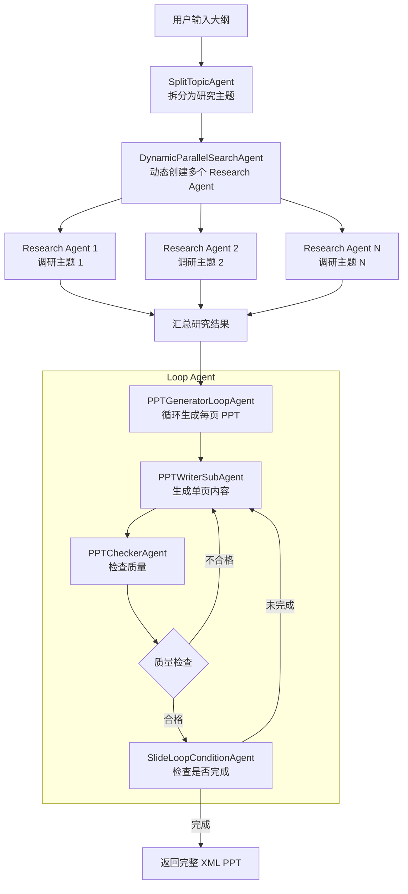

# slide_agent 模块详解

## 📋 目录

- [模块概述](#模块概述)
- [目录结构](#目录结构)
- [核心功能](#核心功能)
- [文件详解](#文件详解)
- [工作流程](#工作流程)
- [配置说明](#配置说明)
- [使用示例](#使用示例)
- [技术栈](#技术栈)
- [与其他模块的对比](#与其他模块的对比)
- [常见问题](#常见问题)

---

## 模块概述

### 功能定位

`slide_agent` 是 **MultiAgentPPT 项目中最核心的多智能体协作模块**，实现了从内容大纲到完整 PPT 的自动化生成流程。与 `simplePPT` 不同，本模块采用了复杂的多 Agent 协作架构，支持并发处理和流式输出。

### 核心特性

| 特性 | 说明 |
|------|------|
| **多 Agent 协作** | 三个专门的 Agent 协同工作：拆分、调研、生成 |
| **并行处理** | Research Agent 并发执行，大幅提升效率 |
| **循环生成** | 使用 LoopAgent 逐页生成 PPT，避免 token 限制 |
| **质量检查** | 内置 PPTChecker Agent，最多重试 3 次确保质量 |
| **流式输出** | 支持 SSE 实时推送生成进度到前端 |
| **动态 Agent 创建** | 根据大纲内容动态创建并行的研究 Agent |
| **多种 LLM 支持** | 支持 Google、Claude、OpenAI、DeepSeek、阿里云等 |

### 与其他模块的对比

| 模块 | Agent 数量 | 并发处理 | 外部检索 | 适用场景 |
|------|-----------|---------|---------|---------|
| **simplePPT** | 单 Agent | ❌ | ❌ | 简单测试、快速原型 |
| **simpleOutline** | 单 Agent | ❌ | ❌ | 简单大纲生成 |
| **slide_outline** | 单 Agent + MCP | ❌ | ✅ | 高质量大纲生成 |
| **slide_agent** | 多 Agent 协作 | ✅ | ✅ | 生产级 PPT 生成 |

---

## 目录结构

```
backend/slide_agent/
├── README.md                    # 模块使用说明
├── __init__.py                  # 包初始化
├── main.py                      # 本地测试入口
├── main_api.py                  # API 服务入口（端口 10011）
├── a2a_client.py                # 客户端测试代码
├── adk_agent_executor.py        # ADK 与 A2A 框架集成
├── env_template                 # 环境变量模板
├── api.log                      # API 运行日志
│
└── slide_agent/                 # 核心 Agent 逻辑
    ├── __init__.py
    ├── agent.py                 # 根 Agent 定义（SequentialAgent）
    ├── agent_utils.py           # 辅助工具函数
    ├── config.py                # Agent 模型配置
    ├── create_model.py          # 模型创建工厂函数
    │
    └── sub_agents/              # 子 Agent 模块
        ├── __init__.py
        ├── split_topic/         # 主题拆分 Agent
        │   ├── agent.py
        │   └── prompt.py
        │
        ├── research_topic/      # 主题调研 Agent（并行）
        │   ├── agent.py         # DynamicParallelSearchAgent
        │   ├── prompt.py
        │   ├── tools.py         # DocumentSearch 工具
        │   └── mcpserver/       # MCP 服务器（暂未使用）
        │       └── research_tool.py
        │
        └── ppt_writer/          # PPT 生成 Agent（循环）
            ├── agent.py         # LoopAgent + Writer + Checker
            ├── prompt.py
            └── tools.py         # SearchImage 工具
```

---

## 核心功能

### 三层 Agent 架构



### 1️⃣ SplitTopicAgent（主题拆分）

**功能**：将用户的大纲拆分为 3-8 个独立的研究主题

**输入**：用户提供的文本大纲

**输出**：JSON 格式的主题列表

```json
{
    "topics": [
        {
            "id": 1,
            "title": "电动汽车的定义和类型",
            "description": "介绍 BEV、PHEV、HEV 等不同类型的区别",
            "keywords": ["BEV", "PHEV", "HEV", "分类"],
            "research_focus": "各类电动车的技术特点和应用场景"
        }
    ]
}
```

### 2️⃣ DynamicParallelSearchAgent（并行调研）

**功能**：根据主题数量，动态创建多个 Research Agent 并行执行

**特点**：
- 动态 Agent 创建：根据 JSON 中的 topics 数量自动创建对应数量的 Agent
- 并发执行：所有 Research Agent 同时工作
- 工具调用：每个 Agent 使用 `DocumentSearch` 工具检索资料

**关键实现**：

```python
class DynamicParallelSearchAgent(ParallelAgent):
    async def _run_async_impl(self, ctx: InvocationContext):
        # 1. 解析上个 Agent 输出的 JSON
        topics_data = json.loads(topics_output)
        topic_list = topics_data.get("topics", [])

        # 2. 动态创建 Agent
        for topic in topic_list:
            new_research_agent = Agent(
                name=f"research_agent_{topic_id}",
                instruction=custom_instruction,
                tools=[DocumentSearch]
            )
            dynamic_sub_agents.append(new_research_agent)

        # 3. 并行运行
        async for event in _merge_agent_run(agent_runs):
            yield event
```

### 3️⃣ PPTGeneratorLoopAgent（循环生成）

**功能**：逐页生成 PPT 内容，并进行质量检查

**子 Agent 结构**：

```
LoopAgent (max_iterations=100)
├── PPTWriterSubAgent    - 生成单页 XML 内容
├── PPTCheckerAgent      - 检查生成质量
└── SlideLoopConditionAgent - 判断是否继续循环
```

**生成逻辑**：

1. **Writer Agent** 生成第 N 页内容
2. **Checker Agent** 检查质量：
   - 格式是否规范？
   - 内容是否完整？
   - 图片是否重复？
   - 语言是否正确？
3. **检查通过**：进入下一页
4. **检查失败**（最多重试 3 次）：
   - 将 `current_slide_index` 减 1
   - 重新调用 Writer Agent 生成
5. **全部完成**：返回完整 XML PPT

---

## 文件详解

### 主入口文件

#### 📄 `main_api.py`

**功能**：启动 FastAPI/Uvicorn 服务器，提供 HTTP/SSE 接口

**关键代码**：

```python
@click.command()
@click.option("--host", "host", default="localhost")
@click.option("--port", "port", default=10011)
def main(host, port):
    # Agent 卡片配置
    agent_card = AgentCard(
        name="Writter PPT Agent",
        description="An agent that can help writer medical ppt",
        capabilities=AgentCapabilities(streaming=True),
        skills=[skill],
    )

    # 初始化 Runner
    runner = Runner(
        app_name=agent_card.name,
        agent=root_agent,  # 来自 slide_agent.agent
        artifact_service=InMemoryArtifactService(),
        session_service=InMemorySessionService(),
        memory_service=InMemoryMemoryService(),
    )

    # 启动服务
    uvicorn.run(app, host=host, port=port)
```

**配置说明**：

- **端口**：默认 `10011`（与 simplePPT 冲突，需关闭其中一个）
- **流式输出**：Agent 层面流式，但 LLM 非流式（避免 JSON 解析问题）
- **show_agent**：`["PPTWriterSubAgent"]` - 指定前端显示的 Agent

#### 📄 `main.py`

**功能**：本地测试入口，直接运行 Agent 流程

```python
async def run_workflow(outline: str):
    session = await runner.session_service.create_session(
        user_id="user1",
        session_id="session1",
        state={'outline': outline}
    )

    async for event in runner.run_async(
        user_id="user1",
        session_id="session1",
        new_message=message_content
    ):
        event_out = parse_event(event)
        print(event_out)
```

#### 📄 `a2a_client.py`

**功能**：客户端测试代码，演示如何调用 API

```python
async def httpx_client():
    client = await A2AClient.get_client_from_agent_card_url(
        httpx_client, 'http://localhost:10011'
    )

    streaming_request = SendStreamingMessageRequest(
        id=request_id,
        params=MessageSendParams(**send_message_payload)
    )

    async for chunk in client.send_message_streaming(streaming_request):
        print(chunk.model_dump(mode='json'))
```

### 核心 Agent 逻辑

#### 📄 `slide_agent/agent.py`

**功能**：定义根 Agent，组织整个流程

```python
root_agent = SequentialAgent(
    name="WritingSystemAgent",
    description="多Agent写作系统的总协调器",
    sub_agents=[
        split_topic_agent,        # 步骤 1：拆分主题
        parallel_search_agent,    # 步骤 2：并行调研
        ppt_generator_loop_agent  # 步骤 3：循环生成 PPT
    ],
    before_agent_callback=before_agent_callback,
)
```

**回调函数**：

```python
def before_agent_callback(callback_context: CallbackContext):
    """在调用 LLM 前提取 metadata"""
    metadata = callback_context.state.get("metadata", {})
    slides_plan_num = metadata.get("numSlides", 10)
    language = metadata.get("language", "EN-US")

    callback_context.state["slides_plan_num"] = slides_plan_num
    callback_context.state["language"] = language
```

#### 📄 `slide_agent/config.py`

**功能**：各 Agent 的模型配置

```python
# 拆分主题 Agent 配置
SPLIT_TOPIC_AGENT_CONFIG = {
    "provider": "deepseek",
    "model": "deepseek-chat",
}

# 调研 Agent 配置
TOPIC_RESEARCH_AGENT_CONFIG = {
    "provider": "deepseek",
    "model": "deepseek-chat",
}

# PPT 生成 Agent 配置
PPT_WRITER_AGENT_CONFIG = {
    "provider": "deepseek",
    "model": "deepseek-chat",
}

# 质量检查 Agent 配置
PPT_CHECKER_AGENT_CONFIG = {
    "provider": "deepseek",
    "model": "deepseek-chat",
}
```

#### 📄 `slide_agent/create_model.py`

**功能**：统一的模型创建工厂函数

**支持的提供商**：

| Provider | 模型示例 | 说明 |
|----------|---------|------|
| `google` | `gemini-2.0-flash` | 直接返回模型名 |
| `claude` | `claude-3-5-sonnet-20241022` | 使用 `anthropic/` 前缀 |
| `openai` | `gpt-4` | 使用 `openai/` 前缀 |
| `deepseek` | `deepseek-chat` | 使用 `openai/` 前缀 |
| `ali` | `qwen-plus` | 阿里云通义千问 |
| `local_*` | 本地部署模型 | 连接 `localhost:6688` |

**示例代码**：

```python
def create_model(model: str, provider: str):
    if provider == "google":
        return model
    elif provider == "claude":
        return LiteLlm(
            model="anthropic/" + model,
            api_key=os.environ.get("CLAUDE_API_KEY"),
        )
    elif provider == "deepseek":
        return LiteLlm(
            model="openai/" + model,
            api_key=os.environ.get("DEEPSEEK_API_KEY"),
            api_base="https://api.deepseek.com/v1"
        )
    # ... 其他提供商
```

### 子 Agent 详解

#### 📄 `sub_agents/split_topic/agent.py`

**功能**：拆分大纲为研究主题

**关键代码**：

```python
def my_before_model_callback(callback_context: CallbackContext, llm_request: LlmRequest):
    user_input = callback_context.user_content.parts[0].text
    callback_context.state["outline"] = user_input

    # 将用户输入加入 LLM 请求
    llm_request.contents.append(
        types.Content(role="user", parts=[types.Part(text=user_input)])
    )

split_topic_agent = Agent(
    name="SplitTopicAgent",
    model=create_model(...),
    instruction=prompt.SPLIT_TOPIC_AGENT_PROMPT,
    output_key="split_topics",  # 输出到 state 的 key
    before_model_callback=my_before_model_callback
)
```

#### 📄 `sub_agents/research_topic/agent.py`

**功能**：动态并行 Agent 实现

**核心类**：`DynamicParallelSearchAgent`

**关键实现**：

```python
class DynamicParallelSearchAgent(ParallelAgent):
    async def _run_async_impl(self, ctx: InvocationContext):
        # 1. 获取上个 Agent 的输出
        topics_output = ctx.session.state.get("split_topics", {})
        topics_data = json.loads(topics_output)
        topic_list = topics_data.get("topics", [])

        # 2. 动态创建 Agent
        dynamic_sub_agents = []
        research_output_keys = []

        for topic in topic_list:
            custom_instruction = (
                f"{prompt.RESEARCH_TOPIC_AGENT_PROMPT}\n\n"
                f"Your specific task is to research:\n"
                f"- **Topic Title**: {topic['title']}\n"
                f"- **Description**: {topic['description']}"
            )

            new_agent = Agent(
                name=f"research_agent_{topic['id']}",
                instruction=custom_instruction,
                tools=[DocumentSearch],
                output_key=f"research_agent_{topic['id']}"
            )
            dynamic_sub_agents.append(new_agent)
            research_output_keys.append(f"research_agent_{topic['id']}")

        # 3. 保存输出 key 列表供后续使用
        ctx.session.state["research_output_keys"] = research_output_keys

        # 4. 并行运行
        async for event in _merge_agent_run(agent_runs):
            yield event
```

#### 📄 `sub_agents/ppt_writer/agent.py`

**功能**：PPT 生成循环 Agent

**三个子 Agent**：

1. **PPTWriterSubAgent**：生成单页内容
   ```python
   class PPTWriterSubAgent(LlmAgent):
       async def _run_async_impl(self, ctx: InvocationContext):
           # 第一页添加 XML 开头
           if current_slide_index == 0:
               yield Event(content=types.Content(parts=[types.Part(text="<PRESENTATION>")]))

           # 调用父类生成内容
           async for event in super()._run_async_impl(ctx):
               yield event

           # 最后一页添加 XML 结尾
           if current_slide_index == slides_plan_num - 1:
               yield Event(content=types.Content(parts=[types.Part(text="</PRESENTATION>")]))
   ```

2. **PPTCheckerAgent**：质量检查
   ```python
   class PPTCheckerAgent(LlmAgent):
       async def _run_async_impl(self, ctx: InvocationContext):
           async for event in super()._run_async_impl(ctx):
               result = event.content.parts[0].text.strip()

               if "需要重写" in result:
                   retry_count = rewrite_retry_count_map.get(current_slide_index, 0)
                   if retry_count < 3:
                       # 回退索引，触发重写
                       ctx.session.state["current_slide_index"] = current_slide_index - 1
                       ctx.session.state["rewrite_reason"] = result

               yield event
   ```

3. **SlideLoopConditionAgent**：循环条件判断
   ```python
   class SlideLoopConditionAgent(BaseAgent):
       async def _run_async_impl(self, ctx: InvocationContext):
           if current_slide_index >= slides_plan_num - 1:
               # 完成，退出循环
               yield Event(actions=EventActions(escalate=True))
           else:
               # 继续，索引 +1
               ctx.session.state["current_slide_index"] = current_slide_index + 1
               yield Event(actions=EventActions())
   ```

### 工具函数

#### 📄 `sub_agents/research_topic/tools.py`

**功能**：提供文档搜索工具

```python
async def DocumentSearch(keyword: str, number: int, tool_context: ToolContext):
    """根据关键词搜索文档"""
    result = ""
    for i, doc in enumerate(Documents):
        result += f"# 文档id:{i}\n {doc}\n\n"

    # 保存参考文献
    tool_context.state["references"] = [
        "1. China's Economic Growth Slows...",
        "2. AI Technology Revolutionizing...",
        # ...
    ]
    return result
```

**注意事项**：
- 当前使用模拟数据（`Documents` 列表）
- 生产环境需替换为真实的 RAG 或搜索 API

#### 📄 `sub_agents/ppt_writer/tools.py`

**功能**：提供图片搜索工具

```python
async def SearchImage(query: str, tool_context: ToolContext):
    """根据关键词搜索图片"""
    simulate_images = [
        "https://cdn.pixabay.com/photo/2024/12/18/07/57/aura-9274671_640.jpg",
        "https://cdn.pixabay.com/photo/2024/12/18/15/02/old-9275581_640.jpg",
        # ...
    ]
    return random.choice(simulate_images)
```

**注意事项**：
- 当前返回随机图片
- 生产环境需替换为真实的图片搜索 API（如 Unsplash、Pexels）

### Prompt 模板

#### 📄 `sub_agents/split_topic/prompt.py`

```python
SPLIT_TOPIC_AGENT_PROMPT = """
你是一位专业的主题划分专家。你的任务是：

1. 分析用户提供的写作大纲；
2. 将该大纲划分为3-8个独立的研究主题；
3. 为每个主题提供清晰的研究重点和相关关键词；
4. 确保各主题之间彼此独立，但共同构成一篇完整的文章。

输出格式必须严格为 JSON，不得包含任何额外文本或标记：
```json
{{
    "topics": [
        {{
            "id": 1,
            "title": "主题标题",
            "description": "主题描述",
            "keywords": ["关键词1", "关键词2"],
            "research_focus": "研究重点"
        }}
    ]
}}
```
"""
```

#### 📄 `sub_agents/research_topic/prompt.py`

```python
RESEARCH_TOPIC_AGENT_PROMPT = """
你是一个高效且严谨的知识研究助手，任务是围绕某个具体的知识点进行深入、结构化的研究。

你具备以下工具：
* `DocumentSearch(keyword: str, number: int)`：使用关键词检索相关文档资料。

### 工作流程指引：

1. 理解研究主题
2. 关键词提取与文档检索（不少于10篇）
3. 评估资料有效性
4. 迭代深入探索
5. 结构化展示研究结果
6. 引用来源清晰

### 输出格式要求：

1. 研究主题与子问题拆解
2. 研究方法
3. 结构化研究发现（列表、表格、图像）
4. 总结与结论
5. 参考文献
"""
```

#### 📄 `sub_agents/ppt_writer/prompt.py`

**包含两个 Prompt**：

1. **XML_PPT_AGENT_NEXT_PAGE_PROMPT**：生成单页 PPT

```python
XML_PPT_AGENT_NEXT_PAGE_PROMPT = """
你是一位专业的演示文稿设计专家，正在将研究文档逐页转换为结构化的幻灯片。

### 当前任务页：第 {page_num} 页

### 已有的历史幻灯片（确保不重复）：
{history_slides_xml}

### 统一参考文档：
{research_doc}

### 幻灯片生成格式：
```xml
<SECTION layout="left|right|vertical" page_number=x>
  <H1>页面标题</H1>
  <BULLETS>...</BULLETS>  <!-- 或其他组件 -->
  
</SECTION>
```

### 可选布局组件：
- COLUMNS：比较展示
- BULLETS：列要点
- ICONS：结合图标
- CYCLE：流程循环
- ARROWS：因果流程
- TIMELINE：时间进程
- PYRAMID：层级结构
- STAIRCASE：阶段进阶
- CHART：数据图表
"""
```

2. **CHECKER_AGENT_PROMPT**：检查质量

```python
CHECKER_AGENT_PROMPT = """
你是一位内容审核专家，请对幻灯片内容进行检查：
- 格式是否规范？
- 信息是否完整？
- 表达是否专业？
- 是否与前几页 PPT 图片重复？
- 图片是否是真实图片（非 example.com）？
- 幻灯片语言是否是：{language}？
- 如果是 COLUMNS 格式，不要包含 <ul> 和 <li> 标签

请只输出以下任意一种文字：
1. [当前第x页PPT合格]
2. [当前第x页PPT需要重写]，原因是xxx

已有历史页幻灯片: {history_slides}
当前页幻灯片内容：{slide_to_check}
"""
```

---

## 工作流程

### 完整执行流程

```
1. 用户发送大纲
   ↓
2. before_agent_callback (root_agent)
   - 提取 metadata（numSlides, language）
   - 存储到 state
   ↓
3. SplitTopicAgent 执行
   - before_model_callback: 存储 outline
   - LLM 调用：生成 JSON 格式 topics
   - 输出 → state["split_topics"]
   ↓
4. DynamicParallelSearchAgent 执行
   - 解析 state["split_topics"]
   - 为每个 topic 创建 Research Agent
   - 并行执行所有 Agent
   - 每个输出 → state["research_agent_{id}"]
   - 存储 keys → state["research_output_keys"]
   ↓
5. PPTGeneratorLoopAgent 执行
   - before_agent_callback:
     * 汇总所有 research 输出
     * 初始化重试计数
   ↓
6. 进入循环 (max_iterations=100)
   ├─ PPTWriterSubAgent
   │   - before_agent_callback:
   │     * 获取当前页索引
   │     * 准备 research 文档
   │     * 检查是否有重写原因
   │   - LLM 调用：生成单页 XML
   │   - after_agent_callback:
   │     * 保存到 generated_slides_content
   │   - 第一页添加 <PRESENTATION>
   │   - 最后一页添加 </PRESENTATION>
   │
   ├─ PPTCheckerAgent
   │   - 获取当前页内容
   │   - LLM 调用：检查质量
   │   - 不合格 → 重写（回退索引，最多3次）
   │   - 合格 → 继续
   │
   └─ SlideLoopConditionAgent
       - 检查 current_slide_index >= slides_plan_num - 1
       - 是 → escalate=True（退出循环）
       - 否 → current_slide_index + 1（继续）
   ↓
7. 所有 Agent 完成
   ↓
8. 返回完整 XML PPT 给前端
```

### 状态流转

```python
# 初始状态
state = {
    "metadata": {"numSlides": 10, "language": "中文"}
}

# SplitTopicAgent 后
state["outline"] = "用户输入的大纲"
state["split_topics"] = '{"topics": [...]}'

# DynamicParallelSearchAgent 后
state["research_agent_1"] = "主题1的研究结果"
state["research_agent_2"] = "主题2的研究结果"
state["research_agent_3"] = "主题3的研究结果"
state["research_output_keys"] = ["research_agent_1", "research_agent_2", "research_agent_3"]

# PPTGeneratorLoopAgent 的 before_agent_callback 后
state["slides_plan_num"] = 10
state["research_outputs_content"] = "汇总所有研究结果"
state["rewrite_retry_count_map"] = {}

# 循环中的状态
state["current_slide_index"] = 0  # 当前页索引
state["generated_slides_content"] = ["第1页XML", "第2页XML", ...]
state["history_slides_xml"] = "历史页面内容"
state["page_num"] = "1/10"
state["rewrite_reason"] = ""  # 重写原因（如果有）
```

---

## 配置说明

### 环境变量 (`.env`)

```bash
# LLM API Keys
GOOGLE_API_KEY=xxx
DEEPSEEK_API_KEY=xxx
OPENAI_API_KEY=xxx
CLAUDE_API_KEY=xxx
ALI_API_KEY=xxx

# 流式响应配置
STREAMING=false  # 注意：多 Agent 模式建议关闭 LLM 流式

# 代理设置
HTTP_PROXY=http://127.0.0.1:7890
HTTPS_PROXY=http://127.0.0.1:7890
```

### 模型配置 (`slide_agent/config.py`)

```python
# 根据需求选择不同的模型
SPLIT_TOPIC_AGENT_CONFIG = {
    "provider": "deepseek",  # 或 "google", "claude", "openai"
    "model": "deepseek-chat",
}

TOPIC_RESEARCH_AGENT_CONFIG = {
    "provider": "deepseek",
    "model": "deepseek-chat",
}

PPT_WRITER_AGENT_CONFIG = {
    "provider": "deepseek",
    "model": "deepseek-chat",
}

PPT_CHECKER_AGENT_CONFIG = {
    "provider": "deepseek",
    "model": "deepseek-chat",
}
```

### 前端调用配置

**环境变量**：
```env
A2A_AGENT_SLIDES_URL="http://localhost:10011"
```

**请求示例**：
```javascript
const response = await fetch('http://localhost:10011/message', {
  method: 'POST',
  headers: {'Content-Type': 'application/json'},
  body: JSON.stringify({
    message: {
      role: 'user',
      parts: [{type: 'text', text: outline}],
      messageId: uuid,
      metadata: {
        numSlides: 10,
        language: '中文'
      }
    }
  })
});
```

---

## 使用示例

### 1. 本地测试

```bash
# 进入目录
cd backend/slide_agent

# 配置环境变量
cp env_template .env
# 编辑 .env 文件，填入 API Keys

# 运行测试
python main.py
```

### 2. 启动 API 服务

```bash
# 启动服务（端口 10011）
python main_api.py

# 服务地址
http://localhost:10011
```

### 3. 客户端调用

```bash
# 运行客户端测试
python a2a_client.py
```

### 4. 前端集成

```javascript
// SSE 流式接收
const eventSource = new EventSource('http://localhost:10011/message/stream');

eventSource.onmessage = (event) => {
  const data = JSON.parse(event.data);

  if (data.result?.kind === 'status-update') {
    console.log('任务状态:', data.result.status.state);
  }

  if (data.result?.kind === 'artifact') {
    const content = data.result.artifact.parts[0].text;
    console.log('生成的 PPT 内容:', content);
  }
};
```

---

## 技术栈

### 核心框架

| 技术 | 版本 | 用途 |
|------|------|------|
| **Google ADK** | latest | Agent 开发框架 |
| **A2A** | latest | Agent 通信协议 |
| **FastAPI** | latest | Web 框架 |
| **Uvicorn** | latest | ASGI 服务器 |
| **LiteLLM** | latest | 统一 LLM 接口 |

### Python 依赖

```txt
google-adk
a2a
litellm
fastapi
uvicorn
pydantic
httpx
python-dotenv
```

---

## 与其他模块的对比

### 功能对比表

| 功能 | simplePPT | slide_agent |
|------|-----------|-------------|
| **Agent 架构** | 单 Agent | 多 Agent 协作 |
| **并发处理** | ❌ | ✅ 并行 Research |
| **内容检索** | ❌ | ✅ DocumentSearch 工具 |
| **循环生成** | ❌ | ✅ LoopAgent |
| **质量检查** | ❌ | ✅ PPTCheckerAgent |
| **重试机制** | ❌ | ✅ 最多 3 次 |
| **动态 Agent** | ❌ | ✅ 根据主题数量 |
| **XML 输出** | ✅ | ✅ |
| **流式输出** | ✅ | ✅ |
| **Metadata** | ✅ | ✅ |

### 适用场景

**使用 simplePPT**：
- 快速原型验证
- 简单测试场景
- 学习 A2A + ADK 基础
- 不需要并发和检索

**使用 slide_agent**：
- 生产环境部署
- 需要高质量内容
- 需要并发处理提升效率
- 需要质量检查和重试
- 复杂主题的 PPT 生成

---

## 常见问题

### Q1: 为什么 LLM 流式输出默认关闭？

**A**: 因为 `SplitTopicAgent` 需要解析 JSON 格式的输出，流式输出可能导致 JSON 被截断，解析失败。

```python
# env_template
STREAMING=false  # 多 Agent 模式建议关闭
```

### Q2: 如何自定义 DocumentSearch 工具？

**A**: 修改 `sub_agents/research_topic/tools.py`：

```python
async def DocumentSearch(keyword: str, number: int, tool_context: ToolContext):
    # 替换为真实的 RAG 或搜索 API
    results = await your_search_api.search(keyword, limit=number)
    return format_results(results)
```

### Q3: 如何调整 PPT 质量检查的严格度？

**A**: 修改 `sub_agents/ppt_writer/prompt.py` 中的 `CHECKER_AGENT_PROMPT`，或调整重试次数：

```python
# agent.py line 174
if retry_count < 3:  # 修改这个数字
```

### Q4: 如何修改每页 PPT 的生成策略？

**A**: 修改 `sub_agents/ppt_writer/prompt.py` 中的 `XML_PPT_AGENT_NEXT_PAGE_PROMPT`。

### Q5: 前端如何显示生成进度？

**A**: 监听 SSE 事件中的 `author` 字段：

```javascript
if (data.metadata?.author === 'PPTWriterSubAgent') {
  // 显示 XML 内容
  renderPPT(data.result.artifact.parts[0].text);
}
```

### Q6: 如何切换到其他 LLM？

**A**: 修改 `slide_agent/config.py` 和 `.env`：

```python
# config.py
PPT_WRITER_AGENT_CONFIG = {
    "provider": "claude",  # 改为 claude
    "model": "claude-3-5-sonnet-20241022",
}

# .env
CLAUDE_API_KEY=sk-xxx  # 添加对应的 key
```

### Q7: 端口冲突怎么办？

**A**: `slide_agent` 和 `simplePPT` 默认都使用 10011 端口，修改其中一个：

```bash
# 启动时指定端口
python main_api.py --port 10012
```

---

## 总结

**slide_agent** 模块是 MultiAgentPPT 项目中最复杂、最完整的多 Agent 协作实现，展示了：

1. **SequentialAgent** 的顺序执行
2. **ParallelAgent** 的并发处理
3. **LoopAgent** 的循环控制
4. **动态 Agent 创建** 的高级技巧
5. **回调机制** 的灵活应用
6. **状态管理** 的复杂流转

该模块适合作为学习多 Agent 架构和生产环境部署的参考实现。
