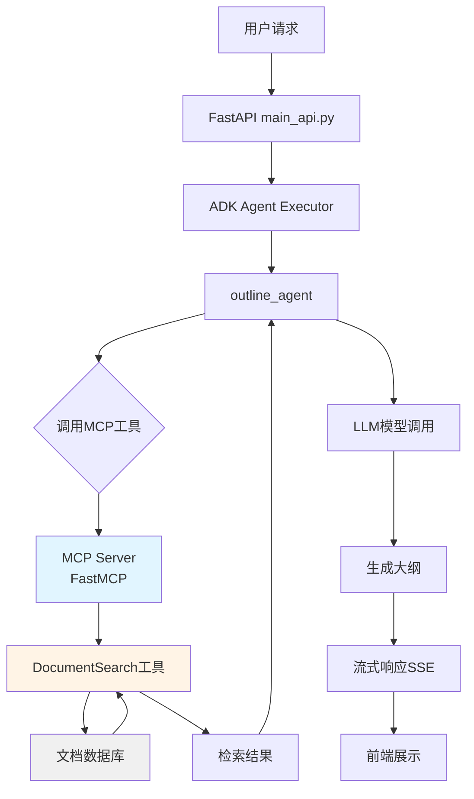
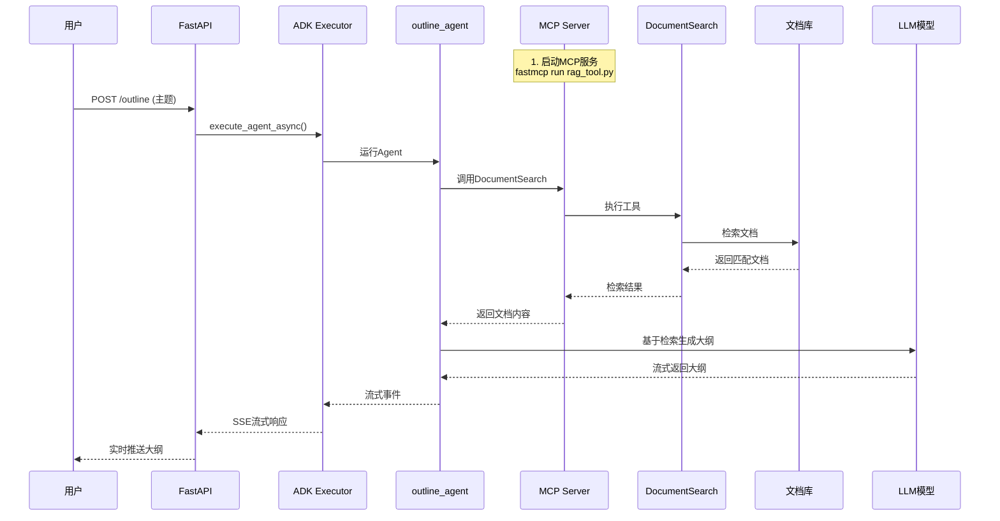

# slide_outline 模块详解

## 📋 目录
- [模块概述](#模块概述)
- [核心功能](#核心功能)
- [技术架构](#技术架构)
- [目录结构](#目录结构)
- [核心组件解析](#核心组件解析)
- [MCP工具集成](#mcp工具集成)
- [工作流程](#工作流程)
- [配置说明](#配置说明)
- [使用方法](#使用方法)
- [与simpleOutline对比](#与simpleoutline对比)
- [常见问题](#常见问题)

---

## 模块概述

**slide_outline** 是 MultiAgentPPT 项目中的高质量大纲生成服务，通过集成 **MCP (Model Context Protocol)** 检索工具，生成基于外部文档检索的高质量大纲。

### 特点
- ✅ **MCP集成**：使用FastMCP构建检索工具
- ✅ **外部检索**：基于文档库生成更准确的大纲
- ✅ **流式输出**：支持SSE实时流式返回
- ✅ **高质量输出**：基于真实数据生成大纲
- ✅ **灵活配置**：支持自定义检索源

### 适用场景
- 需要基于真实数据生成大纲
- 对大纲质量要求高
- 已有文档库需要利用
- 企业级应用场景

---

## 核心功能

| 功能 | 说明 |
|-----|------|
| **文档检索** | 通过MCP工具从文档库检索相关信息 |
| **大纲生成** | 基于检索结果生成结构化大纲 |
| **流式响应** | 通过SSE实时推送生成内容 |
| **多关键词检索** | 支持多个关键词并发检索 |
| **智能整合** | 自动整合检索结果到大纲中 |

---

## 技术架构

### 技术栈
```yaml
框架: FastAPI + A2A + Google ADK
MCP框架: FastMCP
LLM接口: LiteLLM (支持多模型)
流式传输: Server-Sent Events (SSE)
检索方式: 关键词匹配 + 文档检索
```

### 架构图



---

## 目录结构

```
slide_outline/
├── README.md                  # 使用说明文档
├── main_api.py               # FastAPI服务入口 (端口10001)
├── a2a_client.py             # A2A客户端封装
├── adk_agent_executor.py     # ADK Agent执行器
├── adk_agent.py              # Agent和模型创建
├── prompt.txt                # Prompt模板
├── mcp_config.json           # MCP配置文件
├── mcp_config_stdio.json     # MCP stdio配置
├── load_mcp.py               # MCP加载器
├── start_mcp_tool.sh         # MCP服务启动脚本
├── env_template              # 环境变量模板
├── Dockerfile                # Docker镜像
├── Dockerfile_MCPRAG         # MCP RAG版Docker
├── mcp_test_client.py        # MCP测试客户端
└── mcpserver/                # MCP工具目录
    └── rag_tool.py           # RAG检索工具
```

---

## 核心组件解析

### 1. Agent创建 (adk_agent.py)

**模型创建**：
```python
def create_model(model: str, provider: str):
    """
    创建模型，返回字符串或者LiteLlm
    支持的provider: google, claude, openai, deepseek, ali
    """
    if provider == "google":
        return model
    elif provider == "claude":
        if not model.startswith("anthropic/"):
            model = "anthropic/" + model
        return LiteLlm(model=model, api_key=os.environ.get("CLAUDE_API_KEY"))
    # ... 其他provider处理
```

**Agent创建**：
```python
def create_agent(model, provider, agent_name, agent_description,
                 agent_instruction, mcptools=[]):
    """构造ADK agent"""
    model = create_model(model, provider)
    return LlmAgent(
        model=model,
        name=agent_name,
        description=agent_description,
        instruction=agent_instruction,
        tools=mcptools,  # MCP工具列表
    )
```

### 2. Prompt设计 (prompt.txt)

```text
根据用户的描述生成大纲。仅生成大纲即可，无需多余说明。
输出示例格式如下：

# 第一部分主题
- 关于该主题的关键要点
- 另一个重要方面
- 简要结论或影响

# 第二部分主题
- 本部分的主要见解
- 支持性细节或示例
- 实际应用或收获

**示例查询及其处理方式：**

* **请进行小米汽车研究**
  → 使用多条搜索命令：
  `AbstractSearch(keyword="小米汽车")`，
  `AbstractSearch(keyword="小米SU7")`
```

### 3. MCP配置 (mcp_config.json)

```json
{
  "mcpServers": {
    "rag_tool": {
      "command": "python",
      "args": ["mcpserver/rag_tool.py"],
      "transport": "sse"
    }
  }
}
```

---

## MCP工具集成

### MCP Server实现 (mcpserver/rag_tool.py)

**FastMCP工具定义**：
```python
from fastmcp import FastMCP

mcp = FastMCP("检索文档")

@mcp.tool()
def DocumentSearch(keyword: str, number: int = 10) -> str:
    """
    根据关键词搜索文档
    :param keyword: 搜索的相关文档的关键词
    :param number: 搜索文档的数量
    :return: 返回每篇文档数据
    """
    result = ""
    for i, doc in enumerate(Documents):
        result += f"# 文档id:{i}\n {doc}\n\n"
    return result
```

**文档数据库**：
```python
Documents = [
    """
    ## 📰 近期电动车新闻精选

    1. **美国参议院确认：** 共和党无法通过预算调整废除 USPS 运营的 7,200 辆 EV...
    2. **民调转向冷却：** AP-NORC 调查显示，美国民主党对 EV 税收抵免支持率从 2022 年的 70% 降至 58%...
    ...
    """,
    """研究称在 20 年里，电池每年平均退化约 1.8%，意味着续航每年减少不到 2%...""",
    """IEA发布了"2025年全球电动汽车展望报告"。全球电动汽车销量持续创纪录..."""
]
```

### MCP工具特点

| 特性 | 说明 |
|-----|------|
| **检索方式** | 关键词全文匹配 |
| **返回格式** | Markdown格式文档 |
| **并发支持** | 可多次调用检索不同关键词 |
| **可扩展性** | 易于添加新的文档源 |

---

## 工作流程



**详细步骤**：

1. **启动MCP服务**：
   ```bash
   fastmcp run --transport sse mcpserver/rag_tool.py
   ```

2. **启动主服务**：
   ```bash
   python main_api.py
   ```

3. **接收请求**：FastAPI接收用户请求

4. **Agent执行**：outline_agent开始处理

5. **MCP工具调用**：自动调用DocumentSearch工具

6. **文档检索**：从文档库中检索相关内容

7. **大纲生成**：LLM基于检索结果生成大纲

8. **流式返回**：通过SSE实时推送结果

---

## 配置说明

### 1. 环境变量配置

```bash
cp env_template .env
```

**必要环境变量**：
```env
# 模型配置
MODEL_PROVIDER=deepseek
LLM_MODEL=deepseek-chat

# API密钥
GOOGLE_API_KEY=your_google_api_key
CLAUDE_API_KEY=your_claude_api_key
OPENAI_API_KEY=your_openai_api_key
DEEPSEEK_API_KEY=your_deepseek_api_key
ALI_API_KEY=your_ali_api_key
```

### 2. MCP配置

**mcp_config.json**：
```json
{
  "mcpServers": {
    "rag_tool": {
      "command": "python",
      "args": ["mcpserver/rag_tool.py"],
      "transport": "sse"
    }
  }
}
```

### 3. 自定义文档库

编辑 `mcpserver/rag_tool.py`，修改Documents列表：

```python
Documents = [
    """
    你的第一篇文档内容
    """,
    """
    你的第二篇文档内容
    """,
    # 添加更多文档...
]
```

---

## 使用方法

### 1. 启动MCP服务

```bash
cd backend/slide_outline
fastmcp run --transport sse mcpserver/rag_tool.py
```

服务启动在SSE模式（默认端口）

### 2. 启动主服务

```bash
python main_api.py
```

服务启动在 `http://localhost:10001`

### 3. 测试客户端

```bash
python a2a_client.py
```

或使用MCP测试客户端：
```bash
python mcp_test_client.py
```

### 4. API调用示例

**请求格式**：
```json
{
  "user_id": "test_user",
  "session_id": "test_session",
  "message": {
    "role": "user",
    "parts": [
      {
        "type": "text",
        "text": "电动汽车发展概述"
      }
    ]
  }
}
```

**响应示例**：
```text
# 电动汽车发展概述
- 电动汽车的定义与分类
- 电动汽车发展历程：早期探索、技术突破、政策推动
- 电动汽车的优势与劣势：环保、节能、经济性 vs 续航、充电、成本

# 电动汽车技术发展
- 电池技术：类型（锂离子、固态电池等）、能量密度、充电速度
- 电机技术：类型、效率、功率密度
- 电控技术：BMS、MCU、VCU
- 充电技术：充电桩类型、标准、无线充电
...
```

---

## 与simpleOutline对比

### 功能对比

| 特性 | simpleOutline | slide_outline |
|-----|---------------|---------------|
| **外部检索** | ❌ | ✅ (MCP工具) |
| **文档库** | ❌ | ✅ |
| **大纲质量** | 基础 | 高质量（基于数据） |
| **部署复杂度** | 简单 | 中等（需启动MCP） |
| **适用场景** | 快速生成 | 企业级应用 |
| **数据准确性** | 依赖LLM | 基于真实文档 |

### 架构对比

```
simpleOutline架构:
用户 → Agent → LLM → 大纲

slide_outline架构:
用户 → Agent → MCP工具 → 文档库 → Agent → LLM → 大纲
```

### 何时使用哪个？

**使用 simpleOutline**：
- 快速原型开发
- 主题简单，无需外部数据
- 资源有限
- 测试学习

**使用 slide_outline**：
- 需要基于真实数据
- 对准确性要求高
- 有专业文档库
- 企业生产环境

---

## 常见问题

### Q1: MCP服务启动失败？

**A**: 检查以下几点：
1. fastmcp是否安装：`pip install fastmcp`
2. Python路径是否正确
3. mcpserver/rag_tool.py语法是否正确
4. 端口是否被占用

**调试命令**：
```bash
# 直接运行MCP工具测试
python mcpserver/rag_tool.py
```

### Q2: 检索不到相关文档？

**A**: 可能原因：
1. 关键词不匹配
2. 文档库内容不足
3. LLM没有调用工具

**解决方法**：
- 优化prompt，明确指示使用工具
- 扩充文档库内容
- 使用多个关键词检索

### Q3: 如何自定义检索逻辑？

**A**: 修改 `mcpserver/rag_tool.py` 中的DocumentSearch函数：

```python
@mcp.tool()
def DocumentSearch(keyword: str, number: int = 10) -> str:
    # 实现你的检索逻辑
    # 可以使用向量数据库、搜索引擎等
    results = your_search_function(keyword, number)
    return format_results(results)
```

### Q4: 如何连接真实数据库？

**A**: 可以集成向量数据库：

```python
from fastmcp import FastMCP
import chromadb  # 或其他向量数据库

mcp = FastMCP("检索文档")

# 初始化向量数据库
client = chromadb.Client()
collection = client.get_or_create_collection("documents")

@mcp.tool()
def DocumentSearch(keyword: str, number: int = 10) -> str:
    # 使用向量检索
    results = collection.query(
        query_texts=[keyword],
        n_results=number
    )
    return format_vector_results(results)
```

### Q5: 性能优化建议？

**A**:
1. **文档预处理**：提前建立索引
2. **并发检索**：使用多个关键词并发检索
3. **缓存机制**：缓存常用检索结果
4. **异步加载**：使用异步IO加载文档

### Q6: 与slide_agent配合使用？

**A**: 典型流程：

```bash
# Terminal 1: 启动slide_outline的MCP服务
cd backend/slide_outline
fastmcp run --transport sse mcpserver/rag_tool.py

# Terminal 2: 启动slide_agent
cd backend/slide_agent
python main_api.py

# 前端调用流程：
# 1. 调用slide_outline生成高质量大纲
# 2. 将大纲传给slide_agent生成完整PPT
```

---

## 高级用法

### 1. 多关键词检索

**Prompt优化**：
```text
请进行小米汽车研究，使用以下检索：
1. DocumentSearch(keyword="小米汽车")
2. DocumentSearch(keyword="小米SU7")
3. DocumentSearch(keyword="雷军")

然后基于检索结果生成结构化大纲。
```

### 2. 自定义检索工具

添加新的MCP工具：

```python
@mcp.tool()
def WebSearch(keyword: str) -> str:
    """网络搜索工具"""
    # 实现网络搜索
    return search_results

@mcp.tool()
def DatabaseQuery(query: str) -> str:
    """数据库查询工具"""
    # 查询数据库
    return query_results
```

### 3. 检索结果缓存

```python
from functools import lru_cache

@lru_cache(maxsize=100)
def cached_search(keyword: str) -> str:
    """带缓存的检索"""
    return search_documents(keyword)
```

---

## 相关模块

- **simpleOutline**: 简单大纲生成服务
- **slide_agent**: 完整的多Agent PPT生成系统
- **hostAgentAPI**: Super Agent API接口

---

## 总结

slide_outline是一个高质量的大纲生成服务，通过MCP集成外部检索工具，生成基于真实文档的准确大纲。它是MultiAgentPPT项目中连接数据和内容生成的关键组件。

**主要优势**：
- 基于真实文档，质量高
- MCP标准化，易于扩展
- 支持多种检索方式
- 流式输出体验好

**使用建议**：
- 企业级应用首选
- 需要准确数据时使用
- 结合专业文档库效果最佳
- 作为slide_agent的前置模块
