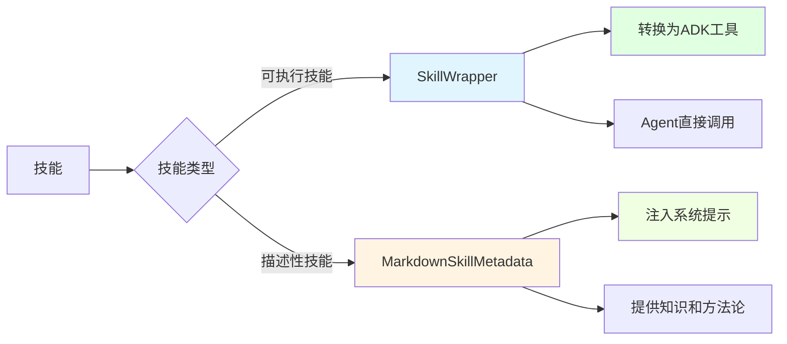
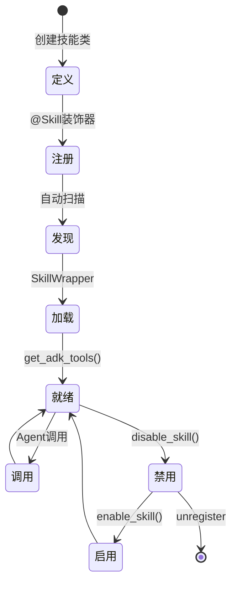

# 技能框架指南

## 概述

技能框架（Skills Framework）是MultiAgentPPT工具系统的核心组件，提供了一套完整的技能定义、注册、管理和调用机制。通过技能框架，开发者可以轻松创建可复用的技能模块，并将其转换为ADK兼容的工具。

## 技能框架设计理念

### 核心概念

技能框架基于以下核心理念设计：

1. **声明式定义**: 使用装饰器声明式地定义技能
2. **自动适配**: 自动将技能方法转换为ADK工具
3. **统一管理**: 集中管理所有技能的生命周期
4. **混合模式**: 支持可执行技能和描述性技能两种模式
5. **灵活扩展**: 支持MCP工具集成和自定义扩展

### 可执行 vs 描述性技能



| 特性 | 可执行技能 | 描述性技能 |
|------|-----------|-----------|
| 定义方式 | Python类 + @Skill装饰器 | Markdown文件 + Frontmatter |
| 使用方式 | 作为工具被Agent调用 | 注入到系统提示中 |
| 执行时机 | 运行时动态调用 | Agent初始化时注入 |
| 适用场景 | 具体功能实现 | 知识和方法论传递 |
| 返回值 | 函数返回值 | 无（纯文本内容） |

## 技能元数据系统

### SkillCategory 枚举

```python
class SkillCategory(Enum):
    """技能分类枚举"""
    DOCUMENT = "document"        # 文档相关技能
    SEARCH = "search"           # 搜索相关技能
    GENERATION = "generation"   # 内容生成技能
    ANALYSIS = "analysis"       # 分析相关技能
    EXTERNAL = "external"       # 外部工具集成
    UTILITY = "utility"         # 通用工具技能
    COMMUNICATION = "communication"  # 通信相关技能
```

### SkillMetadata 数据类

```python
@dataclass
class SkillMetadata:
    """技能元数据"""
    skill_id: str              # 唯一标识符
    name: str                  # 显示名称
    version: str               # 版本号
    category: SkillCategory    # 类别
    tags: List[str]            # 标签列表
    description: str           # 描述
    enabled: bool = True       # 是否启用
    author: Optional[str] = None      # 作者
    dependencies: List[str] = field(default_factory=list)  # 依赖
    parameters: Dict[str, Any] = field(default_factory=dict)  # 参数定义
    examples: List[Dict[str, Any]] = field(default_factory=list)  # 示例
```

### MarkdownSkillMetadata

用于描述性技能的元数据类，继承自 `SkillMetadata`：

```python
@dataclass
class MarkdownSkillMetadata(SkillMetadata):
    """Markdown技能元数据"""
    content: str = ""      # Markdown内容
    file_path: str = ""    # 源文件路径

    def get_content_for_prompt(self) -> str:
        """获取用于注入系统提示的格式化内容"""
```

## 技能定义和注册

### 使用 @Skill 装饰器定义技能

```python
from agents.tools.skills.skill_decorator import Skill
from google.adk.tools import ToolContext

@Skill(
    name="TextSummarizer",
    version="1.0.0",
    category="generation",
    tags=["text", "summarization", "nlp"],
    description="文本摘要技能，支持长文本压缩和关键信息提取",
    enabled=True,
    author="Your Name"
)
class TextSummarizerSkill:
    """文本摘要技能"""

    async def summarize(self, text: str, max_length: int = 200, tool_context: ToolContext) -> str:
        """
        生成文本摘要

        Args:
            text: 待摘要的文本
            max_length: 摘要最大长度
            tool_context: 工具上下文

        Returns:
            摘要文本
        """
        # 实现摘要逻辑
        # 这里可以调用LLM或其他NLP服务
        summary = f"摘要: {text[:max_length]}..."
        return summary

    async def extract_key_points(self, text: str, tool_context: ToolContext) -> str:
        """提取关键点"""
        # 实现关键点提取逻辑
        key_points = ["关键点1", "关键点2", "关键点3"]
        return "\n".join(key_points)
```

### 注册技能到SkillManager

```python
from agents.tools.skills.managers.skill_manager import SkillManager

# 获取SkillManager单例
skill_manager = SkillManager()

# 方式1: 作为装饰器参数注册
@skill_manager.register_custom_skill
class MySkill:
    pass

# 方式2: 直接调用注册
skill_manager.register_custom_skill(skill_class=TextSummarizerSkill)

# 方式3: 使用SkillWrapper注册
from agents.tools.skills.core.skill_wrapper import SkillWrapper
from agents.tools.skills.skill_metadata import SkillMetadata, SkillCategory

metadata = SkillMetadata(
    skill_id="my_skill",
    name="MySkill",
    version="1.0.0",
    category=SkillCategory.UTILITY,
    tags=["custom"],
    description="自定义技能"
)
wrapper = SkillWrapper(MySkillClass, metadata)
skill_manager.registry.register_skill_wrapper(wrapper)
```

### Markdown描述性技能

创建描述性技能只需要创建一个Markdown文件：

```markdown
---
skill_id: "prompt_engineering"
name: "Prompt Engineering Guide"
version: "1.0.0"
category: "utility"
tags:
  - "prompt"
  - "llm"
  - "guide"
description: "提示工程最佳实践指南"
enabled: true
---

# 提示工程指南

## 基本原则

1. **清晰明确**: 清楚地表达你的需求
2. **提供上下文**: 给予足够的背景信息
3. **指定格式**: 明确期望的输出格式
4. **示例引导**: 提供期望输出的示例

## 常用技巧

### 角色设定
```
你是一位资深的产品经理，擅长用户需求分析...
```

### 任务分解
```
请按以下步骤完成任务：
1. 分析用户需求
2. 识别关键功能点
3. 制定产品方案
```

### 输出格式控制
```
请以JSON格式返回结果，包含以下字段：
{
  "summary": "摘要",
  "details": ["详情1", "详情2"]
}
```
```

将此文件保存到 `backend/skills/` 目录，技能框架会自动发现并加载。

## 技能管理器使用

### SkillManager API

#### 获取工具

```python
from agents.tools.skills.managers.skill_manager import SkillManager
from agents.tools.skills.skill_metadata import SkillCategory

skill_manager = SkillManager()

# 获取特定Agent的工具
tools = skill_manager.get_tools_for_agent(
    agent_name="outline_agent"
)

# 按类别过滤
tools = skill_manager.get_tools_for_agent(
    categories=[SkillCategory.SEARCH, SkillCategory.DOCUMENT]
)

# 按标签过滤
tools = skill_manager.get_skills_for_agent(
    tags=["search", "document"]
)

# 按技能ID过滤
tools = skill_manager.get_tools_for_agent(
    skill_ids=["document_search", "image_search"]
)
```

#### 搜索技能

```python
# 关键词搜索
results = skill_manager.search_skills(
    query="document"
)

# 类别过滤
results = skill_manager.search_skills(
    categories=[SkillCategory.DOCUMENT]
)

# 标签过滤
results = skill_manager.search_skills(
    tags=["search", "api"]
)

# 组合过滤
results = skill_manager.search_skills(
    query="search",
    categories=[SkillCategory.SEARCH],
    tags=["api"],
    enabled_only=True
)
```

#### 获取描述性技能内容

```python
# 获取格式化的描述性内容
content = skill_manager.get_descriptive_content_for_prompt(
    agent_name="outline_agent"
)

# 将内容注入到系统提示
instruction = f"""你是PPT大纲专家。

{content}

请根据以上指南创建高质量的PPT大纲。"""

# 创建Agent
agent = Agent(
    name="outline_agent",
    model="gemini-2.5-flash",
    instruction=instruction,
    tools=tools
)
```

#### 技能管理操作

```python
# 启用/禁用技能
skill_manager.enable_skill("document_search")
skill_manager.disable_skill("old_skill")

# 获取技能信息
info = skill_manager.get_skill_info("document_search")
print(info)

# 获取统计信息
stats = skill_manager.get_stats()
print(f"总技能数: {stats['total_skills']}")
print(f"可执行技能: {stats['executable_skills']}")
print(f"描述性技能: {stats['descriptive_skills']}")

# 列出已配置的Agent
agents = skill_manager.list_agents()

# 获取Agent配置
config = skill_manager.get_agent_config("outline_agent")
```

## MCP工具集成

### 加载MCP工具

```python
from agents.tools.mcp.mcp_integration import load_mcp_tools

# 加载MCP配置
mcp_tools = load_mcp_tools(
    mcp_config_path="mcp_config.json",
    skill_manager=skill_manager,
    auto_register=True
)

# MCP工具会自动注册为技能
# 可以通过SkillManager访问
```

### MCP配置文件

创建 `mcp_config.json`:

```json
{
  "mcpServers": {
    "filesystem": {
      "command": "npx",
      "args": ["-y", "@modelcontextprotocol/server-filesystem", "C:/allowed/files"],
      "env": {
        "NODE_ENV": "production"
      }
    },
    "github": {
      "command": "npx",
      "args": ["-y", "@modelcontextprotocol/server-github"],
      "env": {
        "GITHUB_TOKEN": "your-token-here"
      }
    },
    "custom-sse-server": {
      "url": "https://api.example.com/mcp",
      "timeout": 60
    }
  }
}
```

### MCP工具类型

| 类型 | 配置方式 | 适用场景 |
|------|---------|---------|
| **Stdio** | command + args | 本地进程MCP服务器 |
| **SSE** | url | 远程HTTP SSE服务器 |

## 技能配置说明

### skill_config.json

技能框架的配置文件：

```json
{
  "skill_directories": [
    "backend/skills"
  ],
  "config_directory": "backend/skills/configs",
  "auto_discovery": true,
  "cache_enabled": true
}
```

### agent_skill_mapping.json

Agent与技能的映射配置：

```json
{
  "outline_agent": {
    "categories": ["document", "search"],
    "tags": ["ppt", "outline"],
    "skill_ids": ["document_search", "ppt_template_loader"],
    "include_descriptive": true
  },
  "content_agent": {
    "categories": ["generation", "media"],
    "tags": ["content", "image"],
    "skill_ids": ["text_generator", "image_search"]
  },
  "research_agent": {
    "categories": ["search", "analysis"],
    "tags": ["research"],
    "skill_ids": ["web_search", "document_search"]
  }
}
```

## 技能生命周期



### 生命周期阶段

1. **定义阶段**: 创建技能类，使用@Skill装饰器
2. **注册阶段**: 技能被注册到SkillRegistry
3. **发现阶段**: 自动扫描技能目录
4. **加载阶段**: 创建SkillWrapper，解析元数据
5. **就绪阶段**: 转换为ADK工具，可供Agent使用
6. **调用阶段**: Agent调用技能方法
7. **管理阶段**: 启用/禁用/重新加载

## 技能调试技巧

### 查看已注册技能

```python
# 获取所有技能
all_skills = skill_manager.get_all_skills()
for skill in all_skills:
    print(f"{skill['skill_id']}: {skill['name']}")

# 获取描述性技能
descriptive = skill_manager.get_all_descriptive_skills()
for skill in descriptive:
    print(f"{skill['skill_id']}: {skill['name']}")
```

### 检查技能方法

```python
# 获取技能详细信息
info = skill_manager.get_skill_info("text_summarizer")
print(f"方法列表: {info['methods']}")
```

### 测试技能调用

```python
# 创建测试Agent
test_agent = Agent(
    name="test_agent",
    model="gemini-2.5-flash",
    instruction="测试技能",
    tools=skill_manager.get_tools_for_agent(skill_ids=["my_skill"])
)

# 运行测试
async def test_skill():
    response = await test_agent.run("测试我的技能")
    print(response)
```

### 启用详细日志

```python
import logging

logging.basicConfig(level=logging.DEBUG)
logger = logging.getLogger("agents.tools.skills")
logger.setLevel(logging.DEBUG)
```

## 相关文档

- [工具系统总览](tools_overview.md) - 系统概述和快速开始
- [工具系统架构详解](tools_architecture.md) - 架构设计和实现说明
- [工具参考手册](tools_reference.md) - 所有工具的详细说明
- [工具开发指南](tools_development.md) - 创建新工具的开发指南
