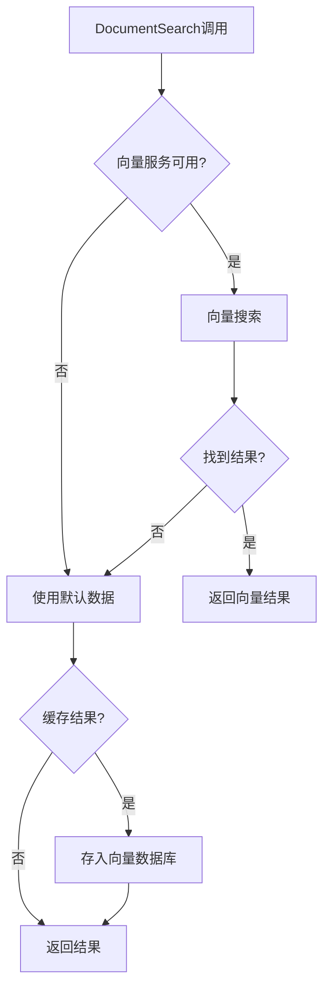
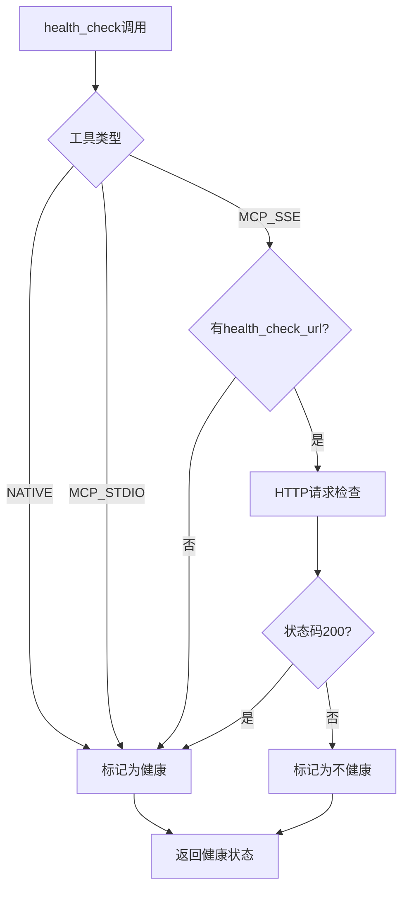
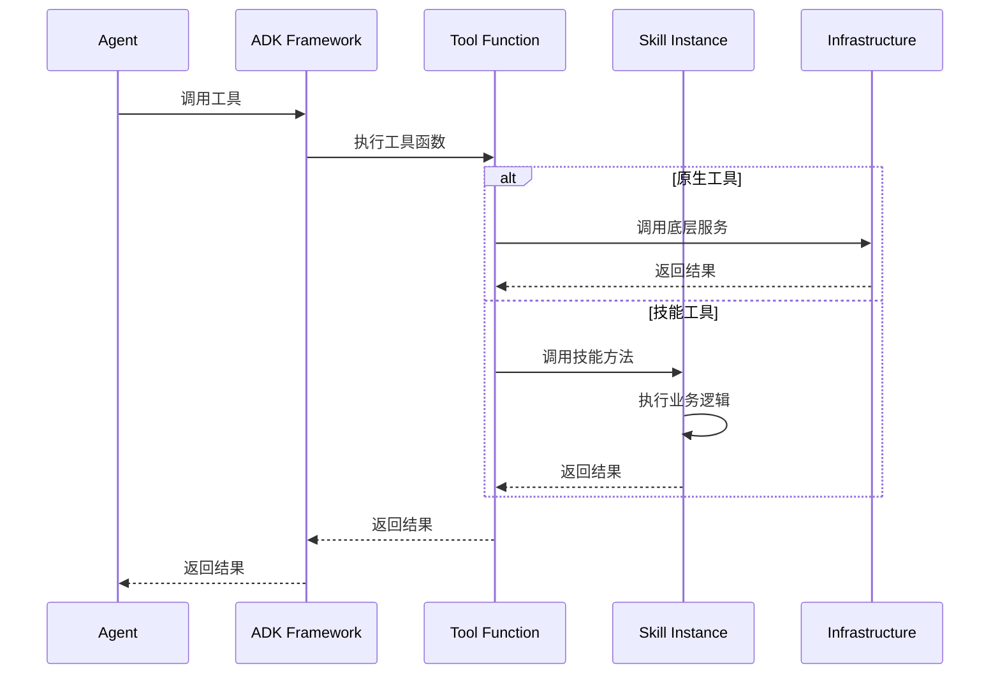

# 工具系统架构详解

## 目录结构

```
backend/
├── agents/
│   └── tools/
│       ├── __init__.py
│       ├── registry/                    # 注册中心
│       │   ├── __init__.py
│       │   ├── tool_registry.py         # 原始工具注册表
│       │   └── unified_registry.py      # 统一注册中心
│       ├── search/                      # 搜索工具
│       │   ├── __init__.py
│       │   └── document_search.py       # 文档搜索工具
│       ├── media/                       # 媒体工具
│       │   ├── __init__.py
│       │   └── image_search.py          # 图片搜索工具
│       ├── mcp/                         # MCP集成
│       │   ├── __init__.py
│       │   └── mcp_integration.py       # MCP协议集成
│       └── skills/                      # 技能框架
│           ├── __init__.py
│           ├── core/                    # 核心模块
│           │   ├── skill_registry.py
│           │   ├── skill_metadata.py
│           │   └── skill_wrapper.py
│           ├── managers/                # 管理器
│           │   └── skill_manager.py
│           ├── skill_decorator.py       # 装饰器
│           └── skill_loaders.py         # 加载器
└── infrastructure/
    └── tools/
        └── tool_manager.py              # 统一工具管理器
```

## 各层职责说明

### 1. 注册中心层 (Registry Layer)

#### UnifiedToolRegistry
**文件路径**: `backend/agents/tools/registry/unified_registry.py`

**职责**:
- 统一管理所有工具和技能的注册
- 提供工具的查询、过滤和检索
- 维护工具分类索引

**核心类**:
```python
class UnifiedToolRegistry:
    def __init__(self):
        self._tools: Dict[str, ToolRegistration] = {}
        self._categories: Dict[ToolCategory, List[str]] = {}
        self._skill_wrappers: Dict[str, Any] = {}
```

**主要方法**:
| 方法 | 说明 |
|------|------|
| `register()` | 注册工具或技能 |
| `register_skill_wrapper()` | 注册技能包装器 |
| `get_tool()` | 获取特定工具 |
| `get_tools_by_category()` | 按类别获取工具 |
| `get_adk_tools()` | 获取ADK兼容工具列表 |
| `list_tools()` | 列出工具名称 |
| `get_stats()` | 获取统计信息 |

#### ToolMetadata 和 ToolRegistration

```python
@dataclass
class ToolMetadata:
    name: str
    category: ToolCategory
    description: str
    version: str = "1.0.0"
    author: str = ""
    enabled: bool = True
    parameters: Dict[str, Any] = None

@dataclass
class ToolRegistration:
    metadata: ToolMetadata
    tool_func: Optional[Callable] = None
    tool_class: Optional[Type] = None
```

### 2. 技能框架层 (Skill Framework Layer)

#### SkillRegistry
**文件路径**: `backend/agents/tools/skills/core/skill_registry.py`

**职责**:
- 管理所有技能的注册和发现
- 维护技能的分类和标签索引
- 支持可执行技能和描述性技能

**核心数据结构**:
```python
class SkillRegistry:
    def __init__(self, config_path: Optional[str] = None, auto_load: bool = True):
        self._skills: Dict[str, SkillWrapper] = {}              # 可执行技能
        self._descriptive_skills: Dict[str, MarkdownSkillMetadata] = {}  # 描述性技能
        self._mcp_tools: List[McpSkillAdapter] = []              # MCP工具
        self._category_index: Dict[SkillCategory, List[str]] = {}  # 分类索引
        self._tag_index: Dict[str, List[str]] = {}               # 标签索引
```

**关键方法**:
```python
# 技能注册
def register_skill_wrapper(self, wrapper: SkillWrapper) -> None
def register_skill_class(self, skill_class: Type) -> None
def register_markdown_skill(self, metadata: MarkdownSkillMetadata) -> None
def register_mcp_tool(self, mcp_toolset: MCPToolset, category: SkillCategory) -> None

# 技能查询
def get_skill(self, skill_id: str) -> Optional[SkillWrapper]
def get_skills_by_category(self, category: SkillCategory) -> List[SkillWrapper]
def get_skills_by_tag(self, tag: str) -> List[SkillWrapper]
def search_skills(self, categories, tags, enabled_only, keyword) -> List[SkillWrapper]

# ADK工具获取
def get_adk_tools(self, categories, tags, skill_ids, include_mcp) -> List[Any]
```

#### SkillManager
**文件路径**: `backend/agents/tools/skills/managers/skill_manager.py`

**职责**:
- 提供高级API供开发者使用
- 简化技能的获取和管理
- 支持Agent-技能映射配置

**使用示例**:
```python
# 获取SkillManager单例
skill_manager = SkillManager()

# 为Agent获取工具
tools = skill_manager.get_tools_for_agent(
    agent_name="outline_agent",
    categories=[SkillCategory.DOCUMENT, SkillCategory.SEARCH]
)

# 搜索技能
results = skill_manager.search_skills(
    query="document",
    tags=["search"]
)
```

#### SkillWrapper 和 SkillAdapter
**文件路径**: `backend/agents/tools/skills/core/skill_wrapper.py`

**SkillWrapper**:
- 包装完整的技能类
- 管理技能的所有方法
- 将技能转换为ADK工具

**SkillAdapter**:
- 适配单个技能方法
- 创建ADK兼容的工具函数
- 处理同步/异步方法调用

### 3. 工具实现层 (Tool Implementation Layer)

#### DocumentSearch
**文件路径**: `backend/agents/tools/search/document_search.py`

**功能**:
- 根据关键词搜索文档
- 集成向量记忆服务
- 支持缓存和降级策略

**签名**:
```python
async def DocumentSearch(
    keyword: str,
    number: int,
    tool_context: ToolContext
) -> str
```

**搜索流程**:


#### SearchImage
**文件路径**: `backend/agents/tools/media/image_search.py`

**功能**:
- 根据关键词搜索图片
- 返回图片URL

**签名**:
```python
async def SearchImage(
    query: str,
    tool_context: ToolContext
) -> str
```

### 4. 基础设施层 (Infrastructure Layer)

#### UnifiedToolManager
**文件路径**: `backend/infrastructure/tools/tool_manager.py`

**职责**:
- 管理所有工具的生命周期
- 提供线程安全的工具访问
- 执行工具健康检查

**核心功能**:
```python
class UnifiedToolManager:
    def register_native_tool(self, tool: AgentTool, name, description)
    def register_mcp_tool(self, name, mcp_client, tool_type, health_check_url, description)
    def get_tool(self, name: str) -> Optional[Any]
    async def health_check(self, tool_name: Optional[str] = None) -> Dict[str, bool]
```

**健康检查流程**:


#### MCP Integration
**文件路径**: `backend/agents/tools/mcp/mcp_integration.py`

**职责**:
- 加载MCP配置
- 创建MCP工具集
- 将MCP工具集转换为技能

**MCP连接类型**:
```python
# SSE连接
SseConnectionParams(
    url="https://example.com/mcp",
    timeout=60
)

# Stdio连接
StdioConnectionParams(
    timeout=60,
    server_params=StdioServerParameters(
        command="node",
        args=["server.js"],
        env={}
    )
)
```

## 工具定义规范

### 工具元数据规范

每个工具必须包含完整的元数据：

| 字段 | 类型 | 必填 | 说明 |
|------|------|------|------|
| name | str | 是 | 工具名称（唯一标识） |
| category | ToolCategory | 是 | 工具类别 |
| description | str | 是 | 工具描述 |
| version | str | 否 | 版本号，默认"1.0.0" |
| author | str | 否 | 作者 |
| enabled | bool | 否 | 是否启用，默认True |
| parameters | Dict | 否 | 参数定义 |

### 技能元数据规范

技能使用 `@Skill` 装饰器定义：

```python
@Skill(
    name="技能名称",
    version="1.0.0",
    category="技能类别",
    tags=["标签1", "标签2"],
    description="技能描述",
    enabled=True,
    author="作者",
    dependencies=["依赖技能ID"]
)
class MySkill:
    async def method_name(self, param1: str, tool_context: ToolContext) -> str:
        """方法实现"""
        pass
```

## 工具注册流程

```mermaid
sequenceDiagram
    participant Dev as 开发者
    participant SM as SkillManager
    participant SR as SkillRegistry
    participant UTR as UnifiedToolRegistry
    participant Agent as Agent

    Dev->>SM: 创建SkillManager
    SM->>SR: 初始化SkillRegistry
    SR->>SR: 自动发现技能

    Dev->>SM: register_custom_skill(skill_class)
    SM->>SR: register_skill_class(skill_class)
    SR->>SR: 创建SkillWrapper
    SR->>SR: 更新索引

    Dev->>SM: get_tools_for_agent(categories)
    SM->>SR: search_skills(categories)
    SR->>SR: 过滤技能
    SR->>SM: 返回SkillWrapper列表
    SM->>SR: get_adk_tools()
    SR-->>SM: 返回ADK工具列表
    SM-->>Dev: 返回工具列表

    Dev->>Agent: Agent(tools=tools)
```



## 工具调用机制

### ADK工具调用流程



### SkillAdapter 调用流程

```python
# 1. Agent调用工具
async def tool_wrapper(**kwargs):
    # 2. 获取技能实例
    skill_instance = self._get_skill_instance()

    # 3. 获取方法
    method = getattr(skill_instance, self.method_name)

    # 4. 提取tool_context
    tool_context = kwargs.get("tool_context")

    # 5. 调用方法
    if inspect.iscoroutinefunction(method):
        result = await method(**kwargs)
    else:
        result = method(**kwargs)

    return result
```

## 设计模式和最佳实践

### 1. 单例模式
**应用**: `SkillManager`, `SkillRegistry`, `UnifiedToolManager`

**好处**:
- 确保全局唯一的注册中心
- 避免重复初始化
- 共享状态和缓存

### 2. 适配器模式
**应用**: `SkillAdapter`, `McpSkillAdapter`

**好处**:
- 统一不同类型的工具接口
- 隔离变化，便于扩展

### 3. 装饰器模式
**应用**: `@Skill`, `@SkillMethod`

**好处**:
- 声明式定义技能
- 附加元数据
- 简化注册流程

### 4. 注册表模式
**应用**: `UnifiedToolRegistry`, `SkillRegistry`

**好处**:
- 集中管理
- 支持动态注册和查询
- 维护索引加速查询

### 最佳实践

1. **命名规范**
   - 工具名称使用蛇形命名: `document_search`
   - 类名使用帕斯卡命名: `DocumentSearch`
   - 技能ID使用蛇形命名: `document_search_skill`

2. **错误处理**
   - 工具调用应有适当的异常处理
   - 使用降级策略保证可用性
   - 记录错误日志便于调试

3. **性能优化**
   - 使用缓存减少重复计算
   - 异步执行避免阻塞
   - 批量操作提高效率

4. **文档完善**
   - 为每个工具编写清晰的文档字符串
   - 提供使用示例
   - 说明参数和返回值

## 相关文档

- [工具系统总览](tools_overview.md) - 系统概述和快速开始
- [工具参考手册](tools_reference.md) - 所有工具的详细说明
- [技能框架指南](skills_framework.md) - 技能框架使用详解
- [工具开发指南](tools_development.md) - 开发新工具的指南
