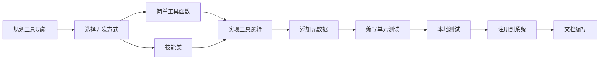

# 工具开发指南

## 概述

本指南介绍如何为MultiAgentPPT工具系统开发新工具。我们将覆盖从创建简单工具到复杂技能的完整开发流程。

## 开发流程概览



## 如何创建新工具

### 方式一：简单工具函数

适合实现简单、单一功能的工具。

#### 步骤

1. **创建工具文件**

在相应类别目录下创建文件，例如 `backend/agents/tools/utility/my_tool.py`:

```python
#!/usr/bin/env python
# -*- coding: utf-8 -*-
"""
My Custom Tool - 自定义工具示例
"""

from google.adk.tools import ToolContext
from datetime import datetime
import asyncio


async def GetCurrentTime(
    timezone: str = "UTC",
    tool_context: ToolContext = None
) -> str:
    """
    获取当前时间

    Args:
        timezone: 时区，默认UTC
        tool_context: ADK工具上下文

    Returns:
        格式化的时间字符串
    """
    agent_name = tool_context.agent_name if tool_context else "unknown"
    print(f"Agent {agent_name} 正在调用工具: GetCurrentTime")

    # 获取当前时间
    now = datetime.now()
    formatted_time = now.strftime("%Y-%m-%d %H:%M:%S")

    return f"当前时间 ({timezone}): {formatted_time}"


if __name__ == '__main__':
    # 测试代码
    import asyncio

    class MockToolContext:
        agent_name = "test_agent"

    async def test():
        result = await GetCurrentTime(
            timezone="UTC",
            tool_context=MockToolContext()
        )
        print(result)

    asyncio.run(test())
```

2. **注册到统一注册中心**

编辑 `backend/agents/tools/registry/unified_registry.py`:

```python
def _register_builtin_tools(registry: UnifiedToolRegistry) -> None:
    """注册内置工具"""
    try:
        from ..search.document_search import DocumentSearch
        from ..media.image_search import SearchImage
        from ..utility.my_tool import GetCurrentTime  # 添加导入

        # ... 现有注册 ...

        # 注册新工具
        registry.register(
            metadata=ToolMetadata(
                name="GetCurrentTime",
                category=ToolCategory.UTILITY,
                description="获取当前时间",
                version="1.0.0",
                author="Your Name"
            ),
            tool_func=GetCurrentTime
        )
    except ImportError as e:
        print(f"Warning: Could not import built-in tools: {e}")
```

3. **使用工具**

```python
from google.adk import Agent
from agents.tools.registry.unified_registry import get_unified_registry

# 获取注册中心
registry = get_unified_registry()

# 获取工具
tools = registry.get_adk_tools(tool_names=["GetCurrentTime"])

# 创建Agent
agent = Agent(
    name="time_agent",
    model="gemini-2.5-flash",
    instruction="你是一个时间助手，使用GetCurrentTime工具获取当前时间。",
    tools=tools
)
```

### 方式二：使用技能框架

适合实现复杂、多方法的技能模块。

#### 步骤

1. **创建技能文件**

创建 `backend/skills/my_skills/translator_skill.py`:

```python
#!/usr/bin/env python
# -*- coding: utf-8 -*-
"""
翻译技能示例
"""

from agents.tools.skills.skill_decorator import Skill, SkillMethod
from google.adk.tools import ToolContext


@Skill(
    name="Translator",
    version="1.0.0",
    category="utility",
    tags=["translation", "language", "nlp"],
    description="多语言翻译技能，支持中英文互译",
    enabled=True,
    author="Your Name"
)
class TranslatorSkill:
    """翻译技能"""

    @SkillMethod(
        description="将中文翻译为英文",
        parameters={
            "text": {
                "type": "string",
                "description": "待翻译的中文文本"
            }
        }
    )
    async def zh_to_en(self, text: str, tool_context: ToolContext) -> str:
        """
        中文翻译为英文

        Args:
            text: 中文文本
            tool_context: 工具上下文

        Returns:
            英文翻译
        """
        agent_name = tool_context.agent_name
        print(f"Agent {agent_name} 调用翻译: zh_to_en")

        # 这里可以调用真实的翻译API
        # 示例中使用模拟翻译
        # 实际项目中可以接入Google Translate、DeepL等API

        # 简单的模拟翻译（仅用于演示）
        translation = f"[EN Translation] {text}"

        return translation

    @SkillMethod(
        description="将英文翻译为中文",
        parameters={
            "text": {
                "type": "string",
                "description": "待翻译的英文文本"
            }
        }
    )
    async def en_to_zh(self, text: str, tool_context: ToolContext) -> str:
        """
        英文翻译为中文

        Args:
            text: 英文文本
            tool_context: 工具上下文

        Returns:
            中文翻译
        """
        agent_name = tool_context.agent_name
        print(f"Agent {agent_name} 调用翻译: en_to_zh")

        # 模拟翻译
        translation = f"[中文翻译] {text}"

        return translation

    @SkillMethod(
        description="检测文本语言",
        parameters={
            "text": {
                "type": "string",
                "description": "待检测的文本"
            }
        }
    )
    async def detect_language(self, text: str, tool_context: ToolContext) -> str:
        """
        检测文本语言

        Args:
            text: 待检测文本
            tool_context: 工具上下文

        Returns:
            检测到的语言
        """
        # 简单的语言检测逻辑
        # 实际项目中可以使用langdetect等库
        has_chinese = any('\u4e00' <= char <= '\u9fff' for char in text)
        language = "Chinese" if has_chinese else "English"

        return f"检测到的语言: {language}"
```

2. **自动发现或手动注册**

**方式A：自动发现（推荐）**

将文件放在 `backend/skills/` 目录下，技能框架会自动发现：

```bash
backend/skills/
├── translator_skill.py
└── ...
```

**方式B：手动注册**

```python
from agents.tools.skills.managers.skill_manager import SkillManager
from skills.my_skills.translator_skill import TranslatorSkill

skill_manager = SkillManager()
skill_manager.register_custom_skill(TranslatorSkill)
```

3. **使用技能**

```python
from google.adk import Agent
from agents.tools.skills.managers.skill_manager import SkillManager

skill_manager = SkillManager()

# 获取翻译技能的工具
tools = skill_manager.get_tools_for_agent(
    skill_ids=["translator"]
)

# 创建翻译Agent
translator_agent = Agent(
    name="translator_agent",
    model="gemini-2.5-flash",
    instruction="你是翻译助手，使用翻译技能进行中英文互译。",
    tools=tools
)

# 使用
async def translate():
    response = await translator_agent.run("请将'Hello World'翻译为中文")
    print(response)

asyncio.run(translate())
```

## 工具开发规范

### 命名规范

| 类型 | 规范 | 示例 |
|------|------|------|
| 文件名 | 蛇形命名 | `document_search.py` |
| 类名 | 帕斯卡命名 | `DocumentSearchSkill` |
| 函数名 | 蛇形命名 | `get_current_time` |
| 技能ID | 蛇形命名 | `document_search` |
| 常量 | 全大写下划线 | `MAX_RESULTS` |

### 文档规范

每个工具必须包含完整的文档字符串：

```python
async def my_function(
    param1: str,
    param2: int,
    tool_context: ToolContext
) -> str:
    """
    函数功能的简要描述

    更详细的功能说明，可以多行。

    Args:
        param1: 参数1的说明
        param2: 参数2的说明
        tool_context: ADK工具上下文

    Returns:
        返回值的说明

    Raises:
        SomeError: 异常情况说明

    Examples:
        >>> result = await my_function("test", 5, context)
        >>> print(result)
    """
    pass
```

### 类型注解

所有函数参数和返回值都应有类型注解：

```python
from typing import Optional, List, Dict, Any

async def search_documents(
    keyword: str,
    limit: int = 10,
    filters: Optional[Dict[str, Any]] = None,
    tool_context: ToolContext = None
) -> str:
    """搜索文档"""
    pass
```

### 错误处理

```python
async def my_tool(param: str, tool_context: ToolContext) -> str:
    """工具实现"""
    try:
        # 主要逻辑
        result = do_something(param)
        return result
    except ValueError as e:
        # 处理特定错误
        return f"参数错误: {e}"
    except Exception as e:
        # 处理未预期错误
        print(f"工具执行错误: {e}")
        return "执行失败，请稍后重试"
```

## 单元测试指南

### 测试文件结构

```
backend/tests/tools/
├── __init__.py
├── test_document_search.py
├── test_image_search.py
└── test_skills/
    ├── __init__.py
    └── test_translator_skill.py
```

### 测试示例

```python
#!/usr/bin/env python
# -*- coding: utf-8 -*-
"""
Translator技能单元测试
"""

import pytest
import asyncio
from unittest.mock import Mock

from skills.my_skills.translator_skill import TranslatorSkill


class TestTranslatorSkill:
    """翻译技能测试类"""

    @pytest.fixture
    def skill(self):
        """创建技能实例"""
        return TranslatorSkill()

    @pytest.fixture
    def mock_context(self):
        """创建模拟的ToolContext"""
        context = Mock()
        context.agent_name = "test_agent"
        return context

    @pytest.mark.asyncio
    async def test_zh_to_en(self, skill, mock_context):
        """测试中译英"""
        result = await skill.zh_to_en("你好", mock_context)
        assert "[EN Translation]" in result
        assert "你好" in result

    @pytest.mark.asyncio
    async def test_en_to_zh(self, skill, mock_context):
        """测试英译中"""
        result = await skill.en_to_zh("Hello", mock_context)
        assert "[中文翻译]" in result
        assert "Hello" in result

    @pytest.mark.asyncio
    async def test_detect_language_chinese(self, skill, mock_context):
        """测试中文检测"""
        result = await skill.detect_language("你好世界", mock_context)
        assert "Chinese" in result

    @pytest.mark.asyncio
    async def test_detect_language_english(self, skill, mock_context):
        """测试英文检测"""
        result = await skill.detect_language("Hello World", mock_context)
        assert "English" in result

    def test_skill_metadata(self, skill):
        """测试技能元数据"""
        metadata = skill.get_skill_metadata()
        assert metadata.name == "Translator"
        assert metadata.version == "1.0.0"
        assert "translation" in metadata.tags


if __name__ == "__main__":
    pytest.main([__file__, "-v"])
```

### 运行测试

```bash
# 运行所有测试
pytest backend/tests/tools/

# 运行特定文件
pytest backend/tests/tools/test_translator_skill.py

# 带覆盖率报告
pytest backend/tests/tools/ --cov=backend/agents/tools --cov-report=html
```

## 工具调试技巧

### 1. 使用日志

```python
import logging

logger = logging.getLogger(__name__)

async def my_tool(param: str, tool_context: ToolContext) -> str:
    logger.info(f"工具调用开始: param={param}")
    try:
        result = do_something(param)
        logger.info(f"工具调用成功: result={result}")
        return result
    except Exception as e:
        logger.error(f"工具调用失败: {e}", exc_info=True)
        raise
```

### 2. 添加调试模式

```python
import os

DEBUG = os.getenv("DEBUG", "false").lower() == "true"

async def my_tool(param: str, tool_context: ToolContext) -> str:
    if DEBUG:
        print(f"[DEBUG] 调用参数: {param}")

    result = do_something(param)

    if DEBUG:
        print(f"[DEBUG] 返回结果: {result}")

    return result
```

### 3. 使用断言

```python
async def my_tool(param: str, tool_context: ToolContext) -> str:
    assert isinstance(param, str), "param必须是字符串"
    assert len(param) > 0, "param不能为空"

    # 主要逻辑
    return result
```

### 4. 交互式调试

```python
if __name__ == '__main__':
    import asyncio
    from google.adk.tools import ToolContext

    class MockContext:
        agent_name = "debug_agent"

    async def debug():
        context = MockContext()
        result = await my_tool("test", context)
        print(result)

    asyncio.run(debug())
```

## 常见问题解答

### Q1: 如何让工具支持异步？

**A**: 使用 `async def` 定义函数：

```python
async def my_async_tool(param: str, tool_context: ToolContext) -> str:
    # 异步操作
    result = await some_async_operation()
    return result
```

### Q2: 如何在工具中访问外部服务？

**A**: 使用异步HTTP客户端：

```python
import httpx
import asyncio

async def fetch_data(url: str, tool_context: ToolContext) -> str:
    async with httpx.AsyncClient() as client:
        response = await client.get(url)
        return response.text
```

### Q3: 如何处理工具中的配置？

**A**: 使用环境变量或配置文件：

```python
import os
from pathlib import Path

# 从环境变量读取
API_KEY = os.getenv("MY_API_KEY")

# 从配置文件读取
config_path = Path("config/tools.json")
if config_path.exists():
    import json
    with open(config_path) as f:
        config = json.load(f)
        API_KEY = config.get("api_key")
```

### Q4: 如何实现工具缓存？

**A**: 使用缓存装饰器：

```python
from functools import lru_cache
import hashlib

def cache_key(func, *args, **kwargs):
    """生成缓存键"""
    key = f"{func.__name__}:{str(args)}:{str(kwargs)}"
    return hashlib.md5(key.encode()).hexdigest()

@lru_cache(maxsize=128)
def cached_sync_tool(param: str) -> str:
    """可缓存同步工具"""
    return expensive_operation(param)

# 异步缓存可以使用async-lru库
```

### Q5: 如何实现工具降级策略？

**A**: 使用try-except和备用方案：

```python
async def robust_tool(param: str, tool_context: ToolContext) -> str:
    """带降级的工具"""
    try:
        # 尝试主要方法
        return await primary_method(param)
    except PrimaryError:
        try:
            # 尝试备用方法
            return await fallback_method(param)
        except Exception:
            # 返回默认值
            return default_result(param)
```

### Q6: 如何在工具间共享状态？

**A**: 使用工具实例变量或全局单例：

```python
@Skill(name="StatefulSkill")
class StatefulSkill:
    def __init__(self):
        self.state = {}  # 实例状态

    async def set_value(self, key: str, value: Any, tool_context: ToolContext) -> str:
        self.state[key] = value
        return f"已设置: {key} = {value}"

    async def get_value(self, key: str, tool_context: ToolContext) -> str:
        return self.state.get(key, "未找到")
```

### Q7: 如何实现工具链调用？

**A**: 在一个工具中调用另一个工具：

```python
from agents.tools.registry.unified_registry import get_unified_registry

async def chained_tool(param: str, tool_context: ToolContext) -> str:
    """工具链示例"""
    registry = get_unified_registry()

    # 获取并调用第一个工具
    tool1 = registry.get_tool("Tool1")
    result1 = await tool1.tool_func(param, tool_context)

    # 使用结果调用第二个工具
    tool2 = registry.get_tool("Tool2")
    result2 = await tool2.tool_func(result1, tool_context)

    return result2
```

## 工具开发模板

### 简单工具模板

```python
#!/usr/bin/env python
# -*- coding: utf-8 -*-
"""
{Tool Description}
"""

from google.adk.tools import ToolContext
from typing import Optional


async def {tool_name}(
    {param1}: {type1},
    {param2}: {type2} = {default_value},
    tool_context: ToolContext = None
) -> str:
    """
    {Function Description}

    Args:
        {param1}: {Parameter description}
        {param2}: {Parameter description}
        tool_context: ADK工具上下文

    Returns:
        {Return value description}
    """
    agent_name = tool_context.agent_name if tool_context else "unknown"
    print(f"Agent {agent_name} 正在调用工具: {tool_name}")

    # 实现逻辑
    result = f"{param1} processed"

    return result


if __name__ == '__main__':
    import asyncio

    class MockToolContext:
        agent_name = "test_agent"

    async def test():
        result = await {tool_name}(
            {param1}="test",
            tool_context=MockToolContext()
        )
        print(result)

    asyncio.run(test())
```

### 技能模板

```python
#!/usr/bin/env python
# -*- coding: utf-8 -*-
"""
{Skill Description}
"""

from agents.tools.skills.skill_decorator import Skill, SkillMethod
from google.adk.tools import ToolContext


@Skill(
    name="{SkillName}",
    version="1.0.0",
    category="{category}",
    tags=["{tag1}", "{tag2}"],
    description="{Skill description}",
    enabled=True,
    author="{Your Name}"
)
class {SkillClassName}:
    """{Skill description}"""

    @SkillMethod(
        description="{Method description}",
        parameters={
            "{param1}": {
                "type": "string",
                "description": "{Parameter description}"
            }
        }
    )
    async def {method_name}(self, {param1}: str, tool_context: ToolContext) -> str:
        """
        {Method description}

        Args:
            {param1}: {Parameter description}
            tool_context: 工具上下文

        Returns:
            {Return description}
        """
        agent_name = tool_context.agent_name
        print(f"Agent {agent_name} 调用技能: {method_name}")

        # 实现逻辑
        result = f"Processed: {param1}"

        return result
```

## 相关文档

- [工具系统总览](tools_overview.md) - 系统概述和快速开始
- [工具系统架构详解](tools_architecture.md) - 架构设计和实现说明
- [工具参考手册](tools_reference.md) - 所有工具的详细说明
- [技能框架指南](skills_framework.md) - 技能框架使用详解
