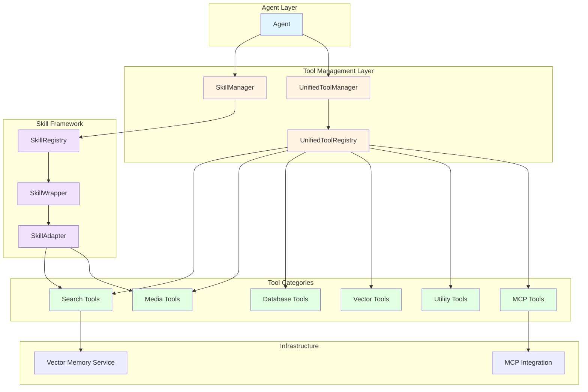

# 工具系统总览

## 概述

Backend工具系统是一个统一的、可扩展的工具和技能管理框架，为MultiAgentPPT项目的所有Agent提供工具支持。该系统集成了原生ADK工具、MCP（Model Context Protocol）工具、向量搜索、媒体搜索等多种类型的工具，并通过统一的注册中心进行管理。

## 系统架构图



## 工具分类体系

### ToolCategory 枚举

工具系统使用 `ToolCategory` 枚举对工具进行分类管理：

```python
class ToolCategory(str, Enum):
    """工具类别"""
    SEARCH = "search"      # 搜索类工具
    MEDIA = "media"        # 媒体类工具
    DATABASE = "database"  # 数据库类工具
    VECTOR = "vector"      # 向量类工具
    UTILITY = "utility"    # 通用工具
    MCP = "mcp"            # MCP协议工具
```

### SkillCategory 枚举

技能框架使用 `SkillCategory` 枚举对技能进行分类：

```python
class SkillCategory(Enum):
    """技能分类"""
    DOCUMENT = "document"        # 文档相关
    SEARCH = "search"           # 搜索相关
    GENERATION = "generation"   # 生成相关
    ANALYSIS = "analysis"       # 分析相关
    EXTERNAL = "external"       # 外部工具
    UTILITY = "utility"         # 通用工具
    COMMUNICATION = "communication"  # 通信相关
```

## 系统分层设计

### 1. 代理层 (Agent Layer)
- **组件**: `Agent`
- **职责**: 使用工具执行任务，调用工具完成具体操作

### 2. 管理层 (Management Layer)
- **组件**: `SkillManager`, `UnifiedToolManager`, `UnifiedToolRegistry`
- **职责**: 工具的注册、发现、管理和分发

### 3. 技能框架层 (Skill Framework Layer)
- **组件**: `SkillRegistry`, `SkillWrapper`, `SkillAdapter`
- **职责**: 技能的定义、包装和适配

### 4. 工具层 (Tool Layer)
- **组件**: 各类具体工具实现
- **职责**: 提供具体的功能实现

### 5. 基础设施层 (Infrastructure Layer)
- **组件**: 向量记忆服务、MCP集成
- **职责**: 提供底层支持

## 核心组件关系图

```mermaid
erDiagram
    UnifiedToolRegistry ||--o{ ToolRegistration : manages
    UnifiedToolRegistry ||--o{ SkillWrapper : manages
    ToolRegistration ||--|| ToolMetadata : contains
    SkillWrapper ||--|| SkillMetadata : contains
    SkillWrapper ||--o{ SkillAdapter : creates
    SkillAdapter ||--|| SkillMethodMetadata : contains
    SkillManager ||--|| SkillRegistry : uses
    SkillRegistry ||--o{ SkillWrapper : manages
    SkillRegistry ||--o{ MarkdownSkillMetadata : manages
    SkillRegistry ||--o{ McpSkillAdapter : manages

    UnifiedToolRegistry {
        str name
        ToolCategory category
        register()
        get_tool()
        list_tools()
    }

    ToolMetadata {
        str name
        ToolCategory category
        str description
        str version
        bool enabled
    }

    SkillWrapper {
        Type skill_class
        SkillMetadata skill_metadata
        get_adk_tools()
    }

    SkillManager {
        SkillRegistry _registry
        get_tools_for_agent()
        register_custom_skill()
    }
```

## 快速开始指南

### 基础使用 - 使用现有工具

```python
from agents.tools.registry.unified_registry import get_unified_registry

# 获取全局注册中心
registry = get_unified_registry()

# 列出所有可用工具
tools = registry.list_tools()
print(f"可用工具: {tools}")

# 获取特定工具
doc_search = registry.get_tool("DocumentSearch")
print(f"文档搜索工具: {doc_search.metadata.description}")

# 按类别获取工具
search_tools = registry.get_tools_by_category(ToolCategory.SEARCH)
for tool in search_tools:
    print(f"- {tool.metadata.name}: {tool.metadata.description}")
```

### 创建Agent并使用工具

```python
from google.adk import Agent
from agents.tools.registry.unified_registry import get_unified_registry
from google.adk.tools import ToolContext

# 获取注册中心并获取工具
registry = get_unified_registry()
tools = registry.get_adk_tools(
    categories=[ToolCategory.SEARCH, ToolCategory.MEDIA],
    include_skills=False
)

# 创建使用工具的Agent
research_agent = Agent(
    name="research_agent",
    model="gemini-2.5-flash",
    instruction="你是一个研究助手，使用搜索工具查找信息。",
    tools=tools
)
```

### 技能框架 - 使用SkillManager

```python
from agents.tools.skills.managers.skill_manager import SkillManager
from agents.tools.skills.skill_metadata import SkillCategory

# 获取SkillManager单例
skill_manager = SkillManager()

# 为Agent获取工具
tools = skill_manager.get_tools_for_agent(
    agent_name="outline_agent",
    categories=[SkillCategory.DOCUMENT, SkillCategory.SEARCH]
)

# 创建Agent
agent = Agent(
    name="outline_agent",
    model="gemini-2.5-flash",
    instruction="创建PPT大纲",
    tools=tools
)

# 获取描述性技能内容（用于注入系统提示）
descriptive_content = skill_manager.get_descriptive_content_for_prompt(
    agent_name="outline_agent"
)
instruction = f"你是PPT大纲专家。\n\n{descriptive_content}"
```

### 创建自定义技能

```python
from agents.tools.skills.skill_decorator import Skill
from google.adk.tools import ToolContext

@Skill(
    name="CustomSearch",
    version="1.0.0",
    category="search",
    tags=["custom", "search"],
    description="自定义搜索技能"
)
class CustomSearchSkill:
    async def search(self, keyword: str, tool_context: ToolContext) -> str:
        """执行搜索"""
        # 实现搜索逻辑
        return f"搜索结果: {keyword}"

# 注册到SkillManager
skill_manager = SkillManager()
skill_manager.register_custom_skill(CustomSearchSkill)

# 获取工具
tools = skill_manager.get_tools_for_agent(skill_ids=["custom_search"])
```

## 系统特性

### 1. 统一管理
- 单一入口管理所有工具和技能
- 支持多种工具类型（原生ADK、MCP、自定义）

### 2. 自动发现
- 自动扫描和注册工具
- 支持配置文件驱动的发现机制

### 3. 类型安全
- 使用枚举定义工具类别
- 完整的元数据系统

### 4. 灵活过滤
- 按类别、标签、启用状态过滤
- 支持关键词搜索

### 5. 健康检查
- 工具健康状态监控
- 自动故障处理

## 相关文档

- [工具系统架构详解](tools_architecture.md) - 详细的架构设计和实现说明
- [工具参考手册](tools_reference.md) - 所有可用工具的完整列表
- [技能框架指南](skills_framework.md) - 技能框架使用详解
- [工具开发指南](tools_development.md) - 创建新工具的开发指南
