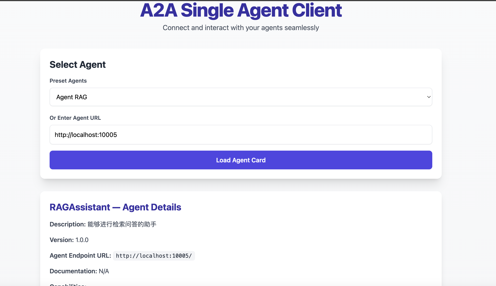
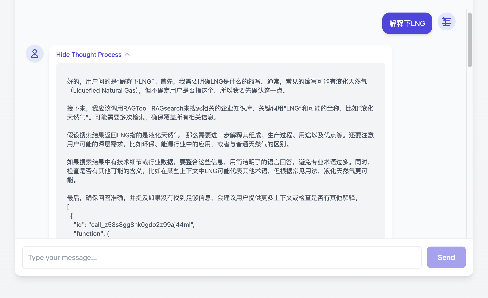

# 🛠️ Tools 工具集

本目录包含多个实用工具，用于辅助开发和测试。

---

## 📂 目录结构

| 工具 | 说明 |
|------|------|
| `single_agent` | 使用 UI 测试单个 A2A 的 Agent |
| `xml_convert_json.py` | XML 转 JSON，方便下载 PPT，调用 save_ppt 下载 |
| `LLM_cache.py` | LLM 中间代理服务器，支持缓存和多种模型 |
| `weixin_search.py` | 搜索微信公众号文章，可作为 MCP 工具使用 |

---

## 🖥️ Single Agent 测试界面

用于测试单个 A2A Agent 的 UI 界面。

**界面截图示例：**





详细说明请参考：[single_agent/README.md](single_agent/README.md)

---

## 🔄 XML 转 JSON 工具

**文件：** `xml_convert_json.py`

将 XML 格式的 PPT 数据转换为 JSON 格式，便于调用 `save_ppt` 进行下载。

---

## 💾 LLM Cache 中间代理服务器

**文件：** `LLM_cache.py`

`LLM_cache.py` 是一个本地可运行的 **大语言模型中间代理服务器**，支持：

- ✅ 将标准 OpenAI 格式的请求代理到多种大模型服务（如 Qwen、OpenRouter、DeepSeek 等）
- ✅ 自动缓存返回结果到本地，避免重复请求浪费 token
- ✅ 支持 `stream=True` 的 SSE 流式响应
- ✅ 本地日志记录请求信息及响应内容

### 🚀 功能简介

- 支持多模型服务：只需设置正确的 model 名称和 API Key，即可自动转发请求
- 本地缓存结果：自动为请求生成唯一哈希，避免重复计算与收费
- 自动检测缓存错误内容（如错误响应，自动提示）
- 支持标准 OpenAI 格式 `chat/completions` 请求接口
- 自带日志记录和缓存管理机制

### 📥 安装依赖

```bash
pip install fastapi uvicorn httpx google-genai python-dotenv
```

### 🧠 支持的模型及地址

内置支持以下模型：

| 模型名称 | 实际代理地址 |
|---------|-------------|
| `openrouter` | https://openrouter.ai/api/v1/chat/completions |
| `qwen-turbo-latest` | https://dashscope.aliyuncs.com/ |
| `gpt-4.1` | https://api.openai.com/v1/chat/completions |
| `deepseek-chat` | https://api.deepseek.com/v1/chat/completions |

你可以自行在 `provider2url` 字典中添加新的模型及其对应地址。

### ▶️ 启动方式

```bash
python LLM_cache.py
# 默认运行在 http://localhost:6688
```

### 📡 请求示例

**使用 curl 命令：**

```bash
curl -X POST http://localhost:6688/chat/completions \
     -H "Content-Type: application/json" \
     -H "Authorization: Bearer YOUR_API_KEY" \
     -d '{
           "model": "qwen-turbo-latest",
           "messages": [{"role": "user", "content": "你好"}],
           "stream": true
         }'
```

### 🧊 缓存机制说明

每次请求将根据请求体内容（包含模型名、参数等）生成唯一的 SHA256 哈希，并作为缓存键。

**缓存内容存储于本地目录：** `llm_cache/`

- 响应缓存：`llm_cache/<hash>.txt`
- 请求记录：`llm_cache/<hash>.request`

如命中缓存，将直接以流式形式返回本地缓存内容，避免再次请求远端模型服务。

### 🪵 日志记录说明

所有日志记录在 `llm.log` 文件中，内容包括：

- 请求体
- 响应内容（每行）
- 是否命中缓存、缓存路径等

### ⚠️ 错误检测机制

服务启动时自动调用 `check_cache_for_errors()`：

- 检查缓存目录下所有 `.txt` 缓存文件
- 若发现包含 "error" 的响应内容，将在控制台输出提醒

### 📚 使用 Google Gemini 示例（可选）

此脚本支持调用 Google Gemini 模型（需设置 `.env` 中的 `GOOGLE_API_KEY`），调用示例参考函数：

```python
await generate_google_streaming_text(prompt="你好", api_key=os.environ["GOOGLE_API_KEY"])
```

### 🧪 测试建议

- 可使用 Postman、curl 或你自己的前端页面与 `http://localhost:6688/chat/completions` 进行交互
- 测试不同的模型请求，确认代理和缓存机制是否正常工作

### 📁 目录结构简览

```text
├── LLM_cache.py             # 主服务文件
├── llm_cache/               # 缓存文件目录（自动创建）
│   ├── <hash>.txt           # 模型响应内容
│   └── <hash>.request       # 请求内容
├── llm.log                  # 日志文件
```

### 💡 提示

- 若某个缓存文件被错误响应污染（如包含 `"error"`），请手动删除
- 若需要扩展支持更多模型，只需修改 `provider2url` 字典并添加对应的 API 地址

---

## 🔍 微信搜索工具

**文件：** `weixin_search.py`

搜索微信公众号文章，可以作为模型的 MCP 工具使用。
